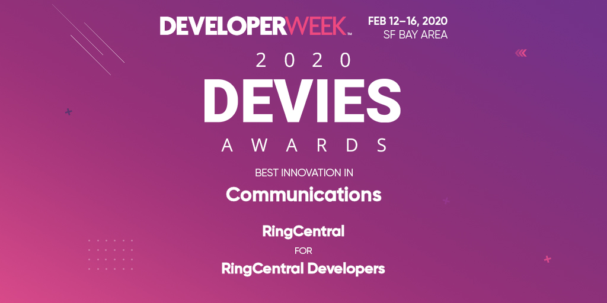
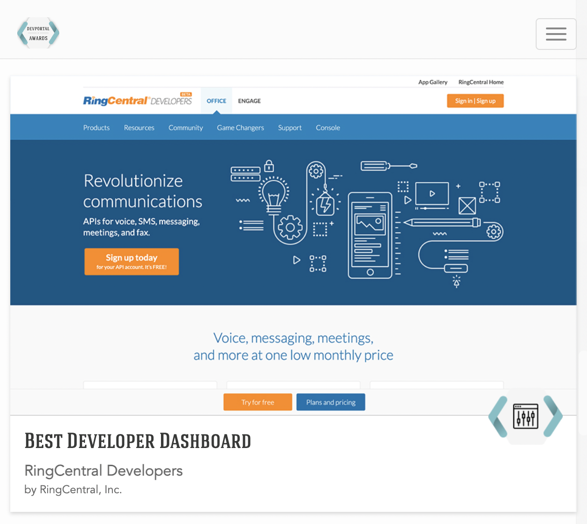
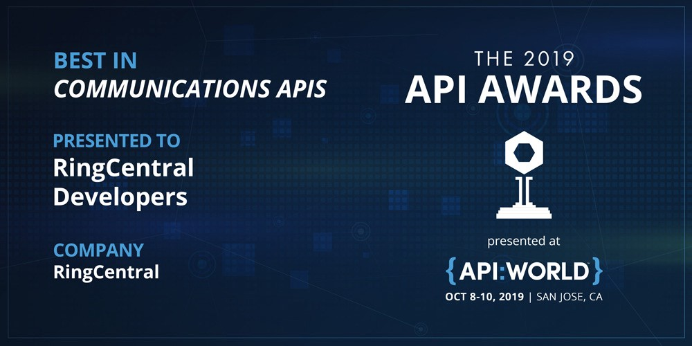
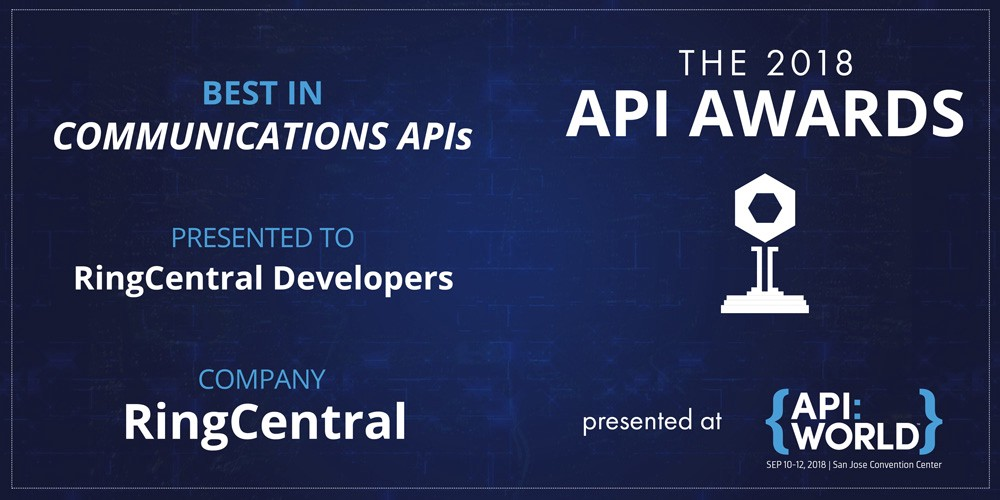

# RingCentral Developers Program and API Awards

The following are product awards my team achieved for the RingCentral Developers Program and APIs:

1. 2021 - API World - Best in Communications APIs
1. 2021 - Metrigy - MetriStar award for Unified Communications-as-a-Service
1. 2020 - DeveloperWeek Devies - Best Innovation in Communications
1. 2020 - DevPortal Awards - Best Developer Dashboard
1. 2019 - API World - Best in Communications APIs
1. 2018 - API World - Best in Communications APIs
1. 2018 - Nordic APIs - Best Public API

## 2021 - API World - Best in Communications APIs

https://apiworld.co/awards/2021-api-awards-winners/

## 2021 - Metrigy - MetriStar Top Provider award for Communications Platform as a Service (CPaaS) for Customer Experience (CX)

* https://www.metrigy.com/research/metrigy-metristar-awards-communications-platform-as-a-service-cpaas/

## 2020 - DeveloperWeek Devies - Best Innovation in Communications

https://www.developerweek.com/awards/2020-devies-winners/

## 2020 - DevPortal Awards - Best Developer Dashboard

* https://devportalawards.org/winners?year=2020
* https://devportalawards.org/nominees/2020/ringcentral

### Overview

https://devportalawards.org/

> Why the DevPortal Awards?
> 
> We wanted to create an opportunity to showcase innovative leaders and their developer portals in the API and interface space. The DevPortal Awards is an opportunity to celebrate the work that goes into developer portals that are not only targeted to developers but also aligned to business needs and operable by its maintainers.
> 
> The DevPortal Awards seeks to recognize the best solutions available today and push the boundaries of what we believe to be the key components of a developer portal for tomorrow.

### Award

> Introduction of the portal
> 
> RingCentral Developers portal combines powerful APIs with a focus on usability and community. Developers will find quick start guides that create apps for them in a matter of minutes, interactive documentation, tutorials, SDKs for 11 languages, and more combined with RingCentral's focus on supporting their community through live chat, forums, social media, and even with free 1-1 developer support. Once in the Developer Portal, developers will also find more details including usage and error analytics to help them monitor their app's health. Then there's RingCentral's Game Changer program that rewards developers with prizes like swag, conference passes, and even electronics like iPads and Macbook Pros just for helping others in the community!
>
> Why nominated
>
> 1. Extremely user friendly documentation
> 2. Language specific quick start guides
> 3. "one click" button to create a quick start app.
> 4. SDK support (11 languages)
> 5. Innovative widgets including RingCentral Embeddable API analytics and user dashboards
> 6. Game Changers program (learn about the RingCentral API and get rewarded)

## 2019 - API World - Best in Communications APIs

https://medium.com/ringcentral-developers/ringcentral-wins-api-worlds-best-in-communication-apis-for-second-year-40a79169bd81

## 2018 - API World - Best in Communications APIs

https://medium.com/ringcentral-developers/voted-best-in-communications-apis-for-2018-48d1f82edece

## 2018 - Nordic APIs - Best Public API

https://nordicapis.com/best-public-api-of-2018/ ([pdf](award_2018_nordic-apis_best-public-api_article.pdf))

> We had 10 nominees for the Best Public API of 2018 award, we received a ton of votes from the community, and now we’re happy to announce that the winner of the Best Public API of 2018 competition is RingCentral!
> 
> The RingCentral API enables multi-faceted business communication abilities, including voice, SMS, messaging, meetings, and fax. Their developer friendly program features extensive docs, sample apps, and a wide SDK library.
> 
> Here are some motivations from the communities votes:
> 
> * All around fantastic engineering and ease of use
> * Ability to implement SMS into my website in 20 minutes! It just works.
> * 99.99 reliability
> * It allows communications from within a bunch of apps that Small Businesses and Enterprises use on a regular basis (like Google apps, Microsoft cloud apps, SalesForce, etc.). And they keep improving and adding more apps to their ecosystem.

