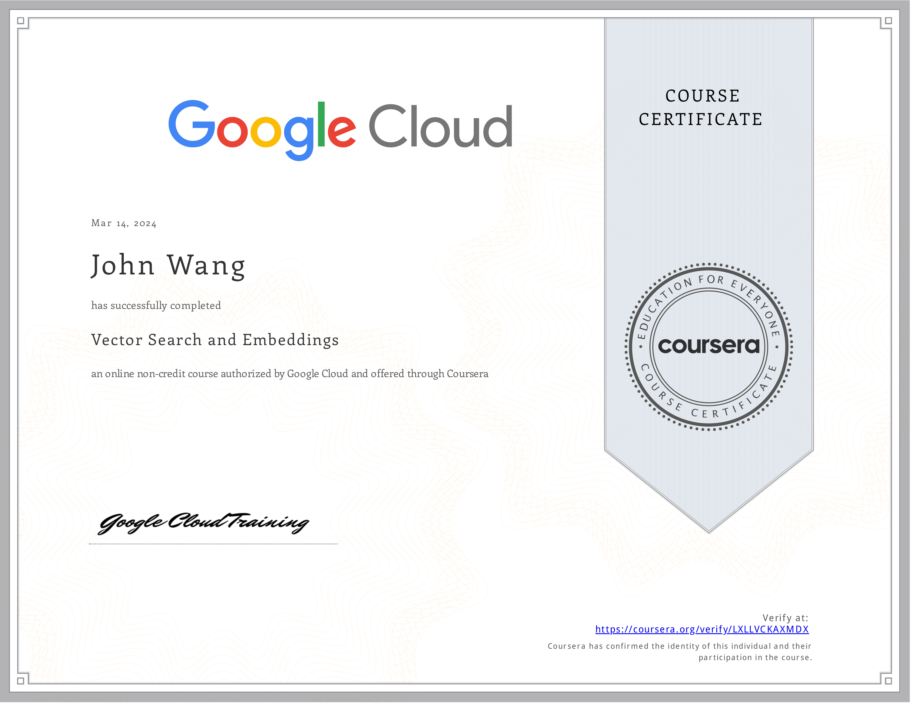
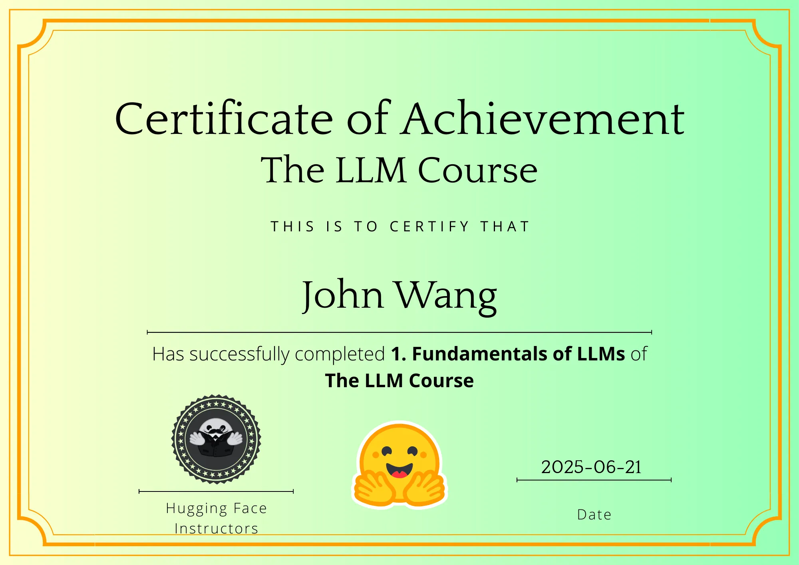
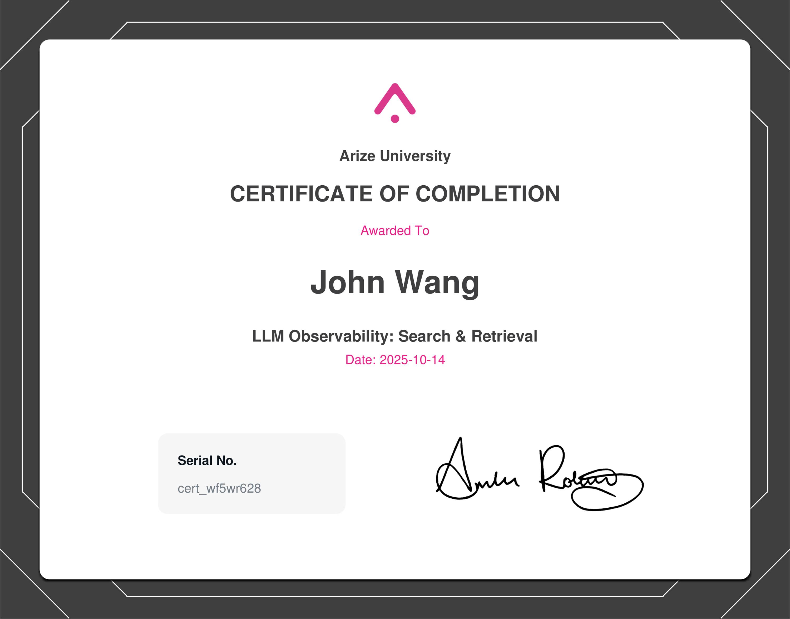
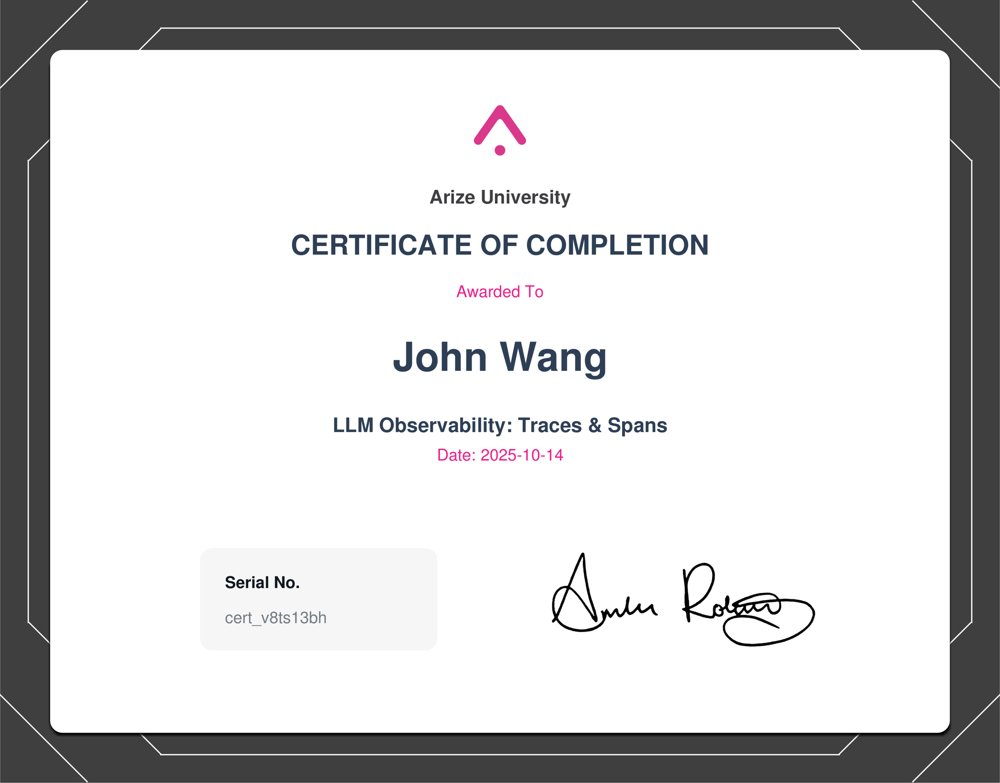
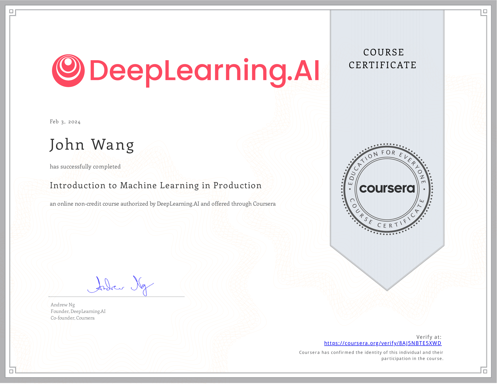
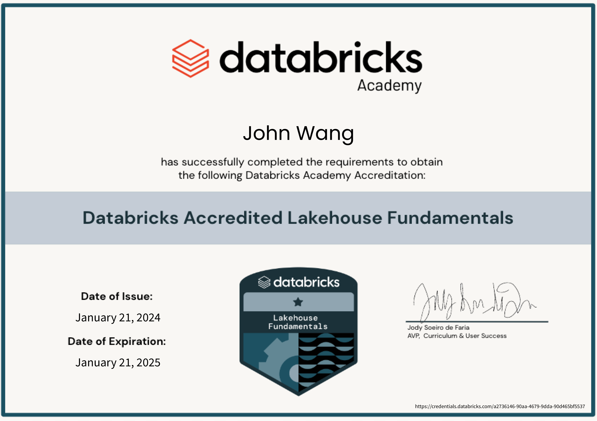

# John's Artificial Intelligence: ML Certificates
1. [Fundamentals](#fundamentals-4)
    1. [Machine Learning Foundations for Product Managers from Duke University by Jon Reifschneider](#machine-learning-foundations-for-product-managers-from-duke-university-by-jon-reifschneider)
    1. [Vector Search and Embeddings from Google Cloud](#vector-search-and-embeddings-from-google-cloud)
    1. [Intro to Hugging Face from Codecademy](#intro-to-hugging-face-from-codecademy)
    1. [Jupyter Notebook from Great Learning Academy by Anirudh Rao](#jupyter-notebook-from-great-learning-academy-by-anirudh-rao)
1. [Large Language Models (LLMs)](#large-language-models-llms-8)
    1. [Fundamentals of LLMs from Hugging Face](#fundamentals-of-llms-from-hugging-face)
    1. [Introduction to Large Language Models from Google Cloud](#introduction-to-large-language-models-from-google-cloud)
    1. [Attention Mechanism from Google Cloud](#attention-mechanism-from-google-cloud)
    1. [LLM Observability: Evaluations from Arize by Amber Roberts](#llm-observability-evaluations-from-arize-by-amber-roberts)
    1. [LLM Observability: Agents, Tools, and Chains from Arize by Amber Roberts](#llm-observability-agents-tools-and-chains-from-arize-by-amber-roberts)
    1. [LLM Observability: Search & Retrieval from Arize by Amber Roberts](#llm-observability-search-retrieval-from-arize-by-amber-roberts)
    1. [LLM Observability: Traces & Spans from Arize by Amber Roberts](#llm-observability-traces-spans-from-arize-by-amber-roberts)
    1. [Domain-specific LLM Agents from Pluralsight by Brian Letort](#domain-specific-llm-agents-from-pluralsight-by-brian-letort)
1. [Algorithms](#algorithms-1)
    1. [KNN Algorithm from Great Learning Academy by Anirudh Rao, Bharani Akella](#knn-algorithm-from-great-learning-academy-by-anirudh-rao-bharani-akella)
1. [Data Engineering](#data-engineering-1)
    1. [Get Started with Databricks for Data Engineering from Databricks](#get-started-with-databricks-for-data-engineering-from-databricks)
1. [MLOps](#mlops-2)
    1. [Introduction to Machine Learning in Production from DeepLearning.AI by Andrew Ng](#introduction-to-machine-learning-in-production-from-deeplearningai-by-andrew-ng)
    1. [AWS SageMaker from Great Learning Academy by Vishal Padghan](#aws-sagemaker-from-great-learning-academy-by-vishal-padghan)
1. [Architecture](#architecture-2)
    1. [Structuring Machine Learning Projects from DeepLearning.AI by Andrew Ng](#structuring-machine-learning-projects-from-deeplearningai-by-andrew-ng)
    1. [Databricks Accredited Lakehouse Fundamentals from Databricks](#databricks-accredited-lakehouse-fundamentals-from-databricks)
1. [Programming](#programming-1)
    1. [Machine Learning from Stanford by Andrew Ng](#machine-learning-from-stanford-by-andrew-ng)
## Fundamentals (4)
### Machine Learning Foundations for Product Managers from Duke University by Jon Reifschneider
* [John's Duke University online credential](https://coursera.org/verify/NCRF8YSUYLSB)

### Vector Search and Embeddings from Google Cloud
* [John's Google Cloud online credential](https://coursera.org/verify/LXLLVCKAXMDX)

### Intro to Hugging Face from Codecademy

### Jupyter Notebook from Great Learning Academy by Anirudh Rao
* [John's Great Learning Academy online credential](https://verify.mygreatlearning.com/verify/PPFKNCCJ)

## Large Language Models (LLMs) (8)
### Fundamentals of LLMs from Hugging Face

### Introduction to Large Language Models from Google Cloud
* [John's Google Cloud online credential](https://coursera.org/verify/QEDZTHK9UC3W)

### Attention Mechanism from Google Cloud
* [John's Google Cloud online credential](https://coursera.org/verify/DFS67KJRE8T5)

### LLM Observability: Evaluations from Arize by Amber Roberts

### LLM Observability: Agents, Tools, and Chains from Arize by Amber Roberts

### LLM Observability: Search & Retrieval from Arize by Amber Roberts

### LLM Observability: Traces & Spans from Arize by Amber Roberts

### Domain-specific LLM Agents from Pluralsight by Brian Letort

## Algorithms (1)
### KNN Algorithm from Great Learning Academy by Anirudh Rao, Bharani Akella
* [John's Great Learning Academy online credential](https://verify.mygreatlearning.com/verify/QMGKZXYC)

## Data Engineering (1)
### Get Started with Databricks for Data Engineering from Databricks

## MLOps (2)
### Introduction to Machine Learning in Production from DeepLearning.AI by Andrew Ng
* [John's DeepLearning.AI online credential](https://coursera.org/verify/8AJ5NBTE5XWD)

### AWS SageMaker from Great Learning Academy by Vishal Padghan
* [John's Great Learning Academy online credential](https://verify.mygreatlearning.com/verify/OICYKGXZ)

## Architecture (2)
### Structuring Machine Learning Projects from DeepLearning.AI by Andrew Ng
* [John's DeepLearning.AI online credential](https://coursera.org/verify/8AXDP5G5K95U)

### Databricks Accredited Lakehouse Fundamentals from Databricks
* [John's Databricks online profile](https://credentials.databricks.com/profile/grokify)
* [John's Databricks online credential](https://credentials.databricks.com/a2736146-90aa-4679-9dda-90d465bf5537)

## Programming (1)
### Machine Learning from Stanford by Andrew Ng

