# John's Artificial Intelligence Certificates
1. [Strategy](#strategy-1)
    1. [AI Strategy and Governance from University of Pennsylvania, Wharton School](#ai-strategy-and-governance-from-university-of-pennsylvania-wharton-school)
1. [Product Management](#product-management-4)
    1. [Generative AI for Innovators from Pluralsight by Esteban Herrera](#generative-ai-for-innovators-from-pluralsight-by-esteban-herrera)
    1. [Artificial Intelligence Micro-Certification (AIC) from Product School by Sam Stevens](#artificial-intelligence-micro-certification-aic-from-product-school-by-sam-stevens)
    1. [AI for Product Management from Pendo](#ai-for-product-management-from-pendo)
    1. [AI Product from Great Learning Academy by Abhinanda Sarkar](#ai-product-from-great-learning-academy-by-abhinanda-sarkar)
1. [AI Assistants](#ai-assistants-7)
    1. [Amazon Q Business Getting Started from AWS](#amazon-q-business-getting-started-from-aws)
    1. [A Hands-On Look at Amazon Q Business Expert from AWS by Paul Colmer](#a-hands-on-look-at-amazon-q-business-expert-from-aws-by-paul-colmer)
    1. [MidJourney: From Inspiration to Implementation from Analytics Vidhya by Sandeep Singh](#midjourney-from-inspiration-to-implementation-from-analytics-vidhya-by-sandeep-singh)
    1. [Duet AI in Gmail from Google Cloud](#duet-ai-in-gmail-from-google-cloud)
    1. [Using Generative AI to Refine Communications to Executives from Pluralsight by Ed Freitas](#using-generative-ai-to-refine-communications-to-executives-from-pluralsight-by-ed-freitas)
    1. [SEO with AI from Sololearn](#seo-with-ai-from-sololearn)
    1. [ChatGPT for Excel from Great Learning Academy by E. Balachandra Murthy](#chatgpt-for-excel-from-great-learning-academy-by-e-balachandra-murthy)
1. [AI Code Assistants](#ai-code-assistants-4)
    1. [Claude Code in Action from Anthropic](#claude-code-in-action-from-anthropic)
    1. [Claude Code: Software Engineering with Generative AI Agents from Vanderbilt University by James White](#claude-code-software-engineering-with-generative-ai-agents-from-vanderbilt-university-by-james-white)
    1. [Introduction to Amazon Q Developer (Technical) from AWS](#introduction-to-amazon-q-developer-technical-from-aws)
    1. [Intro to Claude AI from Scrimba by Shant Dashjian](#intro-to-claude-ai-from-scrimba-by-shant-dashjian)
1. [Vibe Coding](#vibe-coding-7)
    1. [Vibe Coding with Cursor AI from Scrimba by Maham Codes](#vibe-coding-with-cursor-ai-from-scrimba-by-maham-codes)
    1. [Build AI Apps with Lovable: Vibe Coding for Web Dev from Udemy by Pavan Kumar, Manish Patel](#build-ai-apps-with-lovable-vibe-coding-for-web-dev-from-udemy-by-pavan-kumar-manish-patel)
    1. [AI Development with Lovable AI 2.0 - A Deeper Dive from Udemy by Randy Minder](#ai-development-with-lovable-ai-20-a-deeper-dive-from-udemy-by-randy-minder)
    1. [Dashboards in Minutes with Claude AI: Stunning and NOW! from Udemy by Federico Garay](#dashboards-in-minutes-with-claude-ai-stunning-and-now-from-udemy-by-federico-garay)
    1. [Vibe Coding with Replit from Analytics Vidhya by Kunal Jain](#vibe-coding-with-replit-from-analytics-vidhya-by-kunal-jain)
    1. [Guide to Vibe Coding in Windsurf from Analytics Vidhya by Apoorv Vishnoi](#guide-to-vibe-coding-in-windsurf-from-analytics-vidhya-by-apoorv-vishnoi)
    1. [Vibe Coding from Sololearn](#vibe-coding-from-sololearn)
1. [AI Agents](#ai-agents-7)
    1. [Fundamentals of Agents from Hugging Face](#fundamentals-of-agents-from-hugging-face)
    1. [Introduction to Developing AI Agents from Pluralsight by Muhammad Sajid](#introduction-to-developing-ai-agents-from-pluralsight-by-muhammad-sajid)
    1. [Creating Personal AI Agents from Pluralsight by Kamran Ayub](#creating-personal-ai-agents-from-pluralsight-by-kamran-ayub)
    1. [Using AI Agents for Productivity from Pluralsight by Vlad Catrinescu](#using-ai-agents-for-productivity-from-pluralsight-by-vlad-catrinescu)
    1. [Human–AI Agent Collaboration from Pluralsight by Bogdan Sucaciu](#humanai-agent-collaboration-from-pluralsight-by-bogdan-sucaciu)
    1. [Agentic AI Lifecycle Management from Pluralsight by Eman Hassan](#agentic-ai-lifecycle-management-from-pluralsight-by-eman-hassan)
    1. [Deploying AI Agents in Production Environments from Pluralsight by Pratheerth Padman](#deploying-ai-agents-in-production-environments-from-pluralsight-by-pratheerth-padman)
1. [Multi-Agent Systems](#multi-agent-systems-8)
    1. [Multi AI Agent Systems with CrewAI from CrewAI by João Moura](#multi-ai-agent-systems-with-crewai-from-crewai-by-joao-moura)
    1. [Mastering Multi-Agent Development with AutoGen from Packt by Paulo Dichone](#mastering-multi-agent-development-with-autogen-from-packt-by-paulo-dichone)
    1. [Elevate Team Productivity with Crew AI from Coursera by Yash Thakker](#elevate-team-productivity-with-crew-ai-from-coursera-by-yash-thakker)
    1. [Introduction to CrewAI: Building a Researcher Assistant Agent from Analytics Vidhya by Alessandro Romano](#introduction-to-crewai-building-a-researcher-assistant-agent-from-analytics-vidhya-by-alessandro-romano)
    1. [Applying Multi-agent Systems to Daily Tasks from Pluralsight by Bogdan Sucaciu](#applying-multi-agent-systems-to-daily-tasks-from-pluralsight-by-bogdan-sucaciu)
    1. [Developing Task-specific Agents with CrewAI from Pluralsight by Jon Friskics](#developing-task-specific-agents-with-crewai-from-pluralsight-by-jon-friskics)
    1. [Introduction to LangGraph from Pluralsight by Craig Golightly](#introduction-to-langgraph-from-pluralsight-by-craig-golightly)
    1. [Basics of LangGraph Workflows from Pluralsight by Craig Golightly](#basics-of-langgraph-workflows-from-pluralsight-by-craig-golightly)
1. [Workflow Automation](#workflow-automation-1)
    1. [n8n: A Complete Guide to the Automation Tool from Analytics Vidhya by Gyan Prakash Tripathi](#n8n-a-complete-guide-to-the-automation-tool-from-analytics-vidhya-by-gyan-prakash-tripathi)
1. [Model Context Protocol (MCP)](#model-context-protocol-mcp-5)
    1. [Model Context Protocol: Advanced Topics from Anthropic](#model-context-protocol-advanced-topics-from-anthropic)
    1. [Introduction to Model Context Protocol from Anthropic](#introduction-to-model-context-protocol-from-anthropic)
    1. [MCP for Production Automation from Hugging Face](#mcp-for-production-automation-from-hugging-face)
    1. [Fundamentals of MCP (Model Context Protocol) from Hugging Face](#fundamentals-of-mcp-model-context-protocol-from-hugging-face)
    1. [Foundations of Model Context Protocol from Analytics Vidhya by Apoorv Vishnoi](#foundations-of-model-context-protocol-from-analytics-vidhya-by-apoorv-vishnoi)
1. [Prompt Engineering](#prompt-engineering-3)
    1. [Essentials of Prompt Engineering from AWS](#essentials-of-prompt-engineering-from-aws)
    1. [Prompt Engineering for Web Developers from Scrimba by Treasure Porth](#prompt-engineering-for-web-developers-from-scrimba-by-treasure-porth)
    1. [AI Prompting Essentials Certified (AIPEC) from Management and Strategy Institute](#ai-prompting-essentials-certified-aipec-from-management-and-strategy-institute)
1. [Generative AI](#generative-ai-4)
    1. [Generative AI for Web Development Specialization (3 Courses) from Scrimba](#generative-ai-for-web-development-specialization-3-courses-from-scrimba)
    1. [Introduction to Generative AI from Google Cloud](#introduction-to-generative-ai-from-google-cloud)
    1. [Introduction to Image Generation from Google Cloud](#introduction-to-image-generation-from-google-cloud)
    1. [Databricks Accredited Generative AI Fundamentals from Databricks](#databricks-accredited-generative-ai-fundamentals-from-databricks)
1. [Generative AI API](#generative-ai-api-2)
    1. [OpenAI Chat Completions API from Pluralsight by Xavier Morera](#openai-chat-completions-api-from-pluralsight-by-xavier-morera)
    1. [OpenAI Assistant API from Pluralsight by Xavier Morera](#openai-assistant-api-from-pluralsight-by-xavier-morera)
1. [Retrieval-Augmented Generation (RAG)](#retrieval-augmented-generation-rag-3)
    1. [Vector Space Models and Embeddings in RAGs from Pluralsight by Axel Sirota](#vector-space-models-and-embeddings-in-rags-from-pluralsight-by-axel-sirota)
    1. [Multi-modal RAGs from Pluralsight by Dhiraj Kumar](#multi-modal-rags-from-pluralsight-by-dhiraj-kumar)
    1. [Modular RAGs from Pluralsight by JS Padoan](#modular-rags-from-pluralsight-by-js-padoan)
1. [Security](#security-3)
    1. [Defending Against AI-Generated Attacks from Codecademy](#defending-against-ai-generated-attacks-from-codecademy)
    1. [Security Risks and Privacy Concerns Using Generative AI from Pluralsight by Dr. Shaila Rana](#security-risks-and-privacy-concerns-using-generative-ai-from-pluralsight-by-dr-shaila-rana)
    1. [AI Security from Lakera](#ai-security-from-lakera)
1. [Governance](#governance-1)
    1. [Introduction to Responsible AI from Google Cloud](#introduction-to-responsible-ai-from-google-cloud)
1. [AWS](#aws-6)
    1. [Amazon Bedrock Getting Started from AWS](#amazon-bedrock-getting-started-from-aws)
    1. [Automate Generative AI workflows using Amazon Bedrock Flows from AWS](#automate-generative-ai-workflows-using-amazon-bedrock-flows-from-aws)
    1. [Building Retrieval Augmented Generation (RAG) workflows with Amazon OpenSearch Service from AWS](#building-retrieval-augmented-generation-rag-workflows-with-amazon-opensearch-service-from-aws)
    1. [AWS SimuLearn: Secure Conversational AI with Guardrails from AWS](#aws-simulearn-secure-conversational-ai-with-guardrails-from-aws)
    1. [Introduction to Amazon Bedrock from Pluralsight by Muhammad Sajid](#introduction-to-amazon-bedrock-from-pluralsight-by-muhammad-sajid)
    1. [Create AWS Infrastructure as Code Templates Using Generative AI from Pluralsight by Shubham Sinha](#create-aws-infrastructure-as-code-templates-using-generative-ai-from-pluralsight-by-shubham-sinha)
## Resources

1. [Artificial Intelligence Resource Links](../../links/artificial-intelligence/)
## Strategy (1)
### AI Strategy and Governance from University of Pennsylvania, Wharton School
* [John's University of Pennsylvania, Wharton School online credential](https://coursera.org/verify/DGB6XB4C7VKD)

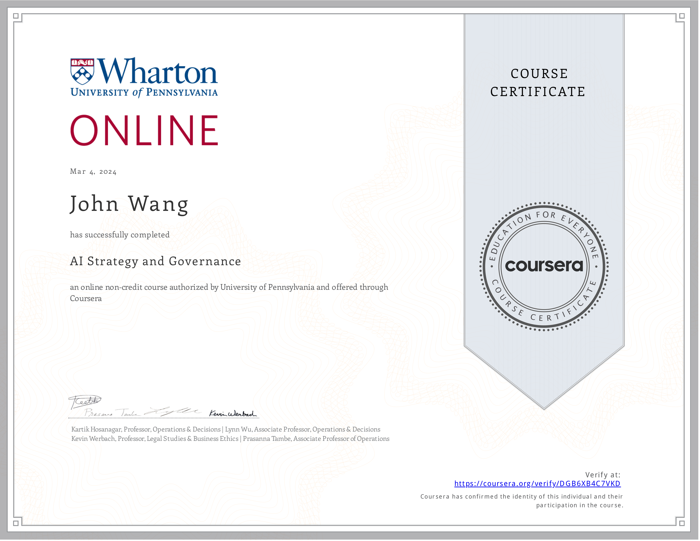

## Product Management (4)
### Generative AI for Innovators from Pluralsight by Esteban Herrera

### Artificial Intelligence Micro-Certification (AIC) from Product School by Sam Stevens

### AI for Product Management from Pendo
* [John's Credly online profile](https://www.credly.com/users/grokify/)
* [John's Pendo online credential](https://www.credly.com/badges/64f1712e-652a-4f49-b392-209f420f5b38)

### AI Product from Great Learning Academy by Abhinanda Sarkar

## AI Assistants (7)
### Amazon Q Business Getting Started from AWS

### A Hands-On Look at Amazon Q Business Expert from AWS by Paul Colmer

### MidJourney: From Inspiration to Implementation from Analytics Vidhya by Sandeep Singh
* [John's Analytics Vidhya online credential](https://courses.analyticsvidhya.com/certificates/edmxgsnnvy)

### Duet AI in Gmail from Google Cloud
* [John's Google Cloud online credential](https://coursera.org/verify/DHKM6DF4MQ67)

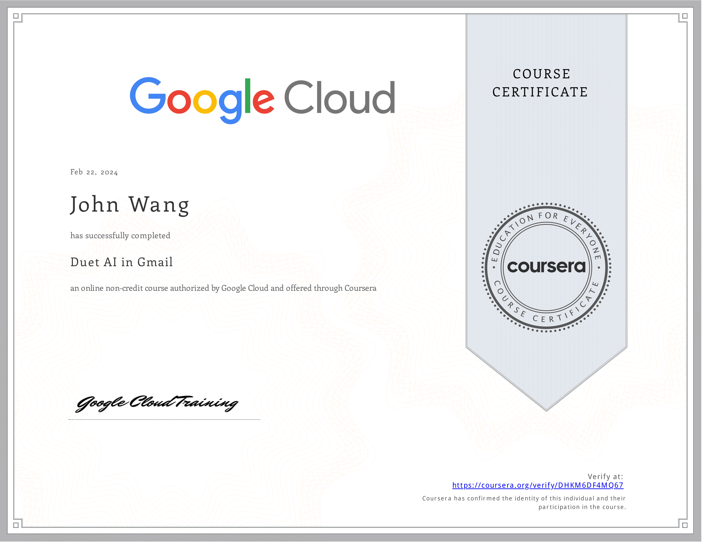

### Using Generative AI to Refine Communications to Executives from Pluralsight by Ed Freitas

### SEO with AI from Sololearn
* [John's Sololearn online credential](https://www.sololearn.com/certificates/CC-8PJDAA6M)

### ChatGPT for Excel from Great Learning Academy by E. Balachandra Murthy
* [John's Great Learning Academy online credential](https://verify.mygreatlearning.com/verify/WFDRKONI)

## AI Code Assistants (4)
### Claude Code in Action from Anthropic
* [John's Anthropic online credential](https://verify.skilljar.com/c/j3k4jnhhakvj)

### Claude Code: Software Engineering with Generative AI Agents from Vanderbilt University by James White
* [John's Vanderbilt University online credential](https://coursera.org/verify/1LRTE17NTNXQ)

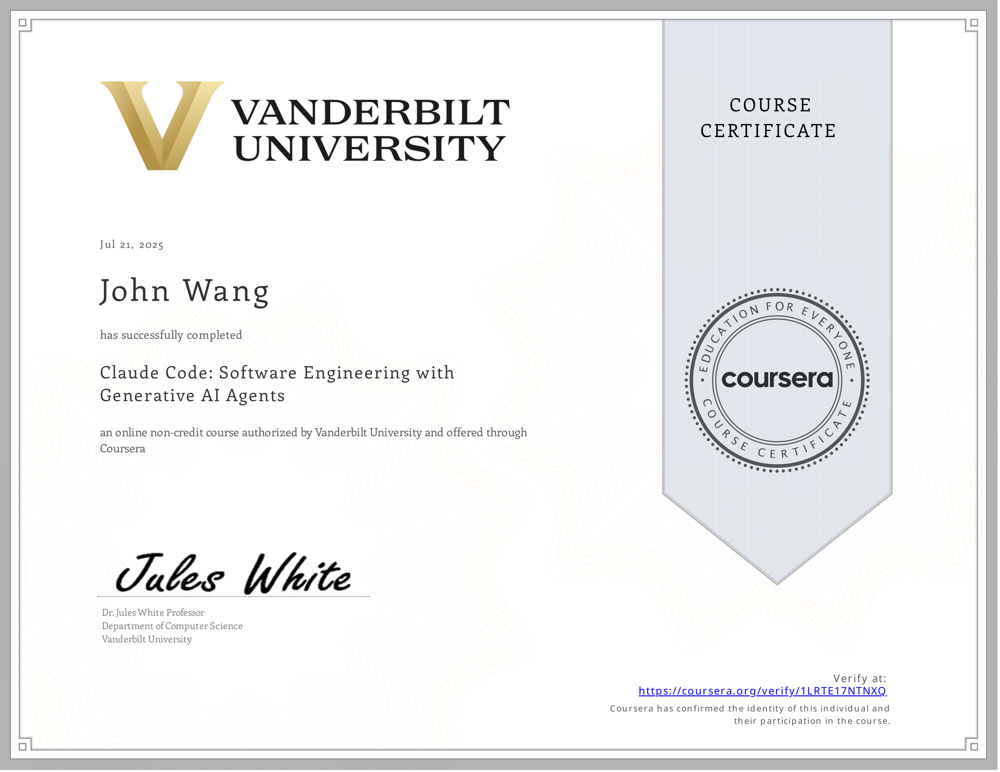

### Introduction to Amazon Q Developer (Technical) from AWS

### Intro to Claude AI from Scrimba by Shant Dashjian
* [John's Scrimba online credential](https://www.coursera.org/verify/BJ2AJF89N18M)

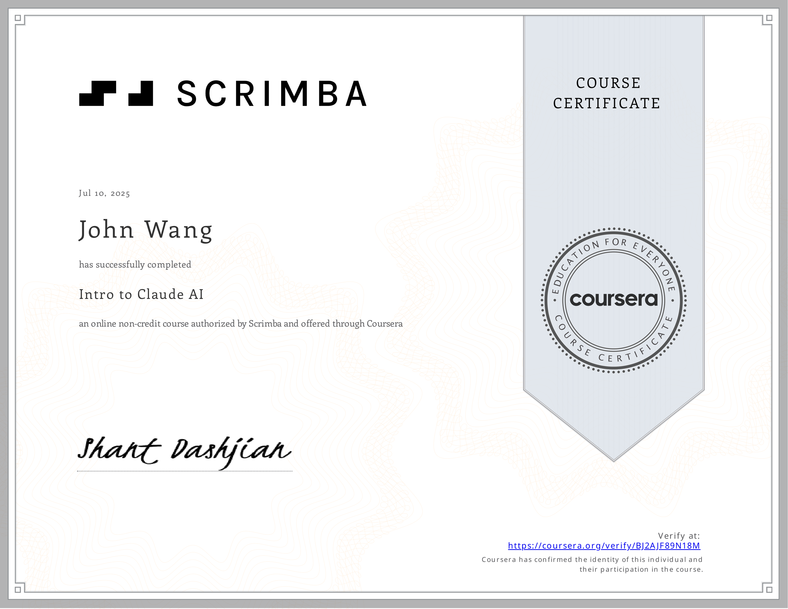

## Vibe Coding (7)
### Vibe Coding with Cursor AI from Scrimba by Maham Codes
* [John's Scrimba online credential](https://www.coursera.org/verify/YYQ26P22WQQF)

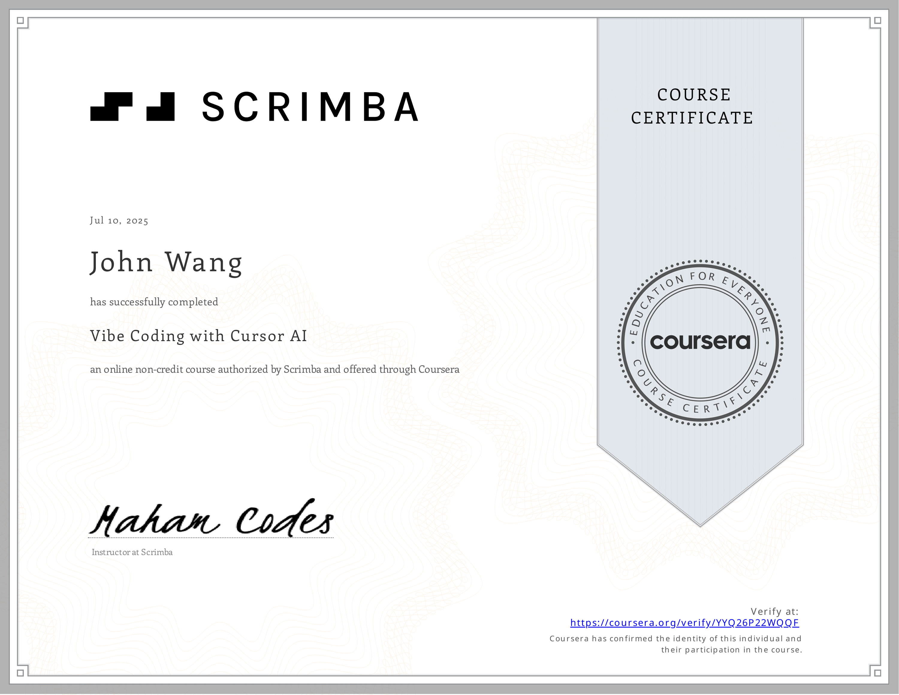

### Build AI Apps with Lovable: Vibe Coding for Web Dev from Udemy by Pavan Kumar, Manish Patel
* [John's Udemy online credential](https://www.udemy.com/certificate/UC-054ec269-a6c0-4c85-90ff-5539102c80a7/)

### AI Development with Lovable AI 2.0 - A Deeper Dive from Udemy by Randy Minder
* [John's Udemy online credential](https://www.udemy.com/certificate/UC-27c83ee7-731e-4879-a2aa-5042b98d267f/)

### Dashboards in Minutes with Claude AI: Stunning and NOW! from Udemy by Federico Garay
* [John's Udemy online credential](https://www.udemy.com/certificate/UC-08a2f155-d9e0-4a66-a4aa-113051caa9ca/)

### Vibe Coding with Replit from Analytics Vidhya by Kunal Jain
* [John's Analytics Vidhya online credential](https://courses.analyticsvidhya.com/certificates/jf8ns9xz2w)

### Guide to Vibe Coding in Windsurf from Analytics Vidhya by Apoorv Vishnoi
* [John's Analytics Vidhya online credential](https://courses.analyticsvidhya.com/certificates/edmxgsnnvy)

### Vibe Coding from Sololearn
* [John's Sololearn online credential](https://www.sololearn.com/certificates/CC-H5DTUCSU)

## AI Agents (7)
### Fundamentals of Agents from Hugging Face
* [John's Hugging Face online credential](https://huggingface.co/datasets/agents-course/certificates/resolve/main/certificates/grokify/2025-06-20.png)

### Introduction to Developing AI Agents from Pluralsight by Muhammad Sajid

### Creating Personal AI Agents from Pluralsight by Kamran Ayub

### Using AI Agents for Productivity from Pluralsight by Vlad Catrinescu

### Human–AI Agent Collaboration from Pluralsight by Bogdan Sucaciu

### Agentic AI Lifecycle Management from Pluralsight by Eman Hassan

### Deploying AI Agents in Production Environments from Pluralsight by Pratheerth Padman

## Multi-Agent Systems (8)
### Multi AI Agent Systems with CrewAI from CrewAI by João Moura

### Mastering Multi-Agent Development with AutoGen from Packt by Paulo Dichone
* [John's Packt online credential](https://coursera.org/verify/I7EM70S5CNDA)

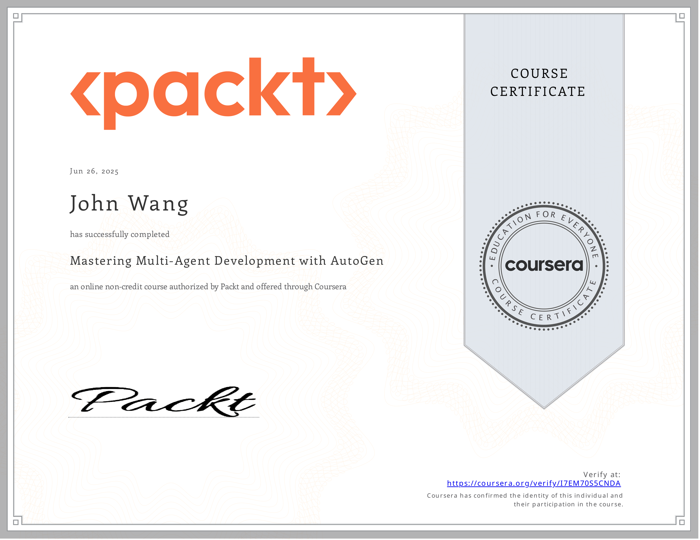

### Elevate Team Productivity with Crew AI from Coursera by Yash Thakker
* [John's Coursera online credential](https://coursera.org/verify/PL8QUEVA2NYB)

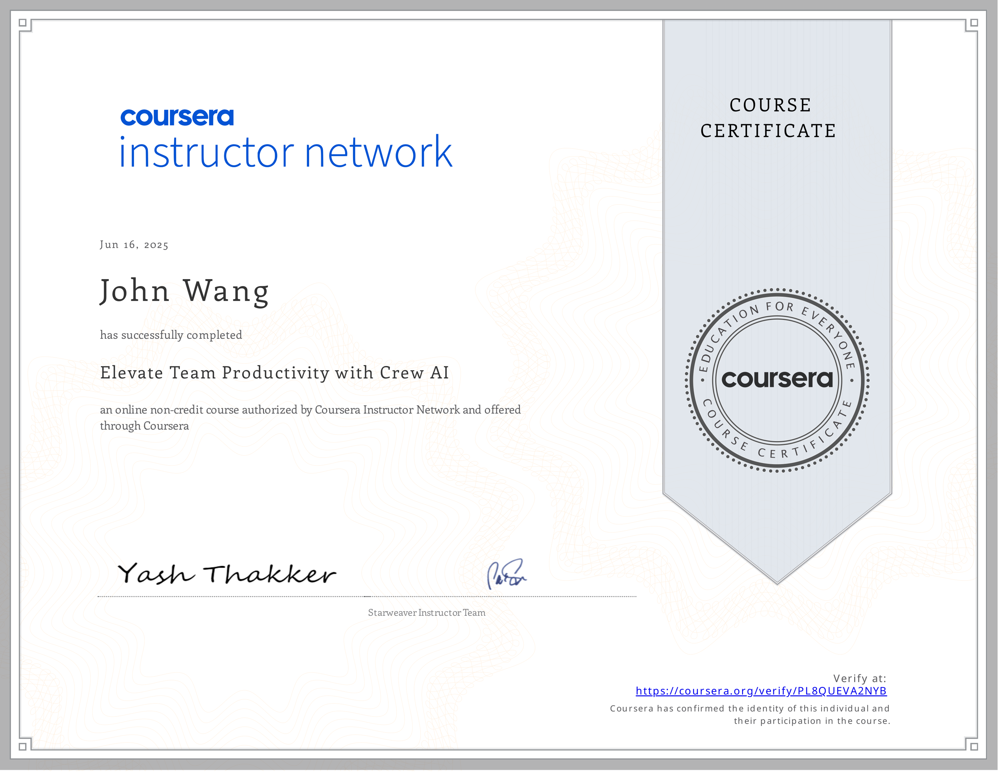

### Introduction to CrewAI: Building a Researcher Assistant Agent from Analytics Vidhya by Alessandro Romano
* [John's Analytics Vidhya online credential](https://courses.analyticsvidhya.com/certificates/bovpkhdpsd)

### Applying Multi-agent Systems to Daily Tasks from Pluralsight by Bogdan Sucaciu

### Developing Task-specific Agents with CrewAI from Pluralsight by Jon Friskics

### Introduction to LangGraph from Pluralsight by Craig Golightly

### Basics of LangGraph Workflows from Pluralsight by Craig Golightly

## Workflow Automation (1)
### n8n: A Complete Guide to the Automation Tool from Analytics Vidhya by Gyan Prakash Tripathi
* [John's Analytics Vidhya online credential](https://courses.analyticsvidhya.com/certificates/8lnnxuybwr)

## Model Context Protocol (MCP) (5)
### Model Context Protocol: Advanced Topics from Anthropic
* [John's Anthropic online credential](https://verify.skilljar.com/c/mu9br5w7hgpu)

### Introduction to Model Context Protocol from Anthropic
* [John's Anthropic online credential](https://verify.skilljar.com/c/z63bcx5kdca8)

### MCP for Production Automation from Hugging Face
* [John's Hugging Face online credential](https://cdn-uploads.huggingface.co/production/uploads/noauth/tzZ2UDkYY3vwymJ368oB-.webp)

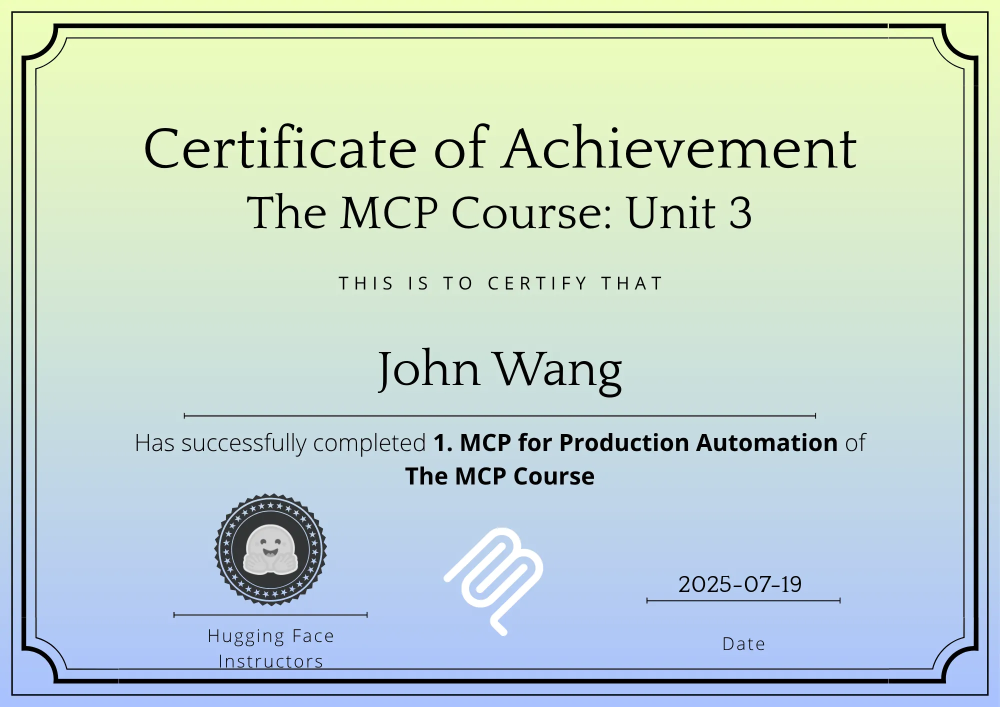

### Fundamentals of MCP (Model Context Protocol) from Hugging Face
* [John's Hugging Face online credential](https://huggingface.co/datasets/mcp-course/certificates/resolve/main/certificates/grokify/2025-06-14.png)

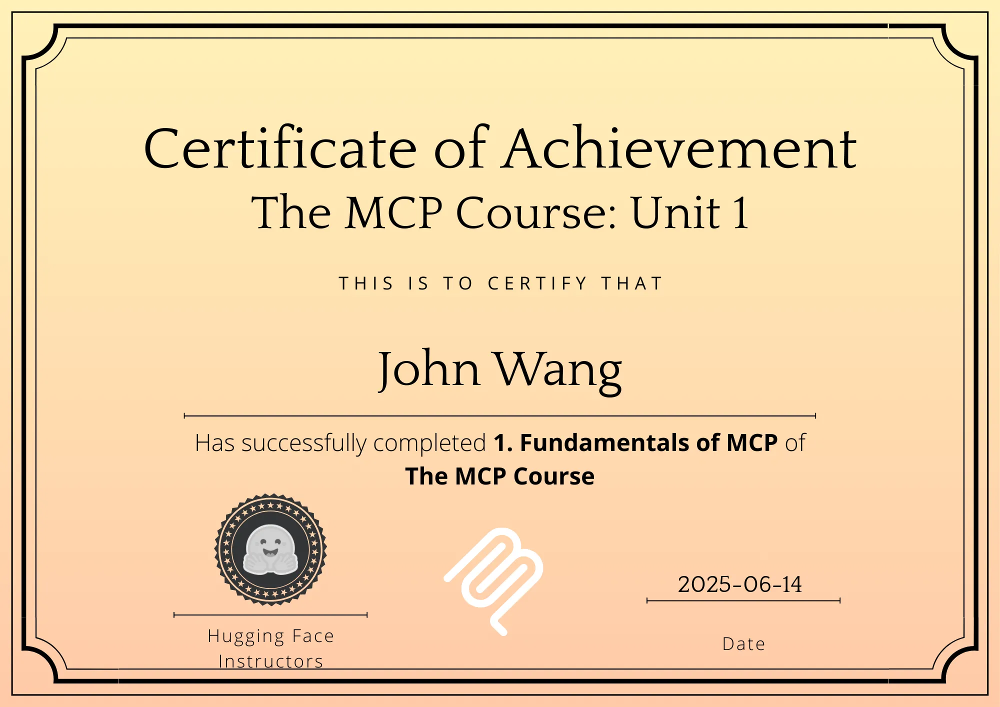

### Foundations of Model Context Protocol from Analytics Vidhya by Apoorv Vishnoi
* [John's Analytics Vidhya online credential](https://courses.analyticsvidhya.com/certificates/xea7hrnfdb)

## Prompt Engineering (3)
### Essentials of Prompt Engineering from AWS

### Prompt Engineering for Web Developers from Scrimba by Treasure Porth
* [John's Scrimba online credential](https://www.coursera.org/verify/EDM1OJ4B87Q4)

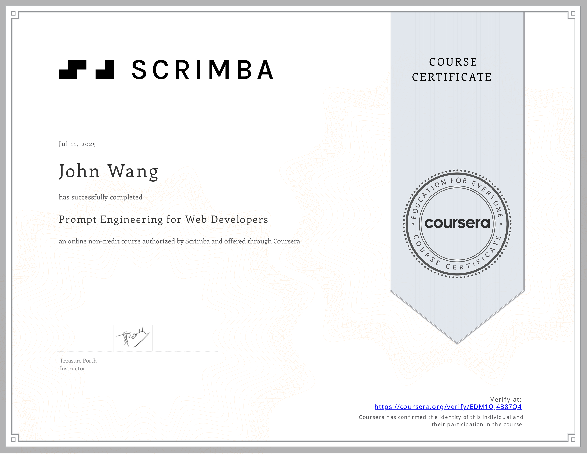

### AI Prompting Essentials Certified (AIPEC) from Management and Strategy Institute
* [John's Management and Strategy Institute online credential](https://www.proprofs.com/quiz-school/user_certificate.php?id=347250771&qid=3809416)

## Generative AI (4)
### Generative AI for Web Development Specialization (3 Courses) from Scrimba
* [John's Scrimba online credential](https://www.coursera.org/verify/specialization/VY1BKDGDO76G)

### Introduction to Generative AI from Google Cloud
* [John's Google Cloud online credential](https://coursera.org/verify/3VBHJ76MBTU9)

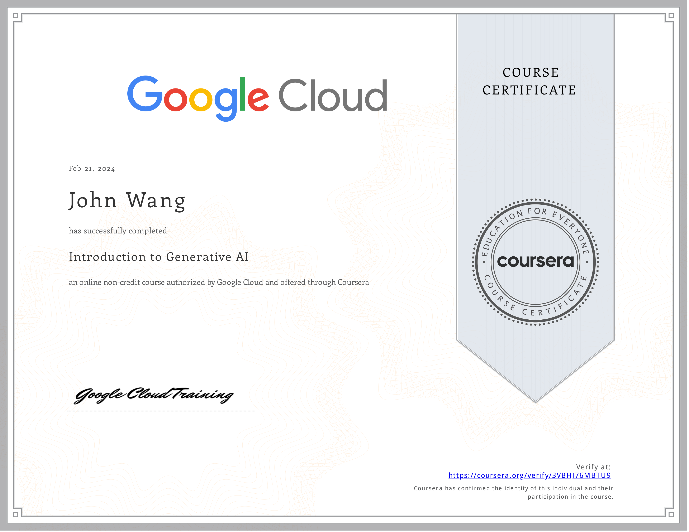

### Introduction to Image Generation from Google Cloud
* [John's Google Cloud online credential](https://coursera.org/verify/8QPV3NJLRBUK)

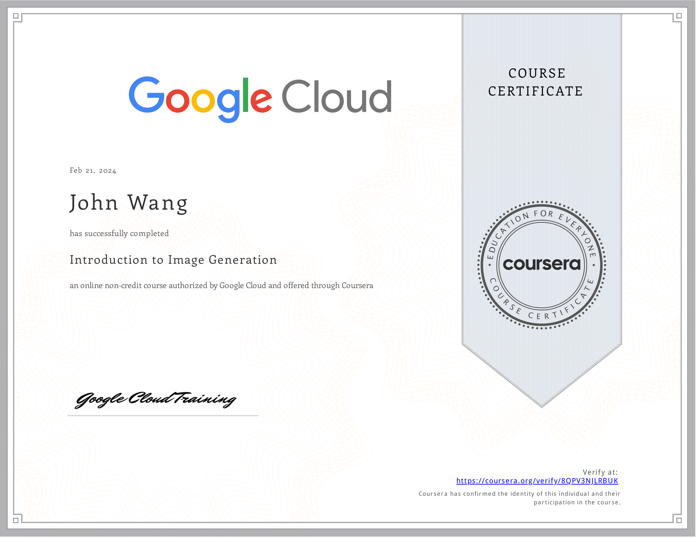

### Databricks Accredited Generative AI Fundamentals from Databricks
* [John's Databricks online profile](https://credentials.databricks.com/profile/grokify)
* [John's Databricks online credential](https://credentials.databricks.com/4ca910a4-6dd5-4e91-97a7-ccc7ed80424f)

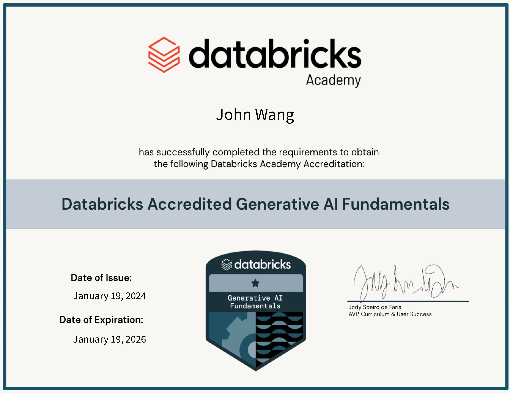

## Generative AI API (2)
### OpenAI Chat Completions API from Pluralsight by Xavier Morera

### OpenAI Assistant API from Pluralsight by Xavier Morera

## Retrieval-Augmented Generation (RAG) (3)
### Vector Space Models and Embeddings in RAGs from Pluralsight by Axel Sirota

### Multi-modal RAGs from Pluralsight by Dhiraj Kumar

### Modular RAGs from Pluralsight by JS Padoan

## Security (3)
### Defending Against AI-Generated Attacks from Codecademy

### Security Risks and Privacy Concerns Using Generative AI from Pluralsight by Dr. Shaila Rana

### AI Security from Lakera
* [John's Lakera online credential](https://security.certificates.lakera.ai/credentials/53495805-342d-41b7-b9bf-5923ae00422d)

## Governance (1)
### Introduction to Responsible AI from Google Cloud
* [John's Google Cloud online credential](https://coursera.org/verify/ZWGW9HZZC2ET)

## AWS (6)
### Amazon Bedrock Getting Started from AWS

### Automate Generative AI workflows using Amazon Bedrock Flows from AWS

### Building Retrieval Augmented Generation (RAG) workflows with Amazon OpenSearch Service from AWS

### AWS SimuLearn: Secure Conversational AI with Guardrails from AWS

### Introduction to Amazon Bedrock from Pluralsight by Muhammad Sajid

### Create AWS Infrastructure as Code Templates Using Generative AI from Pluralsight by Shubham Sinha

