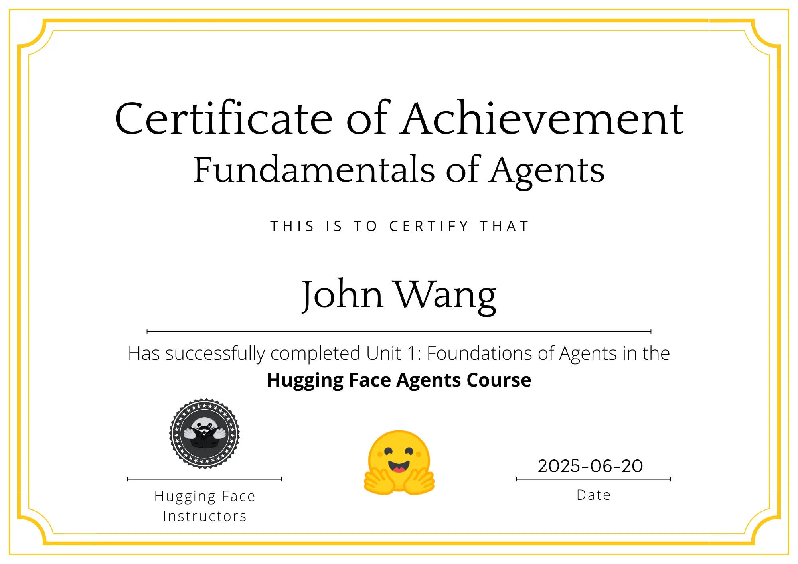

# John's Artificial Intelligence Certificates
1. [Strategy](#strategy-4)
    1. [AI Strategy and Governance from University of Pennsylvania, Wharton School](#ai-strategy-and-governance-from-university-of-pennsylvania-wharton-school)
    1. [Generative AI Strategic Leader Specialization (4 Courses) from Vanderbilt University by James White](#generative-ai-strategic-leader-specialization-4-courses-from-vanderbilt-university-by-james-white)
    1. [Chief Artificial Intelligence Officer from Copenhagen Compliance by Kersi Porbunderwalla](#chief-artificial-intelligence-officer-from-copenhagen-compliance-by-kersi-porbunderwalla)
    1. [AI+ Chief AI Officer™ from AI CERTs](#ai-chief-ai-officertm-from-ai-certs)
1. [Teaching](#teaching-1)
    1. [Teaching AI Fluency from Anthropic](#teaching-ai-fluency-from-anthropic)
1. [Fundamentals](#fundamentals-1)
    1. [AI Ready from STACKIT](#ai-ready-from-stackit)
1. [Product Management](#product-management-6)
    1. [Generative AI for Innovators from Pluralsight by Esteban Herrera](#generative-ai-for-innovators-from-pluralsight-by-esteban-herrera)
    1. [Artificial Intelligence Micro-Certification (AIC) from Product School by Sam Stevens](#artificial-intelligence-micro-certification-aic-from-product-school-by-sam-stevens)
    1. [AI for Product Management from Pendo](#ai-for-product-management-from-pendo)
    1. [AI Product from Great Learning Academy by Abhinanda Sarkar](#ai-product-from-great-learning-academy-by-abhinanda-sarkar)
    1. [AI Product Manager: Roles, Skills and Responsibilities from Great Learning Academy](#ai-product-manager-roles-skills-and-responsibilities-from-great-learning-academy)
    1. [AI and Customer Journey Essentials from Great Learning Academy by Kathie Feng](#ai-and-customer-journey-essentials-from-great-learning-academy-by-kathie-feng)
1. [AI Agents](#ai-agents-16)
    1. [Fundamentals of Agents from Hugging Face](#fundamentals-of-agents-from-hugging-face)
    1. [Agentic AI and AI Agents: A Primer for Leaders from Vanderbilt University by James White](#agentic-ai-and-ai-agents-a-primer-for-leaders-from-vanderbilt-university-by-james-white)
    1. [Claude Code: Software Engineering with Generative AI Agents from Vanderbilt University by James White](#claude-code-software-engineering-with-generative-ai-agents-from-vanderbilt-university-by-james-white)
    1. [Dremio-Powered AI Agents from Dremio by Alex Merced](#dremio-powered-ai-agents-from-dremio-by-alex-merced)
    1. [Introduction to Developing AI Agents from Pluralsight by Muhammad Sajid](#introduction-to-developing-ai-agents-from-pluralsight-by-muhammad-sajid)
    1. [Creating Personal AI Agents from Pluralsight by Kamran Ayub](#creating-personal-ai-agents-from-pluralsight-by-kamran-ayub)
    1. [Using AI Agents for Productivity from Pluralsight by Vlad Catrinescu](#using-ai-agents-for-productivity-from-pluralsight-by-vlad-catrinescu)
    1. [Human–AI Agent Collaboration from Pluralsight by Bogdan Sucaciu](#humanai-agent-collaboration-from-pluralsight-by-bogdan-sucaciu)
    1. [Agentic AI Lifecycle Management from Pluralsight by Eman Hassan](#agentic-ai-lifecycle-management-from-pluralsight-by-eman-hassan)
    1. [Deploying AI Agents in Production Environments from Pluralsight by Pratheerth Padman](#deploying-ai-agents-in-production-environments-from-pluralsight-by-pratheerth-padman)
    1. [Agentic AI Safety and Alignment from Pluralsight by Steve Buchanan](#agentic-ai-safety-and-alignment-from-pluralsight-by-steve-buchanan)
    1. [Agentic AI in Cybersecurity from Pluralsight by Tim Coakley](#agentic-ai-in-cybersecurity-from-pluralsight-by-tim-coakley)
    1. [Integrating AI Agents into Development Workflows from Pluralsight by Adam Bertram](#integrating-ai-agents-into-development-workflows-from-pluralsight-by-adam-bertram)
    1. [Integrating AI Agents in Enterprise Systems from Pluralsight by Tom Taulli](#integrating-ai-agents-in-enterprise-systems-from-pluralsight-by-tom-taulli)
    1. [Evaluating and Optimizing LLM Agents from Pluralsight by Brian Letort](#evaluating-and-optimizing-llm-agents-from-pluralsight-by-brian-letort)
    1. [Building Intelligent AI Agents from Great Learning Academy by Sneha VK](#building-intelligent-ai-agents-from-great-learning-academy-by-sneha-vk)
1. [AI Agents Orchestration](#ai-agents-orchestration-13)
    1. [Multi AI Agent Systems with CrewAI from CrewAI by João Moura](#multi-ai-agent-systems-with-crewai-from-crewai-by-joao-moura)
    1. [Mastering Multi-Agent Development with AutoGen from Packt by Paulo Dichone](#mastering-multi-agent-development-with-autogen-from-packt-by-paulo-dichone)
    1. [Elevate Team Productivity with Crew AI from Coursera by Yash Thakker](#elevate-team-productivity-with-crew-ai-from-coursera-by-yash-thakker)
    1. [Agentic AI for Beginner from Udemy by Aman Kumar](#agentic-ai-for-beginner-from-udemy-by-aman-kumar)
    1. [n8n: A Complete Guide to the Automation Tool from Analytics Vidhya by Gyan Prakash Tripathi](#n8n-a-complete-guide-to-the-automation-tool-from-analytics-vidhya-by-gyan-prakash-tripathi)
    1. [Introduction to CrewAI: Building a Researcher Assistant Agent from Analytics Vidhya by Alessandro Romano](#introduction-to-crewai-building-a-researcher-assistant-agent-from-analytics-vidhya-by-alessandro-romano)
    1. [Demystifying OpenAI Agents SDK from Analytics Vidhya by Prashant Sahu](#demystifying-openai-agents-sdk-from-analytics-vidhya-by-prashant-sahu)
    1. [Applying Multi-agent Systems to Daily Tasks from Pluralsight by Bogdan Sucaciu](#applying-multi-agent-systems-to-daily-tasks-from-pluralsight-by-bogdan-sucaciu)
    1. [Developing Multi-agent Systems from Pluralsight by Muhammad Sajid](#developing-multi-agent-systems-from-pluralsight-by-muhammad-sajid)
    1. [Developing Task-specific Agents with CrewAI from Pluralsight by Jon Friskics](#developing-task-specific-agents-with-crewai-from-pluralsight-by-jon-friskics)
    1. [Building Multi-agent Systems with AutoGen from Pluralsight by Sandy Ludosky](#building-multi-agent-systems-with-autogen-from-pluralsight-by-sandy-ludosky)
    1. [Introduction to LangGraph from Pluralsight by Craig Golightly](#introduction-to-langgraph-from-pluralsight-by-craig-golightly)
    1. [Basics of LangGraph Workflows from Pluralsight by Craig Golightly](#basics-of-langgraph-workflows-from-pluralsight-by-craig-golightly)
1. [A2A Protocol](#a2a-protocol-2)
    1. [Intro to Google's A2A Protocol: Interoperable AI Agents from Udemy by Yash Thakker](#intro-to-googles-a2a-protocol-interoperable-ai-agents-from-udemy-by-yash-thakker)
    1. [Agent2Agent (A2A) Protocol Fundamentals from Udemy by Mayfair Real Estate Institute](#agent2agent-a2a-protocol-fundamentals-from-udemy-by-mayfair-real-estate-institute)
1. [Model Context Protocol (MCP)](#model-context-protocol-mcp-10)
    1. [Model Context Protocol: Advanced Topics from Anthropic](#model-context-protocol-advanced-topics-from-anthropic)
    1. [Introduction to Model Context Protocol from Anthropic](#introduction-to-model-context-protocol-from-anthropic)
    1. [MCP for Production Automation from Hugging Face](#mcp-for-production-automation-from-hugging-face)
    1. [Fundamentals of MCP (Model Context Protocol) from Hugging Face](#fundamentals-of-mcp-model-context-protocol-from-hugging-face)
    1. [Model Context Protocol (MCP) – Simply explained from AWS](#model-context-protocol-mcp-simply-explained-from-aws)
    1. [Model Context Protocol (MCP) Mastery from Fractal Analytics Academy](#model-context-protocol-mcp-mastery-from-fractal-analytics-academy)
    1. [Foundations of Model Context Protocol from Analytics Vidhya by Apoorv Vishnoi](#foundations-of-model-context-protocol-from-analytics-vidhya-by-apoorv-vishnoi)
    1. [MCP: Unlock AI integrations with real-world demos from Analytics Vidhya by Aditya Oberai](#mcp-unlock-ai-integrations-with-real-world-demos-from-analytics-vidhya-by-aditya-oberai)
    1. [MCP Security Fundamentals from APIsec University by Corey Ball](#mcp-security-fundamentals-from-apisec-university-by-corey-ball)
    1. [Dremio MCP Server from Dremio by Alex Merced](#dremio-mcp-server-from-dremio-by-alex-merced)
1. [AI Assistants](#ai-assistants-6)
    1. [Amazon Q Business Getting Started from AWS](#amazon-q-business-getting-started-from-aws)
    1. [A Hands-On Look at Amazon Q Business Expert from AWS by Paul Colmer](#a-hands-on-look-at-amazon-q-business-expert-from-aws-by-paul-colmer)
    1. [Duet AI in Gmail from Google Cloud](#duet-ai-in-gmail-from-google-cloud)
    1. [Using Generative AI to Refine Communications to Executives from Pluralsight by Ed Freitas](#using-generative-ai-to-refine-communications-to-executives-from-pluralsight-by-ed-freitas)
    1. [SEO with AI from Sololearn](#seo-with-ai-from-sololearn)
    1. [ChatGPT for Excel from Great Learning Academy by E. Balachandra Murthy](#chatgpt-for-excel-from-great-learning-academy-by-e-balachandra-murthy)
1. [AI Code Assistants](#ai-code-assistants-4)
    1. [Claude Code in Action from Anthropic](#claude-code-in-action-from-anthropic)
    1. [Introduction to Amazon Q Developer (Technical) from AWS](#introduction-to-amazon-q-developer-technical-from-aws)
    1. [Intro to Claude AI from Scrimba by Shant Dashjian](#intro-to-claude-ai-from-scrimba-by-shant-dashjian)
    1. [Secure Coding with Amazon Q Developer from Pluralsight by Tom Taulli](#secure-coding-with-amazon-q-developer-from-pluralsight-by-tom-taulli)
1. [Vibe Coding](#vibe-coding-7)
    1. [Vibe Coding with Cursor AI from Scrimba by Maham Codes](#vibe-coding-with-cursor-ai-from-scrimba-by-maham-codes)
    1. [Build AI Apps with Lovable: Vibe Coding for Web Dev from Udemy by Pavan Kumar, Manish Patel](#build-ai-apps-with-lovable-vibe-coding-for-web-dev-from-udemy-by-pavan-kumar-manish-patel)
    1. [AI Development with Lovable AI 2.0 - A Deeper Dive from Udemy by Randy Minder](#ai-development-with-lovable-ai-20-a-deeper-dive-from-udemy-by-randy-minder)
    1. [Dashboards in Minutes with Claude AI: Stunning and NOW! from Udemy by Federico Garay](#dashboards-in-minutes-with-claude-ai-stunning-and-now-from-udemy-by-federico-garay)
    1. [Vibe Coding with Replit from Analytics Vidhya by Kunal Jain](#vibe-coding-with-replit-from-analytics-vidhya-by-kunal-jain)
    1. [Guide to Vibe Coding in Windsurf from Analytics Vidhya by Apoorv Vishnoi](#guide-to-vibe-coding-in-windsurf-from-analytics-vidhya-by-apoorv-vishnoi)
    1. [Vibe Coding from Sololearn](#vibe-coding-from-sololearn)
1. [Prompt Engineering](#prompt-engineering-5)
    1. [Prompt Engineering for ChatGPT from Vanderbilt University by James White](#prompt-engineering-for-chatgpt-from-vanderbilt-university-by-james-white)
    1. [Essentials of Prompt Engineering from AWS](#essentials-of-prompt-engineering-from-aws)
    1. [Prompt Engineering for Web Developers from Scrimba by Treasure Porth](#prompt-engineering-for-web-developers-from-scrimba-by-treasure-porth)
    1. [Prompt Engineering from Sololearn](#prompt-engineering-from-sololearn)
    1. [AI Prompting Essentials Certified (AIPEC) from Management and Strategy Institute](#ai-prompting-essentials-certified-aipec-from-management-and-strategy-institute)
1. [Generative AI](#generative-ai-11)
    1. [Generative AI SQL Database Specialist with ChatGPT Specialization (3 Courses) from Vanderbilt University by James White](#generative-ai-sql-database-specialist-with-chatgpt-specialization-3-courses-from-vanderbilt-university-by-james-white)
    1. [Generative AI Primer from Vanderbilt University by James White](#generative-ai-primer-from-vanderbilt-university-by-james-white)
    1. [Generative AI Deep Research: Strategic AI Edge for Leaders from Vanderbilt University by James White](#generative-ai-deep-research-strategic-ai-edge-for-leaders-from-vanderbilt-university-by-james-white)
    1. [Chat with Your Data: Generative AI-Powered SQL Data Analysis from Vanderbilt University by James White](#chat-with-your-data-generative-ai-powered-sql-data-analysis-from-vanderbilt-university-by-james-white)
    1. [ChatGPT + Excel: Master Data, Make Decisions, Tell Stories from Vanderbilt University by James White](#chatgpt-excel-master-data-make-decisions-tell-stories-from-vanderbilt-university-by-james-white)
    1. [Generative AI Database Design & Management with ChatGPT from Vanderbilt University by James White](#generative-ai-database-design-management-with-chatgpt-from-vanderbilt-university-by-james-white)
    1. [Work smarter with AI from Canva](#work-smarter-with-ai-from-canva)
    1. [Introduction to Generative AI from Google Cloud](#introduction-to-generative-ai-from-google-cloud)
    1. [Generative AI for Web Development Specialization (3 Courses) from Scrimba](#generative-ai-for-web-development-specialization-3-courses-from-scrimba)
    1. [AI Literacy Basics: Applying Generative AI in the Workplace from Udemy by Nicolle Merrill](#ai-literacy-basics-applying-generative-ai-in-the-workplace-from-udemy-by-nicolle-merrill)
    1. [Databricks Accredited Generative AI Fundamentals from Databricks](#databricks-accredited-generative-ai-fundamentals-from-databricks)
1. [Generative AI API](#generative-ai-api-2)
    1. [OpenAI Chat Completions API from Pluralsight by Xavier Morera](#openai-chat-completions-api-from-pluralsight-by-xavier-morera)
    1. [OpenAI Assistant API from Pluralsight by Xavier Morera](#openai-assistant-api-from-pluralsight-by-xavier-morera)
1. [Generative AI Images](#generative-ai-images-6)
    1. [Introduction to Image Generation from Google Cloud](#introduction-to-image-generation-from-google-cloud)
    1. [MidJourney: From Inspiration to Implementation from Analytics Vidhya by Sandeep Singh](#midjourney-from-inspiration-to-implementation-from-analytics-vidhya-by-sandeep-singh)
    1. [Exploring Stability.AI from Analytics Vidhya by Sandeep Singh](#exploring-stabilityai-from-analytics-vidhya-by-sandeep-singh)
    1. [Ghibli Art Using AI from Great Learning Academy by Rushikesh Meharwade](#ghibli-art-using-ai-from-great-learning-academy-by-rushikesh-meharwade)
    1. [Deepfakes Basics from Great Learning Academy by Dr. Abhinanda Sarkar, Anirudh Rao, Sampriti Chatterjee](#deepfakes-basics-from-great-learning-academy-by-dr-abhinanda-sarkar-anirudh-rao-sampriti-chatterjee)
    1. [Deepfake Demo from Great Learning Academy by Anirudh Rao](#deepfake-demo-from-great-learning-academy-by-anirudh-rao)
1. [Retrieval-Augmented Generation (RAG)](#retrieval-augmented-generation-rag-6)
    1. [Neo4j & GenerativeAI Fundamentals from Neo4j](#neo4j-generativeai-fundamentals-from-neo4j)
    1. [Supercharge AI with Knowledge Graphs: RAG System Mastery from Udemy by Paulo Dichone](#supercharge-ai-with-knowledge-graphs-rag-system-mastery-from-udemy-by-paulo-dichone)
    1. [Building Your first RAG System using LlamaIndex from Analytics Vidhya by Prashant Sahu, Ravi Theja](#building-your-first-rag-system-using-llamaindex-from-analytics-vidhya-by-prashant-sahu-ravi-theja)
    1. [Vector Space Models and Embeddings in RAGs from Pluralsight by Axel Sirota](#vector-space-models-and-embeddings-in-rags-from-pluralsight-by-axel-sirota)
    1. [Multi-modal RAGs from Pluralsight by Dhiraj Kumar](#multi-modal-rags-from-pluralsight-by-dhiraj-kumar)
    1. [Modular RAGs from Pluralsight by JS Padoan](#modular-rags-from-pluralsight-by-js-padoan)
1. [Security](#security-9)
    1. [Agentic AI - Risk and Cybersecurity Masterclass 2025 from Udemy by Taimur Ijlal](#agentic-ai-risk-and-cybersecurity-masterclass-2025-from-udemy-by-taimur-ijlal)
    1. [AI Security Bootcamp: LLM Hacking Basics from Udemy by Naveen Konrajankuppam Mahavishnu, Mohankumar Vengatachalam](#ai-security-bootcamp-llm-hacking-basics-from-udemy-by-naveen-konrajankuppam-mahavishnu-mohankumar-vengatachalam)
    1. [Defending Against AI-Generated Attacks from Codecademy](#defending-against-ai-generated-attacks-from-codecademy)
    1. [Building the AI Security Roadmap from Silicon Valley Certification Hub by Tiffany Saade](#building-the-ai-security-roadmap-from-silicon-valley-certification-hub-by-tiffany-saade)
    1. [Security Hot Takes: ChatGPT from Pluralsight by Xavier Morera](#security-hot-takes-chatgpt-from-pluralsight-by-xavier-morera)
    1. [Cybersecurity and Artificial Intelligence from Pluralsight by Christopher Rees](#cybersecurity-and-artificial-intelligence-from-pluralsight-by-christopher-rees)
    1. [OpenAI Security and Moderations from Pluralsight by Chris Jackson](#openai-security-and-moderations-from-pluralsight-by-chris-jackson)
    1. [Security Risks and Privacy Concerns Using Generative AI from Pluralsight by Dr. Shaila Rana](#security-risks-and-privacy-concerns-using-generative-ai-from-pluralsight-by-dr-shaila-rana)
    1. [AI Security from Lakera](#ai-security-from-lakera)
1. [Vulnerability Examples](#vulnerability-examples-1)
    1. [CVE-2025-32711 Microsoft 365 Copilot EchoLeak: Zero-click AI Vulnerability from Pluralsight by Chris Jackson](#cve-2025-32711-microsoft-365-copilot-echoleak-zero-click-ai-vulnerability-from-pluralsight-by-chris-jackson)
1. [Governance](#governance-12)
    1. [Responsible Generative AI from University of Michigan by Merve Hickok](#responsible-generative-ai-from-university-of-michigan-by-merve-hickok)
    1. [Generative AI: Fundamentals, Applications, and Challenges from University of Michigan by Merve Hickok](#generative-ai-fundamentals-applications-and-challenges-from-university-of-michigan-by-merve-hickok)
    1. [Generative AI: Impact on Business and Society from University of Michigan by Merve Hickok](#generative-ai-impact-on-business-and-society-from-university-of-michigan-by-merve-hickok)
    1. [Generative AI: Governance, Policy, and Emerging Regulation from University of Michigan by Merve Hickok](#generative-ai-governance-policy-and-emerging-regulation-from-university-of-michigan-by-merve-hickok)
    1. [Generative AI: Labor and the Future of Work from University of Michigan by Merve Hickok](#generative-ai-labor-and-the-future-of-work-from-university-of-michigan-by-merve-hickok)
    1. [Introduction to Responsible AI from Google Cloud](#introduction-to-responsible-ai-from-google-cloud)
    1. [Intro to AI Ethics from Kaggle](#intro-to-ai-ethics-from-kaggle)
    1. [AI Governance from STACKIT](#ai-governance-from-stackit)
    1. [AI-Ready Data from Silicon Valley Certification Hub by Kash Mehdi](#ai-ready-data-from-silicon-valley-certification-hub-by-kash-mehdi)
    1. [Navigating Global AI Policy and Regulations: Insights for Latam from Silicon Valley Certification Hub by Merve Hickok](#navigating-global-ai-policy-and-regulations-insights-for-latam-from-silicon-valley-certification-hub-by-merve-hickok)
    1. [Artificial Intelligence Essentials: Responsible AI from Pluralsight by Ben Weissman](#artificial-intelligence-essentials-responsible-ai-from-pluralsight-by-ben-weissman)
    1. [AI and the Law: Implementing Trustworthy AI from Pluralsight by Anton Ekker](#ai-and-the-law-implementing-trustworthy-ai-from-pluralsight-by-anton-ekker)
1. [AIOps](#aiops-2)
    1. [AIOps: Observability and Explainability for Production Models from Pluralsight by Russ Thomas](#aiops-observability-and-explainability-for-production-models-from-pluralsight-by-russ-thomas)
    1. [Scale and Deploy LLMs in Production Environments from Pluralsight by Abhishek Kumar](#scale-and-deploy-llms-in-production-environments-from-pluralsight-by-abhishek-kumar)
1. [AWS](#aws-15)
    1. [Building Your Agentic Applications the Well-Architected Way from AWS](#building-your-agentic-applications-the-well-architected-way-from-aws)
    1. [Amazon Bedrock Getting Started from AWS](#amazon-bedrock-getting-started-from-aws)
    1. [Introduction to Amazon Bedrock: Foundation Models and AI Applications from AWS](#introduction-to-amazon-bedrock-foundation-models-and-ai-applications-from-aws)
    1. [Automate Generative AI workflows using Amazon Bedrock Flows from AWS](#automate-generative-ai-workflows-using-amazon-bedrock-flows-from-aws)
    1. [Building Retrieval Augmented Generation (RAG) workflows with Amazon OpenSearch Service from AWS](#building-retrieval-augmented-generation-rag-workflows-with-amazon-opensearch-service-from-aws)
    1. [AWS SimuLearn: Secure Conversational AI with Guardrails from AWS](#aws-simulearn-secure-conversational-ai-with-guardrails-from-aws)
    1. [Amazon Bedrock AgentCore Getting Started from AWS](#amazon-bedrock-agentcore-getting-started-from-aws)
    1. [Amazon Bedrock AgentCore Identity Tutorial from AWS](#amazon-bedrock-agentcore-identity-tutorial-from-aws)
    1. [Amazon Bedrock AgentCore Memory Tutorial from AWS](#amazon-bedrock-agentcore-memory-tutorial-from-aws)
    1. [Amazon Bedrock AgentCore RunTime Tutorial from AWS](#amazon-bedrock-agentcore-runtime-tutorial-from-aws)
    1. [Amazon Bedrock AgentCore Tools Tutorial from AWS](#amazon-bedrock-agentcore-tools-tutorial-from-aws)
    1. [Generative AI Business Strategy and Solution Design from AWS by Jody Baty](#generative-ai-business-strategy-and-solution-design-from-aws-by-jody-baty)
    1. [Introduction to Amazon SageMaker from AWS](#introduction-to-amazon-sagemaker-from-aws)
    1. [Introduction to Amazon Bedrock from Pluralsight by Muhammad Sajid](#introduction-to-amazon-bedrock-from-pluralsight-by-muhammad-sajid)
    1. [Create AWS Infrastructure as Code Templates Using Generative AI from Pluralsight by Shubham Sinha](#create-aws-infrastructure-as-code-templates-using-generative-ai-from-pluralsight-by-shubham-sinha)
1. [Azure](#azure-1)
    1. [Azure AI Fundamentals from Pluralsight by Daniel Krzyczkowski](#azure-ai-fundamentals-from-pluralsight-by-daniel-krzyczkowski)
## Resources

1. [Artificial Intelligence Resource Links](../../links/artificial-intelligence/)
## Strategy (4)
### AI Strategy and Governance from University of Pennsylvania, Wharton School
* [John's University of Pennsylvania, Wharton School online credential](https://coursera.org/verify/DGB6XB4C7VKD)

### Generative AI Strategic Leader Specialization (4 Courses) from Vanderbilt University by James White
* [John's Vanderbilt University online credential](https://coursera.org/verify/specialization/MZFR2PSPD5UK)

### Chief Artificial Intelligence Officer from Copenhagen Compliance by Kersi Porbunderwalla

### AI+ Chief AI Officer™ from AI CERTs
* [John's AI CERTs online credential](https://verify.certs365.io/?=05f5ffd0a95d)

## Teaching (1)
### Teaching AI Fluency from Anthropic
* [John's Anthropic online credential](https://verify.skilljar.com/c/o6e6wbt7oma6)

## Fundamentals (1)
### AI Ready from STACKIT

## Product Management (6)
### Generative AI for Innovators from Pluralsight by Esteban Herrera

### Artificial Intelligence Micro-Certification (AIC) from Product School by Sam Stevens

### AI for Product Management from Pendo
* [John's Credly online profile](https://www.credly.com/users/grokify/)
* [John's Pendo online credential](https://www.credly.com/badges/64f1712e-652a-4f49-b392-209f420f5b38)

### AI Product from Great Learning Academy by Abhinanda Sarkar
* [John's Great Learning Academy online credential](https://www.mygreatlearning.com/certificate/UHWQWTQT)

### AI Product Manager: Roles, Skills and Responsibilities from Great Learning Academy
* [John's Great Learning Academy online credential](https://www.mygreatlearning.com/certificate/ZIBSQYCA)

### AI and Customer Journey Essentials from Great Learning Academy by Kathie Feng
* [John's Great Learning Academy online credential](https://www.mygreatlearning.com/certificate/XNICZSBZ)

## AI Agents (16)
### Fundamentals of Agents from Hugging Face
* [John's Hugging Face online credential](https://huggingface.co/datasets/agents-course/certificates/resolve/main/certificates/grokify/2025-06-20.png)

### Agentic AI and AI Agents: A Primer for Leaders from Vanderbilt University by James White
* [John's Vanderbilt University online credential](https://coursera.org/verify/APXUOJ49ZSFI)

### Claude Code: Software Engineering with Generative AI Agents from Vanderbilt University by James White
* [John's Vanderbilt University online credential](https://coursera.org/verify/1LRTE17NTNXQ)

### Dremio-Powered AI Agents from Dremio by Alex Merced
* [John's Dremio online credential](https://mycourse.app/SUPaoxZw0ZS7TgJio)

### Introduction to Developing AI Agents from Pluralsight by Muhammad Sajid

### Creating Personal AI Agents from Pluralsight by Kamran Ayub

### Using AI Agents for Productivity from Pluralsight by Vlad Catrinescu

### Human–AI Agent Collaboration from Pluralsight by Bogdan Sucaciu

### Agentic AI Lifecycle Management from Pluralsight by Eman Hassan

### Deploying AI Agents in Production Environments from Pluralsight by Pratheerth Padman

### Agentic AI Safety and Alignment from Pluralsight by Steve Buchanan

### Agentic AI in Cybersecurity from Pluralsight by Tim Coakley

### Integrating AI Agents into Development Workflows from Pluralsight by Adam Bertram

### Integrating AI Agents in Enterprise Systems from Pluralsight by Tom Taulli

### Evaluating and Optimizing LLM Agents from Pluralsight by Brian Letort

### Building Intelligent AI Agents from Great Learning Academy by Sneha VK
* [John's Great Learning Academy online credential](https://www.mygreatlearning.com/certificate/QKDQCPMT)

## AI Agents Orchestration (13)
### Multi AI Agent Systems with CrewAI from CrewAI by João Moura

### Mastering Multi-Agent Development with AutoGen from Packt by Paulo Dichone
* [John's Packt online credential](https://coursera.org/verify/I7EM70S5CNDA)

### Elevate Team Productivity with Crew AI from Coursera by Yash Thakker
* [John's Coursera online credential](https://coursera.org/verify/PL8QUEVA2NYB)

### Agentic AI for Beginner from Udemy by Aman Kumar
* [John's Udemy online credential](http://ude.my/UC-a0ba79a9-c37a-4fc1-a044-91d54fb7fed0)

### n8n: A Complete Guide to the Automation Tool from Analytics Vidhya by Gyan Prakash Tripathi
* [John's Analytics Vidhya online credential](https://courses.analyticsvidhya.com/certificates/8lnnxuybwr)

### Introduction to CrewAI: Building a Researcher Assistant Agent from Analytics Vidhya by Alessandro Romano
* [John's Analytics Vidhya online credential](https://courses.analyticsvidhya.com/certificates/bovpkhdpsd)

### Demystifying OpenAI Agents SDK from Analytics Vidhya by Prashant Sahu
* [John's Analytics Vidhya online credential](https://courses.analyticsvidhya.com/certificates/7qmywnllzk)

### Applying Multi-agent Systems to Daily Tasks from Pluralsight by Bogdan Sucaciu

### Developing Multi-agent Systems from Pluralsight by Muhammad Sajid

### Developing Task-specific Agents with CrewAI from Pluralsight by Jon Friskics

### Building Multi-agent Systems with AutoGen from Pluralsight by Sandy Ludosky

### Introduction to LangGraph from Pluralsight by Craig Golightly

### Basics of LangGraph Workflows from Pluralsight by Craig Golightly

## A2A Protocol (2)
### Intro to Google's A2A Protocol: Interoperable AI Agents from Udemy by Yash Thakker
* [John's Udemy online credential](http://ude.my/UC-575247de-13c9-44c2-9139-9fe1582f27d9/)

### Agent2Agent (A2A) Protocol Fundamentals from Udemy by Mayfair Real Estate Institute
* [John's Udemy online credential](http://ude.my/UC-8c673384-3329-4fd3-9502-6ba873b5bf96/)

## Model Context Protocol (MCP) (10)
### Model Context Protocol: Advanced Topics from Anthropic
* [John's Anthropic online credential](https://verify.skilljar.com/c/mu9br5w7hgpu)

### Introduction to Model Context Protocol from Anthropic
* [John's Anthropic online credential](https://verify.skilljar.com/c/z63bcx5kdca8)

### MCP for Production Automation from Hugging Face
* [John's Hugging Face online credential](https://cdn-uploads.huggingface.co/production/uploads/noauth/tzZ2UDkYY3vwymJ368oB-.webp)

### Fundamentals of MCP (Model Context Protocol) from Hugging Face
* [John's Hugging Face online credential](https://huggingface.co/datasets/mcp-course/certificates/resolve/main/certificates/grokify/2025-06-14.png)

### Model Context Protocol (MCP) – Simply explained from AWS

### Model Context Protocol (MCP) Mastery from Fractal Analytics Academy
* [John's Fractal Analytics Academy online credential](https://coursera.org/verify/0JTIA6PWXHVI)

### Foundations of Model Context Protocol from Analytics Vidhya by Apoorv Vishnoi
* [John's Analytics Vidhya online credential](https://courses.analyticsvidhya.com/certificates/xea7hrnfdb)

### MCP: Unlock AI integrations with real-world demos from Analytics Vidhya by Aditya Oberai
* [John's Analytics Vidhya online credential](https://courses.analyticsvidhya.com/certificates/mim2vizdvc)

### MCP Security Fundamentals from APIsec University by Corey Ball

### Dremio MCP Server from Dremio by Alex Merced
* [John's Dremio online credential](https://mycourse.app/O3RwtKTwnNIIZQn67)

## AI Assistants (6)
### Amazon Q Business Getting Started from AWS

### A Hands-On Look at Amazon Q Business Expert from AWS by Paul Colmer

### Duet AI in Gmail from Google Cloud
* [John's Google Cloud online credential](https://coursera.org/verify/DHKM6DF4MQ67)

### Using Generative AI to Refine Communications to Executives from Pluralsight by Ed Freitas

### SEO with AI from Sololearn
* [John's Sololearn online credential](https://www.sololearn.com/certificates/CC-8PJDAA6M)

### ChatGPT for Excel from Great Learning Academy by E. Balachandra Murthy
* [John's Great Learning Academy online credential](https://verify.mygreatlearning.com/verify/WFDRKONI)

## AI Code Assistants (4)
### Claude Code in Action from Anthropic
* [John's Anthropic online credential](https://verify.skilljar.com/c/j3k4jnhhakvj)

### Introduction to Amazon Q Developer (Technical) from AWS

### Intro to Claude AI from Scrimba by Shant Dashjian
* [John's Scrimba online credential](https://www.coursera.org/verify/BJ2AJF89N18M)

### Secure Coding with Amazon Q Developer from Pluralsight by Tom Taulli

## Vibe Coding (7)
### Vibe Coding with Cursor AI from Scrimba by Maham Codes
* [John's Scrimba online credential](https://www.coursera.org/verify/YYQ26P22WQQF)

### Build AI Apps with Lovable: Vibe Coding for Web Dev from Udemy by Pavan Kumar, Manish Patel
* [John's Udemy online credential](https://www.udemy.com/certificate/UC-054ec269-a6c0-4c85-90ff-5539102c80a7/)

### AI Development with Lovable AI 2.0 - A Deeper Dive from Udemy by Randy Minder
* [John's Udemy online credential](https://www.udemy.com/certificate/UC-27c83ee7-731e-4879-a2aa-5042b98d267f/)

### Dashboards in Minutes with Claude AI: Stunning and NOW! from Udemy by Federico Garay
* [John's Udemy online credential](https://www.udemy.com/certificate/UC-08a2f155-d9e0-4a66-a4aa-113051caa9ca/)

### Vibe Coding with Replit from Analytics Vidhya by Kunal Jain
* [John's Analytics Vidhya online credential](https://courses.analyticsvidhya.com/certificates/jf8ns9xz2w)

### Guide to Vibe Coding in Windsurf from Analytics Vidhya by Apoorv Vishnoi
* [John's Analytics Vidhya online credential](https://courses.analyticsvidhya.com/certificates/edmxgsnnvy)

### Vibe Coding from Sololearn
* [John's Sololearn online credential](https://www.sololearn.com/certificates/CC-H5DTUCSU)

## Prompt Engineering (5)
### Prompt Engineering for ChatGPT from Vanderbilt University by James White
* [John's Vanderbilt University online credential](https://coursera.org/verify/9VHLWEHPR0QV)

### Essentials of Prompt Engineering from AWS

### Prompt Engineering for Web Developers from Scrimba by Treasure Porth
* [John's Scrimba online credential](https://www.coursera.org/verify/EDM1OJ4B87Q4)

### Prompt Engineering from Sololearn
* [John's Sololearn online credential](https://www.sololearn.com/en/certificates/CC-6UVMSWSY/)

### AI Prompting Essentials Certified (AIPEC) from Management and Strategy Institute
* [John's Management and Strategy Institute online credential](https://www.proprofs.com/quiz-school/user_certificate.php?id=347250771&qid=3809416)

## Generative AI (11)
### Generative AI SQL Database Specialist with ChatGPT Specialization (3 Courses) from Vanderbilt University by James White
* [John's Vanderbilt University online credential](https://coursera.org/verify/specialization/PFS4AXZ9EIF4)

### Generative AI Primer from Vanderbilt University by James White
* [John's Vanderbilt University online credential](https://coursera.org/verify/Y8JRWZ58E62M)

### Generative AI Deep Research: Strategic AI Edge for Leaders from Vanderbilt University by James White
* [John's Vanderbilt University online credential](https://coursera.org/verify/HSTIHLM4FCWG)

### Chat with Your Data: Generative AI-Powered SQL Data Analysis from Vanderbilt University by James White
* [John's Vanderbilt University online credential](https://coursera.org/verify/KZ5NKNL9FZ1M)

### ChatGPT + Excel: Master Data, Make Decisions, Tell Stories from Vanderbilt University by James White
* [John's Vanderbilt University online credential](https://coursera.org/verify/2JV659VK31TV)

### Generative AI Database Design & Management with ChatGPT from Vanderbilt University by James White
* [John's Vanderbilt University online credential](https://coursera.org/verify/76CR020U130O)

### Work smarter with AI from Canva
* [John's Canva online credential](https://www.canva.com/design-school/certification-award/09baca73-3c63-48ab-bc9a-a96519f200ac)

### Introduction to Generative AI from Google Cloud
* [John's Google Cloud online credential](https://coursera.org/verify/3VBHJ76MBTU9)

### Generative AI for Web Development Specialization (3 Courses) from Scrimba
* [John's Scrimba online credential](https://www.coursera.org/verify/specialization/VY1BKDGDO76G)

### AI Literacy Basics: Applying Generative AI in the Workplace from Udemy by Nicolle Merrill
* [John's Udemy online credential](http://ude.my/UC-ee0ddc67-8697-4d0f-b00d-d81bd8bb75c7/)

### Databricks Accredited Generative AI Fundamentals from Databricks
* [John's Databricks online profile](https://credentials.databricks.com/profile/grokify)
* [John's Databricks online credential](https://credentials.databricks.com/4ca910a4-6dd5-4e91-97a7-ccc7ed80424f)

## Generative AI API (2)
### OpenAI Chat Completions API from Pluralsight by Xavier Morera

### OpenAI Assistant API from Pluralsight by Xavier Morera

## Generative AI Images (6)
### Introduction to Image Generation from Google Cloud
* [John's Google Cloud online credential](https://coursera.org/verify/8QPV3NJLRBUK)

### MidJourney: From Inspiration to Implementation from Analytics Vidhya by Sandeep Singh
* [John's Analytics Vidhya online credential](https://courses.analyticsvidhya.com/certificates/edmxgsnnvy)

### Exploring Stability.AI from Analytics Vidhya by Sandeep Singh
* [John's Analytics Vidhya online credential](https://courses.analyticsvidhya.com/certificates/qkjf9asxfc)

### Ghibli Art Using AI from Great Learning Academy by Rushikesh Meharwade
* [John's Great Learning Academy online credential](https://www.mygreatlearning.com/certificate/AOQMNOYI)

### Deepfakes Basics from Great Learning Academy by Dr. Abhinanda Sarkar, Anirudh Rao, Sampriti Chatterjee
* [John's Great Learning Academy online credential](https://www.mygreatlearning.com/certificate/QHMVPUVP)

### Deepfake Demo from Great Learning Academy by Anirudh Rao
* [John's Great Learning Academy online credential](https://www.mygreatlearning.com/certificate/DOVTINJH)

## Retrieval-Augmented Generation (RAG) (6)
### Neo4j & GenerativeAI Fundamentals from Neo4j
* [John's Neo4j online credential](https://graphacademy.neo4j.com/c/3cc6608a-217d-4dde-a0cb-75e2b2c93098/)

### Supercharge AI with Knowledge Graphs: RAG System Mastery from Udemy by Paulo Dichone
* [John's Udemy online credential](http://ude.my/UC-dd892633-ab1d-4092-80f2-1539d60358a0/)

### Building Your first RAG System using LlamaIndex from Analytics Vidhya by Prashant Sahu, Ravi Theja
* [John's Analytics Vidhya online credential](https://courses.analyticsvidhya.com/certificates/usqyy5wkd5)

### Vector Space Models and Embeddings in RAGs from Pluralsight by Axel Sirota

### Multi-modal RAGs from Pluralsight by Dhiraj Kumar

### Modular RAGs from Pluralsight by JS Padoan

## Security (9)
### Agentic AI - Risk and Cybersecurity Masterclass 2025 from Udemy by Taimur Ijlal
* [John's Udemy online credential](http://ude.my/UC-ab54d286-b26e-4cd6-bae5-3c7f5e4c975e)

### AI Security Bootcamp: LLM Hacking Basics from Udemy by Naveen Konrajankuppam Mahavishnu, Mohankumar Vengatachalam
* [John's Udemy online credential](http://ude.my/UC-e1b44f95-516d-41e1-af3e-686c0dbb38e1)

### Defending Against AI-Generated Attacks from Codecademy

### Building the AI Security Roadmap from Silicon Valley Certification Hub by Tiffany Saade
* [John's Silicon Valley Certification Hub online credential](https://svch.io/tutor-certificate-2-2/?cert_hash=415e03ea4ad86a07)

### Security Hot Takes: ChatGPT from Pluralsight by Xavier Morera

### Cybersecurity and Artificial Intelligence from Pluralsight by Christopher Rees

### OpenAI Security and Moderations from Pluralsight by Chris Jackson

### Security Risks and Privacy Concerns Using Generative AI from Pluralsight by Dr. Shaila Rana

### AI Security from Lakera
* [John's Lakera online credential](https://security.certificates.lakera.ai/credentials/53495805-342d-41b7-b9bf-5923ae00422d)

## Vulnerability Examples (1)
### CVE-2025-32711 Microsoft 365 Copilot EchoLeak: Zero-click AI Vulnerability from Pluralsight by Chris Jackson

## Governance (12)
### Responsible Generative AI from University of Michigan by Merve Hickok
* [John's University of Michigan online credential](https://coursera.org/verify/specialization/BWWDTFDSRMU0)

### Generative AI: Fundamentals, Applications, and Challenges from University of Michigan by Merve Hickok
* [John's University of Michigan online credential](https://coursera.org/verify/5STNSVJ5488J)

### Generative AI: Impact on Business and Society from University of Michigan by Merve Hickok
* [John's University of Michigan online credential](https://coursera.org/verify/6S88Q6OU4ZHT)

### Generative AI: Governance, Policy, and Emerging Regulation from University of Michigan by Merve Hickok
* [John's University of Michigan online credential](https://coursera.org/verify/HFXGLDS9S8N1)

### Generative AI: Labor and the Future of Work from University of Michigan by Merve Hickok
* [John's University of Michigan online credential](https://coursera.org/verify/RQ0HBHAKIUFD)

### Introduction to Responsible AI from Google Cloud
* [John's Google Cloud online credential](https://coursera.org/verify/ZWGW9HZZC2ET)

### Intro to AI Ethics from Kaggle
* [John's Kaggle online credential](https://www.kaggle.com/learn/certification/grokify/intro-to-ai-ethics)

### AI Governance from STACKIT

### AI-Ready Data from Silicon Valley Certification Hub by Kash Mehdi
* [John's Silicon Valley Certification Hub online credential](https://svch.io/tutor-certificate-2-2/?cert_hash=359fdc8bb7d3b3fb)

### Navigating Global AI Policy and Regulations: Insights for Latam from Silicon Valley Certification Hub by Merve Hickok
* [John's Silicon Valley Certification Hub online credential](https://svch.io/tutor-certificate-2-2/?cert_hash=86333c1144297c63&regenerate=1)

### Artificial Intelligence Essentials: Responsible AI from Pluralsight by Ben Weissman

### AI and the Law: Implementing Trustworthy AI from Pluralsight by Anton Ekker

## AIOps (2)
### AIOps: Observability and Explainability for Production Models from Pluralsight by Russ Thomas

### Scale and Deploy LLMs in Production Environments from Pluralsight by Abhishek Kumar

## AWS (15)
### Building Your Agentic Applications the Well-Architected Way from AWS

### Amazon Bedrock Getting Started from AWS

### Introduction to Amazon Bedrock: Foundation Models and AI Applications from AWS

### Automate Generative AI workflows using Amazon Bedrock Flows from AWS

### Building Retrieval Augmented Generation (RAG) workflows with Amazon OpenSearch Service from AWS

### AWS SimuLearn: Secure Conversational AI with Guardrails from AWS

### Amazon Bedrock AgentCore Getting Started from AWS

### Amazon Bedrock AgentCore Identity Tutorial from AWS

### Amazon Bedrock AgentCore Memory Tutorial from AWS

### Amazon Bedrock AgentCore RunTime Tutorial from AWS

### Amazon Bedrock AgentCore Tools Tutorial from AWS

### Generative AI Business Strategy and Solution Design from AWS by Jody Baty

### Introduction to Amazon SageMaker from AWS

### Introduction to Amazon Bedrock from Pluralsight by Muhammad Sajid

### Create AWS Infrastructure as Code Templates Using Generative AI from Pluralsight by Shubham Sinha

## Azure (1)
### Azure AI Fundamentals from Pluralsight by Daniel Krzyczkowski

