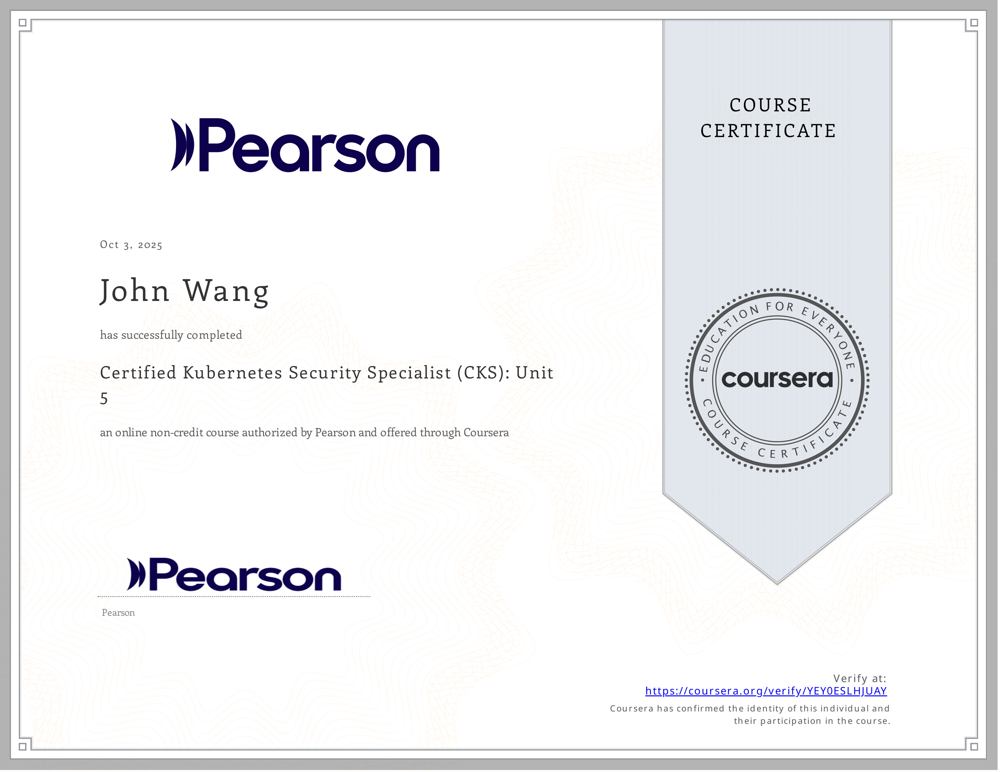
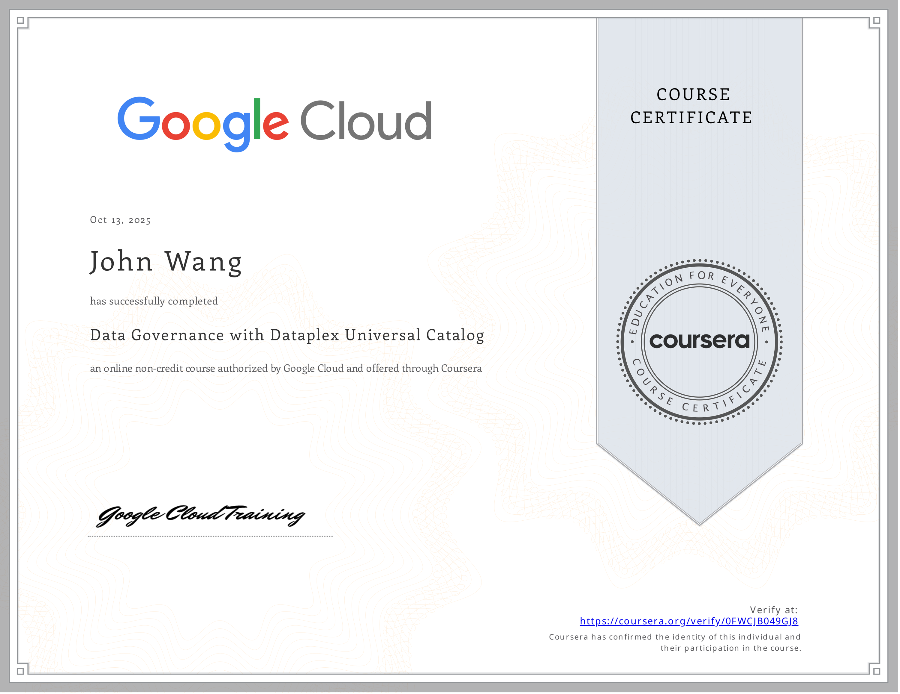

# John's Cloud Computing Certificates
1. [Container Security](#container-security-3)
    1. [Painless Vulnerability Management from Chainguard](#painless-vulnerability-management-from-chainguard)
    1. [NeuVector Basics from Rancher Academy](#neuvector-basics-from-rancher-academy)
    1. [Container Infrastructure Analysis with Trivy from Pluralsight by Zach Roof](#container-infrastructure-analysis-with-trivy-from-pluralsight-by-zach-roof)
1. [Kubernetes Administration](#kubernetes-administration-2)
    1. [Certified Kubernetes Administrator: Kubernetes Foundations from Pluralsight by Anthony Nocentino](#certified-kubernetes-administrator-kubernetes-foundations-from-pluralsight-by-anthony-nocentino)
    1. [Packaging Applications with Helm for Kubernetes from Pluralsight by Philippe Collignon](#packaging-applications-with-helm-for-kubernetes-from-pluralsight-by-philippe-collignon)
1. [Kubernetes Observability](#kubernetes-observability-3)
    1. [Monitoring a Kubernetes Cluster: Install the Agent from Datadog](#monitoring-a-kubernetes-cluster-install-the-agent-from-datadog)
    1. [Monitoring a Kubernetes Cluster: The Control Plane from Datadog](#monitoring-a-kubernetes-cluster-the-control-plane-from-datadog)
    1. [Monitoring a Kubernetes Cluster: Troubleshooting Workloads from Datadog](#monitoring-a-kubernetes-cluster-troubleshooting-workloads-from-datadog)
1. [Kubernetes Security](#kubernetes-security-6)
    1. [Certified Kubernetes Security Specialist (CKS): Unit 5 from Pearson by Chris Jackson](#certified-kubernetes-security-specialist-cks-unit-5-from-pearson-by-chris-jackson)
    1. [Kubernetes Security: Cluster Setup from Pluralsight by Antonio Jesús Piedra](#kubernetes-security-cluster-setup-from-pluralsight-by-antonio-jesus-piedra)
    1. [Kubernetes Security: Cluster Hardening from Pluralsight by Erik Whitaker](#kubernetes-security-cluster-hardening-from-pluralsight-by-erik-whitaker)
    1. [Kubernetes Security: Minimizing Microservice Vulnerabilities from Pluralsight by Justin Boyer](#kubernetes-security-minimizing-microservice-vulnerabilities-from-pluralsight-by-justin-boyer)
    1. [Kubernetes Security: Implementing Monitoring, Logging, and Runtime Security from Pluralsight by Antonio Jesús Piedra](#kubernetes-security-implementing-monitoring-logging-and-runtime-security-from-pluralsight-by-antonio-jesus-piedra)
    1. [Kubernetes Security: Implementing Supply Chain Security from Pluralsight by Antonio Jesús Piedra](#kubernetes-security-implementing-supply-chain-security-from-pluralsight-by-antonio-jesus-piedra)
1. [Hyperscalers](#hyperscalers-1)
    1. [AWS vs Azure vs GCP from Great Learning Academy by Vishal Padghan](#aws-vs-azure-vs-gcp-from-great-learning-academy-by-vishal-padghan)
1. [AWS](#aws-10)
    1. [Designing Landing Zone Architectures with AWS Control Tower from AWS](#designing-landing-zone-architectures-with-aws-control-tower-from-aws)
    1. [AWS Shared Responsibility Model from AWS](#aws-shared-responsibility-model-from-aws)
    1. [Create AWS Infrastructure as Code Templates Using Generative AI from Pluralsight by Shubham Sinha](#create-aws-infrastructure-as-code-templates-using-generative-ai-from-pluralsight-by-shubham-sinha)
    1. [Introduction to AWS Identity and Access Management (IAM) from Simplilearn](#introduction-to-aws-identity-and-access-management-iam-from-simplilearn)
    1. [Introduction to AWS Trusted Advisor from Simplilearn](#introduction-to-aws-trusted-advisor-from-simplilearn)
    1. [Getting Started with AWS Security Hub from Simplilearn](#getting-started-with-aws-security-hub-from-simplilearn)
    1. [Introduction to AWS Security Token Services (STS) from Simplilearn](#introduction-to-aws-security-token-services-sts-from-simplilearn)
    1. [Getting Started with AWS Control Tower from Simplilearn](#getting-started-with-aws-control-tower-from-simplilearn)
    1. [AWS CI/CD Pipeline from Great Learning Academy](#aws-cicd-pipeline-from-great-learning-academy)
    1. [AWS: Identity and Access Management from Whizlabs](#aws-identity-and-access-management-from-whizlabs)
1. [AWS Bedrock](#aws-bedrock-6)
    1. [Amazon Bedrock Getting Started from AWS](#amazon-bedrock-getting-started-from-aws)
    1. [Introduction to Amazon Bedrock: Foundation Models and AI Applications from AWS](#introduction-to-amazon-bedrock-foundation-models-and-ai-applications-from-aws)
    1. [Automate Generative AI workflows using Amazon Bedrock Flows from AWS](#automate-generative-ai-workflows-using-amazon-bedrock-flows-from-aws)
    1. [Building Retrieval Augmented Generation (RAG) workflows with Amazon OpenSearch Service from AWS](#building-retrieval-augmented-generation-rag-workflows-with-amazon-opensearch-service-from-aws)
    1. [AWS SimuLearn: Secure Conversational AI with Guardrails from AWS](#aws-simulearn-secure-conversational-ai-with-guardrails-from-aws)
    1. [Introduction to Amazon Bedrock from Pluralsight by Muhammad Sajid](#introduction-to-amazon-bedrock-from-pluralsight-by-muhammad-sajid)
1. [AWS Bedrock AgentCore](#aws-bedrock-agentcore-5)
    1. [Amazon Bedrock AgentCore Getting Started from AWS](#amazon-bedrock-agentcore-getting-started-from-aws)
    1. [Amazon Bedrock AgentCore Identity Tutorial from AWS](#amazon-bedrock-agentcore-identity-tutorial-from-aws)
    1. [Amazon Bedrock AgentCore Memory Tutorial from AWS](#amazon-bedrock-agentcore-memory-tutorial-from-aws)
    1. [Amazon Bedrock AgentCore RunTime Tutorial from AWS](#amazon-bedrock-agentcore-runtime-tutorial-from-aws)
    1. [Amazon Bedrock AgentCore Tools Tutorial from AWS](#amazon-bedrock-agentcore-tools-tutorial-from-aws)
1. [AWS SageMaker](#aws-sagemaker-2)
    1. [Introduction to Amazon SageMaker from AWS](#introduction-to-amazon-sagemaker-from-aws)
    1. [AWS SageMaker from Great Learning Academy by Vishal Padghan](#aws-sagemaker-from-great-learning-academy-by-vishal-padghan)
1. [AWS Well-Architected](#aws-well-architected-2)
    1. [Building Your Agentic Applications the Well-Architected Way from AWS](#building-your-agentic-applications-the-well-architected-way-from-aws)
    1. [Well-Architected For Enterprises from AWS](#well-architected-for-enterprises-from-aws)
1. [Azure](#azure-3)
    1. [Azure AI Fundamentals from Pluralsight by Daniel Krzyczkowski](#azure-ai-fundamentals-from-pluralsight-by-daniel-krzyczkowski)
    1. [Create Azure Resource Manager Templates Using Generative AI from Pluralsight by Bismark Adomako](#create-azure-resource-manager-templates-using-generative-ai-from-pluralsight-by-bismark-adomako)
    1. [Microsoft Azure Solutions Architect: Design for High Availability from Pluralsight by Barry Luijbregts](#microsoft-azure-solutions-architect-design-for-high-availability-from-pluralsight-by-barry-luijbregts)
1. [Google Cloud Platform (GCP)](#google-cloud-platform-gcp-2)
    1. [Scaling with Google Cloud Operations from Google Cloud](#scaling-with-google-cloud-operations-from-google-cloud)
    1. [Data Governance with Dataplex Universal Catalog from Google Cloud](#data-governance-with-dataplex-universal-catalog-from-google-cloud)
1. [Datadog](#datadog-1)
    1. [Detect, Prioritize, and Remediate Cloud Security Risks with Datadog CSM from Datadog](#detect-prioritize-and-remediate-cloud-security-risks-with-datadog-csm-from-datadog)
## Container Security (3)
### Painless Vulnerability Management from Chainguard
* [John's Credly online profile](https://www.credly.com/users/grokify/)
* [John's Chainguard online credential](https://verify.skilljar.com/c/mp47sq9gms8t)

### NeuVector Basics from Rancher Academy
* [John's Rancher Academy online credential](https://www.rancher.academy/certificates/pnr5lqx5uw)

### Container Infrastructure Analysis with Trivy from Pluralsight by Zach Roof

## Kubernetes Administration (2)
### Certified Kubernetes Administrator: Kubernetes Foundations from Pluralsight by Anthony Nocentino

### Packaging Applications with Helm for Kubernetes from Pluralsight by Philippe Collignon

## Kubernetes Observability (3)
### Monitoring a Kubernetes Cluster: Install the Agent from Datadog
* [John's Datadog online credential](https://learn.datadoghq.com/certificates/jsko012qas)

### Monitoring a Kubernetes Cluster: The Control Plane from Datadog
* [John's Datadog online credential](https://learn.datadoghq.com/certificates/ehnz89oual)

### Monitoring a Kubernetes Cluster: Troubleshooting Workloads from Datadog
* [John's Datadog online credential](https://learn.datadoghq.com/certificates/8v4xiyb3tt)

## Kubernetes Security (6)
### Certified Kubernetes Security Specialist (CKS): Unit 5 from Pearson by Chris Jackson
* [John's Pearson online credential](https://coursera.org/verify/YEY0ESLHJUAY)

### Kubernetes Security: Cluster Setup from Pluralsight by Antonio Jesús Piedra

### Kubernetes Security: Cluster Hardening from Pluralsight by Erik Whitaker

### Kubernetes Security: Minimizing Microservice Vulnerabilities from Pluralsight by Justin Boyer

### Kubernetes Security: Implementing Monitoring, Logging, and Runtime Security from Pluralsight by Antonio Jesús Piedra

### Kubernetes Security: Implementing Supply Chain Security from Pluralsight by Antonio Jesús Piedra

## Hyperscalers (1)
### AWS vs Azure vs GCP from Great Learning Academy by Vishal Padghan
* [John's Great Learning Academy online credential](https://verify.mygreatlearning.com/verify/WRHCURXB)

## AWS (10)
### Designing Landing Zone Architectures with AWS Control Tower from AWS

### AWS Shared Responsibility Model from AWS

### Create AWS Infrastructure as Code Templates Using Generative AI from Pluralsight by Shubham Sinha

### Introduction to AWS Identity and Access Management (IAM) from Simplilearn

### Introduction to AWS Trusted Advisor from Simplilearn

### Getting Started with AWS Security Hub from Simplilearn

### Introduction to AWS Security Token Services (STS) from Simplilearn

### Getting Started with AWS Control Tower from Simplilearn

### AWS CI/CD Pipeline from Great Learning Academy
* [John's Great Learning Academy online credential](/www.mygreatlearning.com/certificate/ZGRSHOKG)

### AWS: Identity and Access Management from Whizlabs
* [John's Whizlabs online credential](https://coursera.org/verify/QRD93E7CVUMP)

## AWS Bedrock (6)
### Amazon Bedrock Getting Started from AWS

### Introduction to Amazon Bedrock: Foundation Models and AI Applications from AWS

### Automate Generative AI workflows using Amazon Bedrock Flows from AWS

### Building Retrieval Augmented Generation (RAG) workflows with Amazon OpenSearch Service from AWS

### AWS SimuLearn: Secure Conversational AI with Guardrails from AWS

### Introduction to Amazon Bedrock from Pluralsight by Muhammad Sajid

## AWS Bedrock AgentCore (5)
### Amazon Bedrock AgentCore Getting Started from AWS

### Amazon Bedrock AgentCore Identity Tutorial from AWS

### Amazon Bedrock AgentCore Memory Tutorial from AWS

### Amazon Bedrock AgentCore RunTime Tutorial from AWS

### Amazon Bedrock AgentCore Tools Tutorial from AWS

## AWS SageMaker (2)
### Introduction to Amazon SageMaker from AWS

### AWS SageMaker from Great Learning Academy by Vishal Padghan
* [John's Great Learning Academy online credential](https://verify.mygreatlearning.com/verify/OICYKGXZ)

## AWS Well-Architected (2)
### Building Your Agentic Applications the Well-Architected Way from AWS

### Well-Architected For Enterprises from AWS

## Azure (3)
### Azure AI Fundamentals from Pluralsight by Daniel Krzyczkowski

### Create Azure Resource Manager Templates Using Generative AI from Pluralsight by Bismark Adomako

### Microsoft Azure Solutions Architect: Design for High Availability from Pluralsight by Barry Luijbregts

## Google Cloud Platform (GCP) (2)
### Scaling with Google Cloud Operations from Google Cloud
* [John's Google Cloud online credential](https://coursera.org/verify/UZNVFWLTKF6V)

### Data Governance with Dataplex Universal Catalog from Google Cloud
* [John's Google Cloud online credential](https://coursera.org/verify/0FWCJB049GJ8)

## Datadog (1)
### Detect, Prioritize, and Remediate Cloud Security Risks with Datadog CSM from Datadog
* [John's Datadog online credential](https://learn.datadoghq.com/certificates/jq29dawso1)

