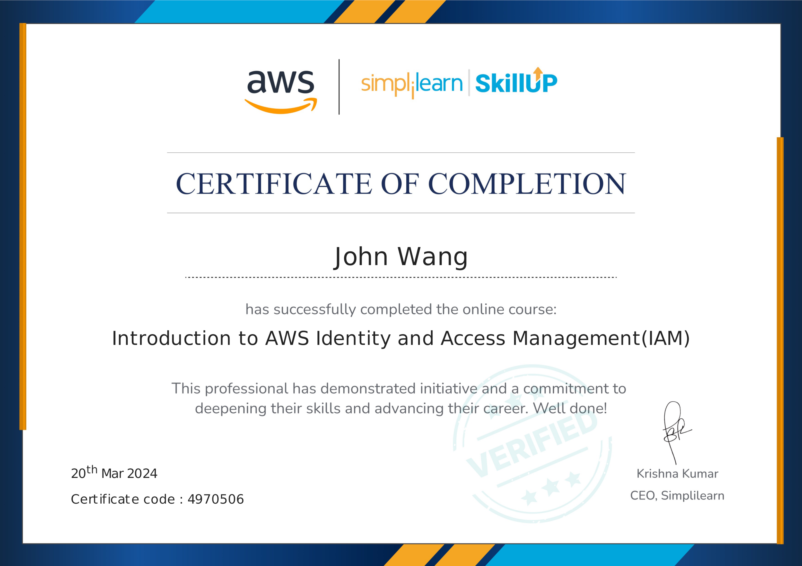
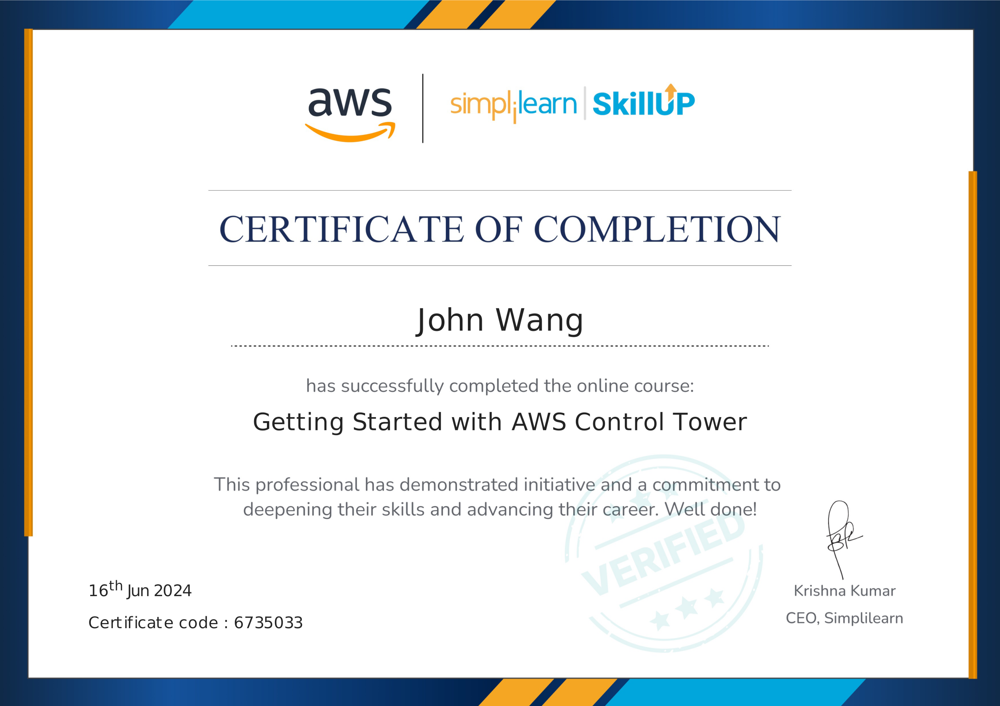
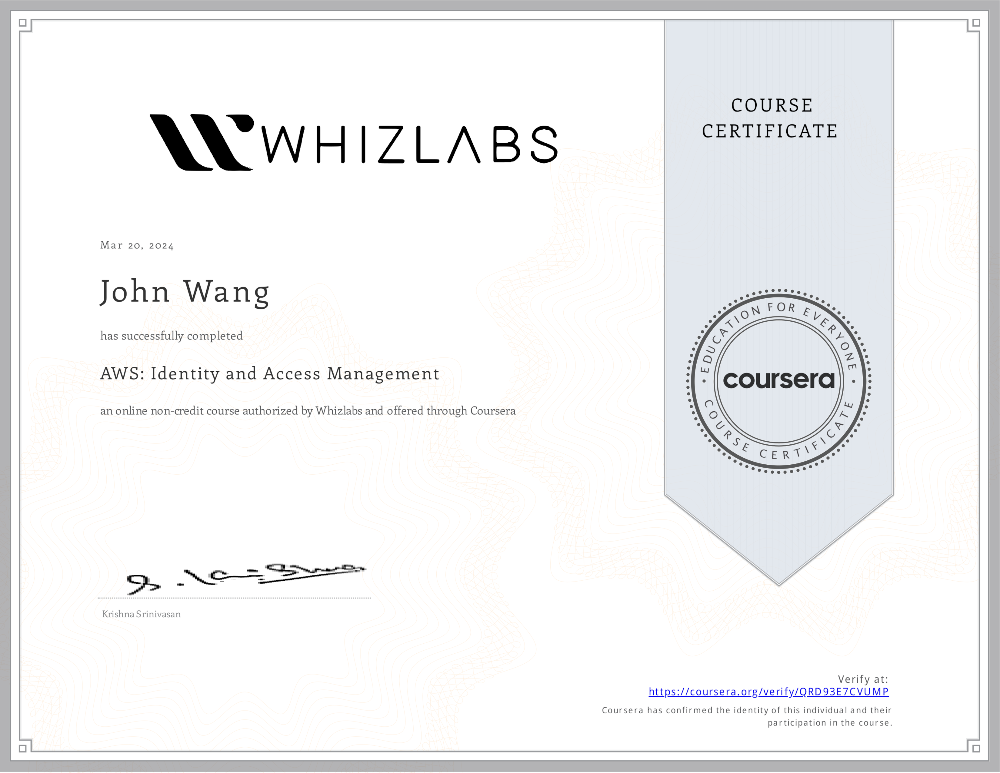
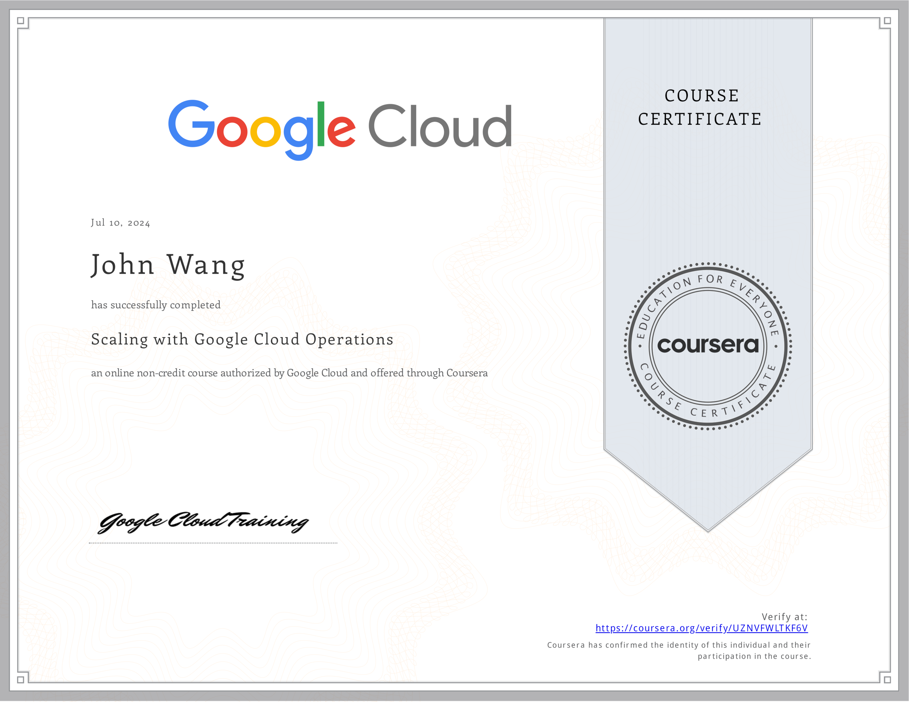

# John's Cloud Infrastructure Certificates
1. [AWS](#aws-10)
    1. [Designing Landing Zone Architectures with AWS Control Tower from AWS](#designing-landing-zone-architectures-with-aws-control-tower-from-aws)
    1. [AWS Shared Responsibility Model from AWS](#aws-shared-responsibility-model-from-aws)
    1. [Create AWS Infrastructure as Code Templates Using Generative AI from Pluralsight by Shubham Sinha](#create-aws-infrastructure-as-code-templates-using-generative-ai-from-pluralsight-by-shubham-sinha)
    1. [Introduction to AWS Identity and Access Management (IAM) from Simplilearn](#introduction-to-aws-identity-and-access-management-iam-from-simplilearn)
    1. [Introduction to AWS Trusted Advisor from Simplilearn](#introduction-to-aws-trusted-advisor-from-simplilearn)
    1. [Getting Started with AWS Security Hub from Simplilearn](#getting-started-with-aws-security-hub-from-simplilearn)
    1. [Introduction to AWS Security Token Services (STS) from Simplilearn](#introduction-to-aws-security-token-services-sts-from-simplilearn)
    1. [Getting Started with AWS Control Tower from Simplilearn](#getting-started-with-aws-control-tower-from-simplilearn)
    1. [AWS CI/CD Pipeline from Great Learning Academy](#aws-cicd-pipeline-from-great-learning-academy)
    1. [AWS: Identity and Access Management from Whizlabs](#aws-identity-and-access-management-from-whizlabs)
1. [AWS Bedrock](#aws-bedrock-6)
    1. [Amazon Bedrock Getting Started from AWS](#amazon-bedrock-getting-started-from-aws)
    1. [Introduction to Amazon Bedrock: Foundation Models and AI Applications from AWS](#introduction-to-amazon-bedrock-foundation-models-and-ai-applications-from-aws)
    1. [Automate Generative AI workflows using Amazon Bedrock Flows from AWS](#automate-generative-ai-workflows-using-amazon-bedrock-flows-from-aws)
    1. [Building Retrieval Augmented Generation (RAG) workflows with Amazon OpenSearch Service from AWS](#building-retrieval-augmented-generation-rag-workflows-with-amazon-opensearch-service-from-aws)
    1. [AWS SimuLearn: Secure Conversational AI with Guardrails from AWS](#aws-simulearn-secure-conversational-ai-with-guardrails-from-aws)
    1. [Introduction to Amazon Bedrock from Pluralsight by Muhammad Sajid](#introduction-to-amazon-bedrock-from-pluralsight-by-muhammad-sajid)
1. [AWS Bedrock AgentCore](#aws-bedrock-agentcore-3)
    1. [Amazon Bedrock AgentCore Getting Started from AWS](#amazon-bedrock-agentcore-getting-started-from-aws)
    1. [Amazon Bedrock AgentCore Identity Tutorial from AWS](#amazon-bedrock-agentcore-identity-tutorial-from-aws)
    1. [Amazon Bedrock AgentCore Tools Tutorial from AWS](#amazon-bedrock-agentcore-tools-tutorial-from-aws)
1. [Azure](#azure-2)
    1. [Create Azure Resource Manager Templates Using Generative AI from Pluralsight by Bismark Adomako](#create-azure-resource-manager-templates-using-generative-ai-from-pluralsight-by-bismark-adomako)
    1. [Microsoft Azure Solutions Architect: Design for High Availability from Pluralsight by Barry Luijbregts](#microsoft-azure-solutions-architect-design-for-high-availability-from-pluralsight-by-barry-luijbregts)
1. [Google Cloud Platform (GCP)](#google-cloud-platform-gcp-1)
    1. [Scaling with Google Cloud Operations from Google Cloud](#scaling-with-google-cloud-operations-from-google-cloud)
## AWS (10)
### Designing Landing Zone Architectures with AWS Control Tower from AWS

### AWS Shared Responsibility Model from AWS

### Create AWS Infrastructure as Code Templates Using Generative AI from Pluralsight by Shubham Sinha

### Introduction to AWS Identity and Access Management (IAM) from Simplilearn

### Introduction to AWS Trusted Advisor from Simplilearn

### Getting Started with AWS Security Hub from Simplilearn

### Introduction to AWS Security Token Services (STS) from Simplilearn

### Getting Started with AWS Control Tower from Simplilearn

### AWS CI/CD Pipeline from Great Learning Academy
* [John's Great Learning Academy online credential](https://verify.mygreatlearning.com/verify/ZGRSHOKG)

### AWS: Identity and Access Management from Whizlabs
* [John's Whizlabs online credential](https://coursera.org/verify/QRD93E7CVUMP)

## AWS Bedrock (6)
### Amazon Bedrock Getting Started from AWS

### Introduction to Amazon Bedrock: Foundation Models and AI Applications from AWS

### Automate Generative AI workflows using Amazon Bedrock Flows from AWS

### Building Retrieval Augmented Generation (RAG) workflows with Amazon OpenSearch Service from AWS

### AWS SimuLearn: Secure Conversational AI with Guardrails from AWS

### Introduction to Amazon Bedrock from Pluralsight by Muhammad Sajid

## AWS Bedrock AgentCore (3)
### Amazon Bedrock AgentCore Getting Started from AWS

### Amazon Bedrock AgentCore Identity Tutorial from AWS

### Amazon Bedrock AgentCore Tools Tutorial from AWS

## Azure (2)
### Create Azure Resource Manager Templates Using Generative AI from Pluralsight by Bismark Adomako

### Microsoft Azure Solutions Architect: Design for High Availability from Pluralsight by Barry Luijbregts

## Google Cloud Platform (GCP) (1)
### Scaling with Google Cloud Operations from Google Cloud
* [John's Google Cloud online credential](https://coursera.org/verify/UZNVFWLTKF6V)

