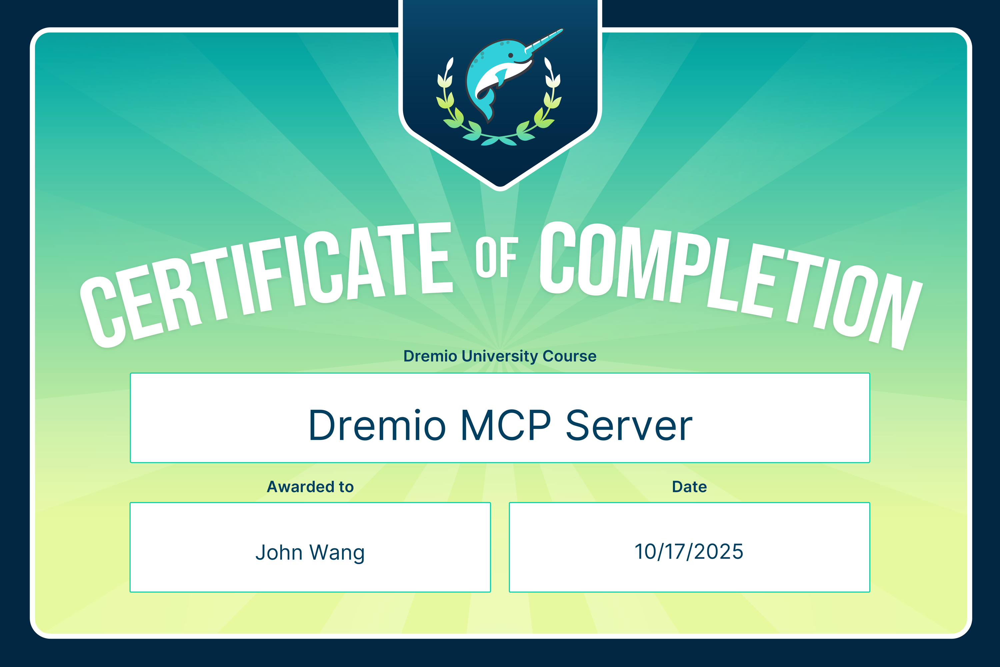
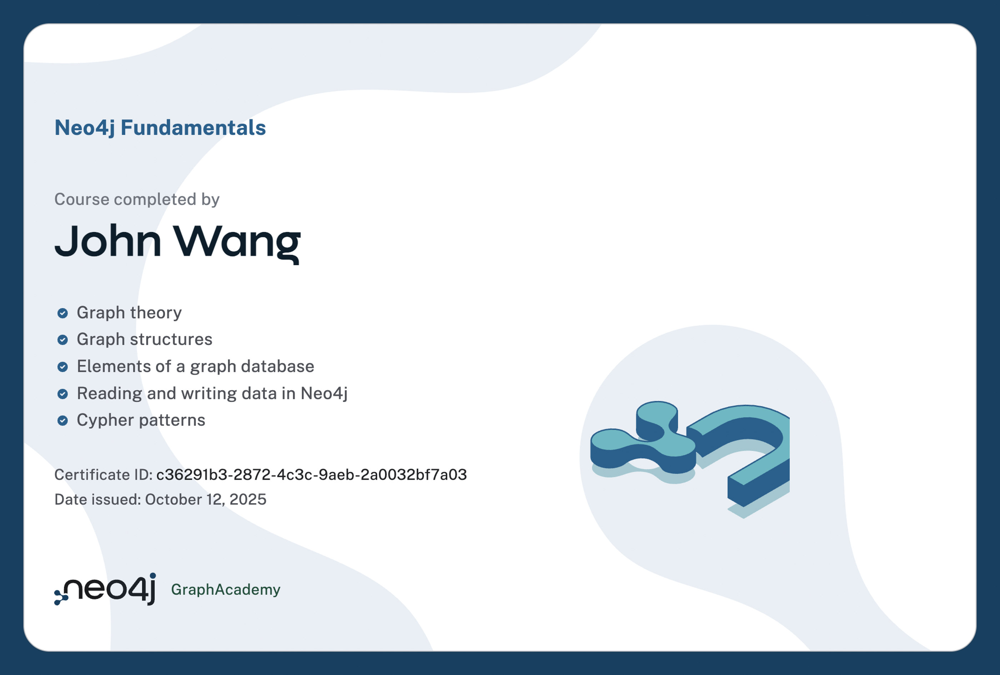

# John's Data Certificates
1. [Product Management](#product-management-1)
    1. [Data Product Fundamentals from Dremio by Andrew Madson](#data-product-fundamentals-from-dremio-by-andrew-madson)
1. [Governance](#governance-1)
    1. [Data Governance with Dataplex Universal Catalog from Google Cloud](#data-governance-with-dataplex-universal-catalog-from-google-cloud)
1. [Data Lakehouse](#data-lakehouse-1)
    1. [Databricks Accredited Lakehouse Fundamentals from Databricks](#databricks-accredited-lakehouse-fundamentals-from-databricks)
1. [Apache Iceberg](#apache-iceberg-7)
    1. [Apache Iceberg from Dremio by Alex Merced](#apache-iceberg-from-dremio-by-alex-merced)
    1. [DataOps with Apache Iceberg from Dremio by Alex Merced](#dataops-with-apache-iceberg-from-dremio-by-alex-merced)
    1. [Apache Polaris from Dremio by Andrew Madson](#apache-polaris-from-dremio-by-andrew-madson)
    1. [Introduction to Apache Iceberg from Pluralsight by Russ Thomas](#introduction-to-apache-iceberg-from-pluralsight-by-russ-thomas)
    1. [Leveraging Apache Iceberg Catalogs from Pluralsight by Pinal Dave](#leveraging-apache-iceberg-catalogs-from-pluralsight-by-pinal-dave)
    1. [Understanding Apache Iceberg Architecture from Pluralsight by Russ Thomas](#understanding-apache-iceberg-architecture-from-pluralsight-by-russ-thomas)
    1. [Rollbacks, Time Travel, and Disaster Recovery with Apache Iceberg from Pluralsight by Russ Thomas](#rollbacks-time-travel-and-disaster-recovery-with-apache-iceberg-from-pluralsight-by-russ-thomas)
1. [Dremio](#dremio-5)
    1. [Dremio Fundamentals (Cloud) from Dremio](#dremio-fundamentals-cloud-from-dremio)
    1. [Dremio Fundamentals (Software) from Dremio](#dremio-fundamentals-software-from-dremio)
    1. [Dremio-Powered AI Agents from Dremio by Alex Merced](#dremio-powered-ai-agents-from-dremio-by-alex-merced)
    1. [Dremio MCP Server from Dremio by Alex Merced](#dremio-mcp-server-from-dremio-by-alex-merced)
    1. [Apache Iceberg for Analytics and Machine Learning from Dremio by Andrew Madson](#apache-iceberg-for-analytics-and-machine-learning-from-dremio-by-andrew-madson)
1. [Neo4j](#neo4j-2)
    1. [Neo4j Fundamentals from Neo4j](#neo4j-fundamentals-from-neo4j)
    1. [Neo4j & GenerativeAI Fundamentals from Neo4j](#neo4j-generativeai-fundamentals-from-neo4j)
## Product Management (1)
### Data Product Fundamentals from Dremio by Andrew Madson
* [John's Dremio online credential](https://mycourse.app/r5Tjg2HV9SurSPxTT)

## Governance (1)
### Data Governance with Dataplex Universal Catalog from Google Cloud
* [John's Google Cloud online credential](https://coursera.org/verify/0FWCJB049GJ8)

## Data Lakehouse (1)
### Databricks Accredited Lakehouse Fundamentals from Databricks
* [John's Databricks online profile](https://credentials.databricks.com/profile/grokify)
* [John's Databricks online credential](https://credentials.databricks.com/a2736146-90aa-4679-9dda-90d465bf5537)

## Apache Iceberg (7)
### Apache Iceberg from Dremio by Alex Merced
* [John's Dremio online credential](https://mycourse.app/xlATmMEU0duRzacDY)

### DataOps with Apache Iceberg from Dremio by Alex Merced
* [John's Dremio online credential](https://mycourse.app/130kSPMPA189yZIBf)

### Apache Polaris from Dremio by Andrew Madson
* [John's Dremio online credential](https://mycourse.app/MOcKSoUquFBEzXCGQ)

### Introduction to Apache Iceberg from Pluralsight by Russ Thomas

### Leveraging Apache Iceberg Catalogs from Pluralsight by Pinal Dave

### Understanding Apache Iceberg Architecture from Pluralsight by Russ Thomas

### Rollbacks, Time Travel, and Disaster Recovery with Apache Iceberg from Pluralsight by Russ Thomas

## Dremio (5)
### Dremio Fundamentals (Cloud) from Dremio
* [John's Dremio online credential](https://mycourse.app/iYAOIXcUYfHqSX5Aw)

### Dremio Fundamentals (Software) from Dremio
* [John's Dremio online credential](https://mycourse.app/5YmlEeMeQE1DOCVSW)

### Dremio-Powered AI Agents from Dremio by Alex Merced
* [John's Dremio online credential](https://mycourse.app/SUPaoxZw0ZS7TgJio)

### Dremio MCP Server from Dremio by Alex Merced
* [John's Dremio online credential](https://mycourse.app/O3RwtKTwnNIIZQn67)

### Apache Iceberg for Analytics and Machine Learning from Dremio by Andrew Madson
* [John's Dremio online credential](https://mycourse.app/130kSPMPA189yZIBf)

## Neo4j (2)
### Neo4j Fundamentals from Neo4j
* [John's Neo4j online credential](https://graphacademy.neo4j.com/c/c36291b3-2872-4c3c-9aeb-2a0032bf7a03/)

### Neo4j & GenerativeAI Fundamentals from Neo4j
* [John's Neo4j online credential](https://graphacademy.neo4j.com/c/3cc6608a-217d-4dde-a0cb-75e2b2c93098/)

