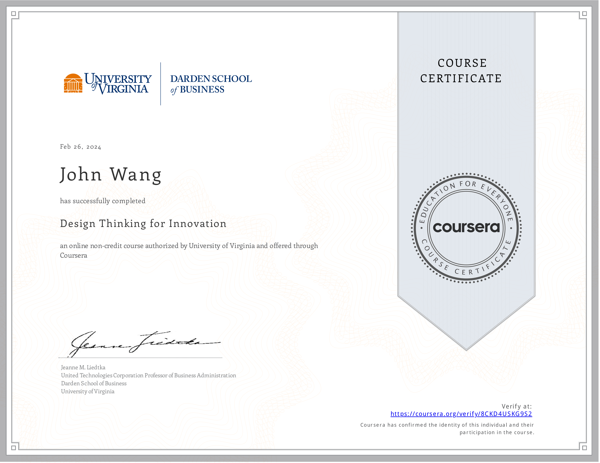

# John's Design Thinking Certificates
1. [Innovation](#innovation-1)
    1. [Introduction to Design Thinking from Great Learning Academy by Milind Kopikare](#introduction-to-design-thinking-from-great-learning-academy-by-milind-kopikare)
1. [Frameworks](#frameworks-2)
    1. [Design Thinking for Innovation from University of Virginia, Darden School by Jeanne M. Liedtka](#design-thinking-for-innovation-from-university-of-virginia-darden-school-by-jeanne-m-liedtka)
    1. [Customer-Centric IT Strategy from University of Virginia, Darden School by Alex Cowan](#customercentric-it-strategy-from-university-of-virginia-darden-school-by-alex-cowan)
1. [Agile](#agile-1)
    1. [Certified Professional In Design Thinking (CPDT) from Scrum Institute](#certified-professional-in-design-thinking-cpdt-from-scrum-institute)
## Resources

1. [Design Thinking Resource Links](../design-thinking_resource-links)
## Innovation (1)
### Introduction to Design Thinking from Great Learning Academy by Milind Kopikare
* [John's Great Learning Academy online credential](https://verify.mygreatlearning.com/verify/IQVEANNH)

## Frameworks (2)
### Design Thinking for Innovation from University of Virginia, Darden School by Jeanne M. Liedtka
* [John's University of Virginia, Darden School online credential](https://coursera.org/verify/8CKD4USKG9S2)

### Customer-Centric IT Strategy from University of Virginia, Darden School by Alex Cowan
* [John's University of Virginia, Darden School online credential](https://coursera.org/verify/JU7THK93NFN3)

## Agile (1)
### Certified Professional In Design Thinking (CPDT) from Scrum Institute
* [John's Scrum Institute online credential](https://www.scrum-institute.org/badges/34525810407940)

