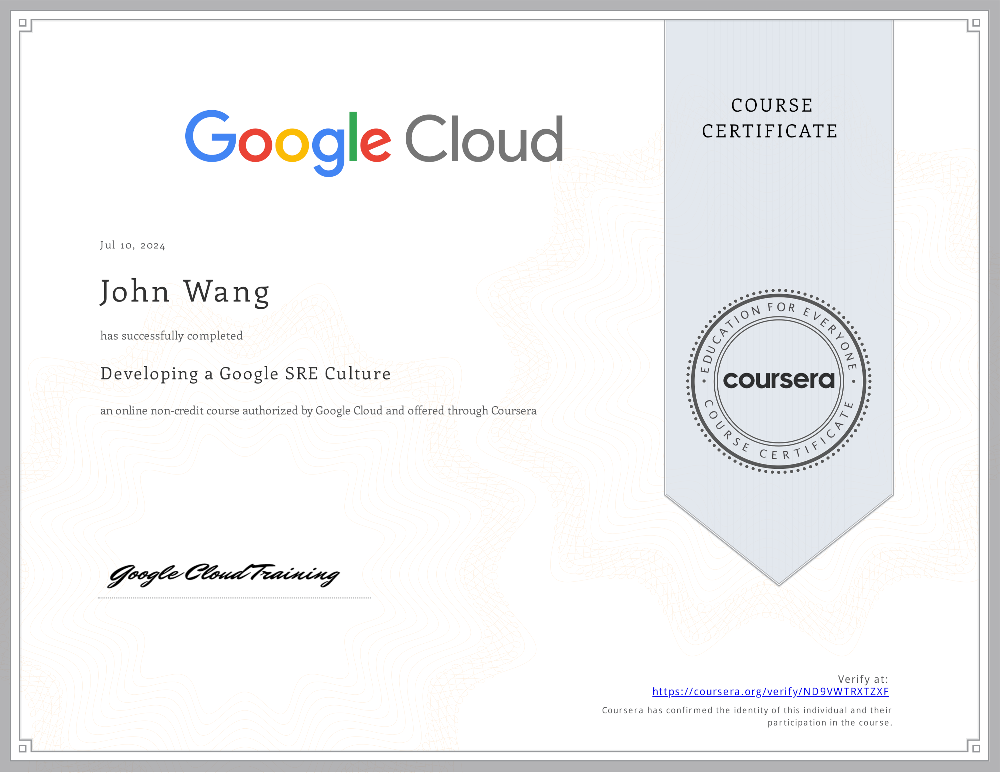

# John's DevOps Certificates
1. [Fundamentals](#fundamentals-1)
    1. [Certified DevOps Generalist (DevOps-GEN) from DevOps Academy](#certified-devops-generalist-devops-gen-from-devops-academy)
1. [Culture](#culture-2)
    1. [Developing a Google SRE Culture from Google Cloud by Kiran Varma](#developing-a-google-sre-culture-from-google-cloud-by-kiran-varma)
    1. [You Can't Buy DevOps from Pluralsight by Julie Gunderson](#you-cant-buy-devops-from-pluralsight-by-julie-gunderson)
1. [DORA Metrics](#dora-metrics-1)
    1. [Leveraging Data & DORA Metrics to Transform Software Delivery Processes from Pluralsight by Greg Ceccarelli, Nicole Forsgren, Dan Carpenter](#leveraging-data-dora-metrics-to-transform-software-delivery-processes-from-pluralsight-by-greg-ceccarelli-nicole-forsgren-dan-carpenter)
1. [Developer](#developer-1)
    1. [Certified DevOps Developer (DevOps-DEV) from DevOps Academy](#certified-devops-developer-devops-dev-from-devops-academy)
1. [Product Owner](#product-owner-1)
    1. [Certified DevOps Product Owner (DevOps-PO) from DevOps Academy](#certified-devops-product-owner-devops-po-from-devops-academy)
1. [Project Management](#project-management-1)
    1. [Certified DevOps Project Manager (DevOps-PM) from DevOps Academy](#certified-devops-project-manager-devops-pm-from-devops-academy)
1. [Argo CD](#argo-cd-1)
    1. [Getting Started with Argo CD from Pluralsight by Steve Buchanan](#getting-started-with-argo-cd-from-pluralsight-by-steve-buchanan)
1. [Rancher](#rancher-1)
    1. [Rancher Basics from Rancher Academy](#rancher-basics-from-rancher-academy)
1. [Security](#security-1)
    1. [Certified DevOps Information Security Engineer (DevOps-SEC) from DevOps Academy](#certified-devops-information-security-engineer-devops-sec-from-devops-academy)
1. [AWS](#aws-1)
    1. [AWS CI/CD Pipeline from Great Learning Academy](#aws-cicd-pipeline-from-great-learning-academy)
1. [Azure](#azure-2)
    1. [Create Azure Resource Manager Templates Using Generative AI from Pluralsight by Bismark Adomako](#create-azure-resource-manager-templates-using-generative-ai-from-pluralsight-by-bismark-adomako)
    1. [Microsoft Azure Solutions Architect: Design for High Availability from Pluralsight by Barry Luijbregts](#microsoft-azure-solutions-architect-design-for-high-availability-from-pluralsight-by-barry-luijbregts)
## Resources

1. [DevOps Reading List](../../links/devops/)
## Fundamentals (1)
### Certified DevOps Generalist (DevOps-GEN) from DevOps Academy
* [John's DevOps Academy online credential](https://www.devops-certification.org/badges/64340326384175)

## Culture (2)
### Developing a Google SRE Culture from Google Cloud by Kiran Varma
* [John's Google Cloud online credential](https://coursera.org/verify/ND9VWTRXTZXF)

### You Can't Buy DevOps from Pluralsight by Julie Gunderson

## DORA Metrics (1)
### Leveraging Data & DORA Metrics to Transform Software Delivery Processes from Pluralsight by Greg Ceccarelli, Nicole Forsgren, Dan Carpenter

## Developer (1)
### Certified DevOps Developer (DevOps-DEV) from DevOps Academy
* [John's DevOps Academy online credential](https://www.devops-certification.org/badges/79762822092976)

## Product Owner (1)
### Certified DevOps Product Owner (DevOps-PO) from DevOps Academy
* [John's DevOps Academy online credential](https://www.devops-certification.org/badges/36722377107944)

## Project Management (1)
### Certified DevOps Project Manager (DevOps-PM) from DevOps Academy
* [John's DevOps Academy online credential](https://www.devops-certification.org/badges/82770791998598)

## Argo CD (1)
### Getting Started with Argo CD from Pluralsight by Steve Buchanan

## Rancher (1)
### Rancher Basics from Rancher Academy
* [John's Rancher Academy online credential](https://www.rancher.academy/certificates/momrsaa5tq)

## Security (1)
### Certified DevOps Information Security Engineer (DevOps-SEC) from DevOps Academy
* [John's DevOps Academy online credential](https://www.devops-certification.org/badges/22465533642098)

## AWS (1)
### AWS CI/CD Pipeline from Great Learning Academy
* [John's Great Learning Academy online credential](/www.mygreatlearning.com/certificate/ZGRSHOKG)

## Azure (2)
### Create Azure Resource Manager Templates Using Generative AI from Pluralsight by Bismark Adomako

### Microsoft Azure Solutions Architect: Design for High Availability from Pluralsight by Barry Luijbregts

