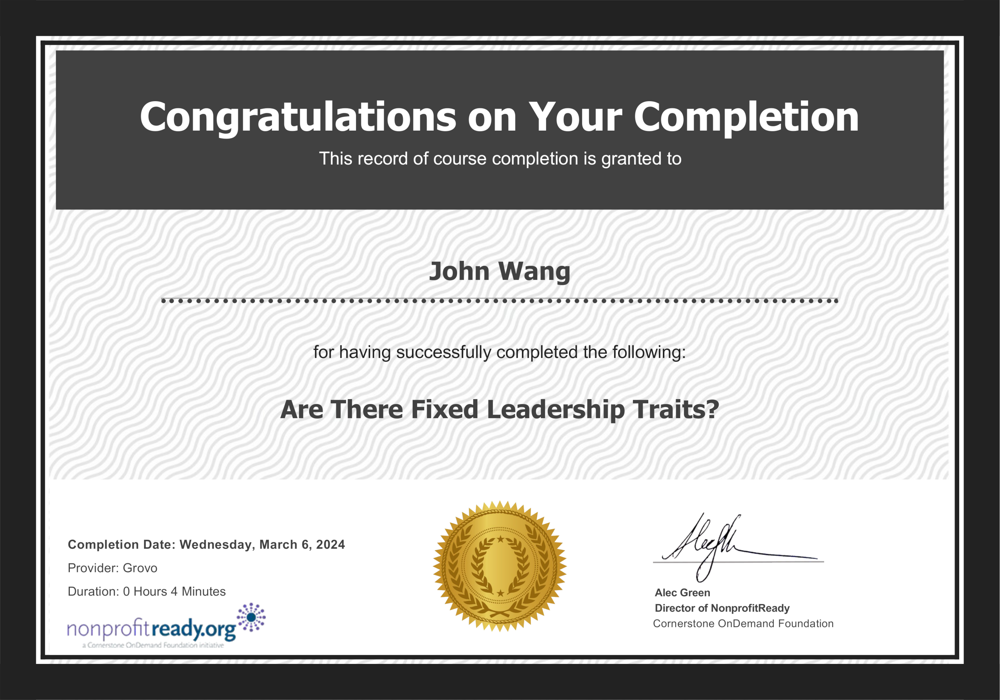
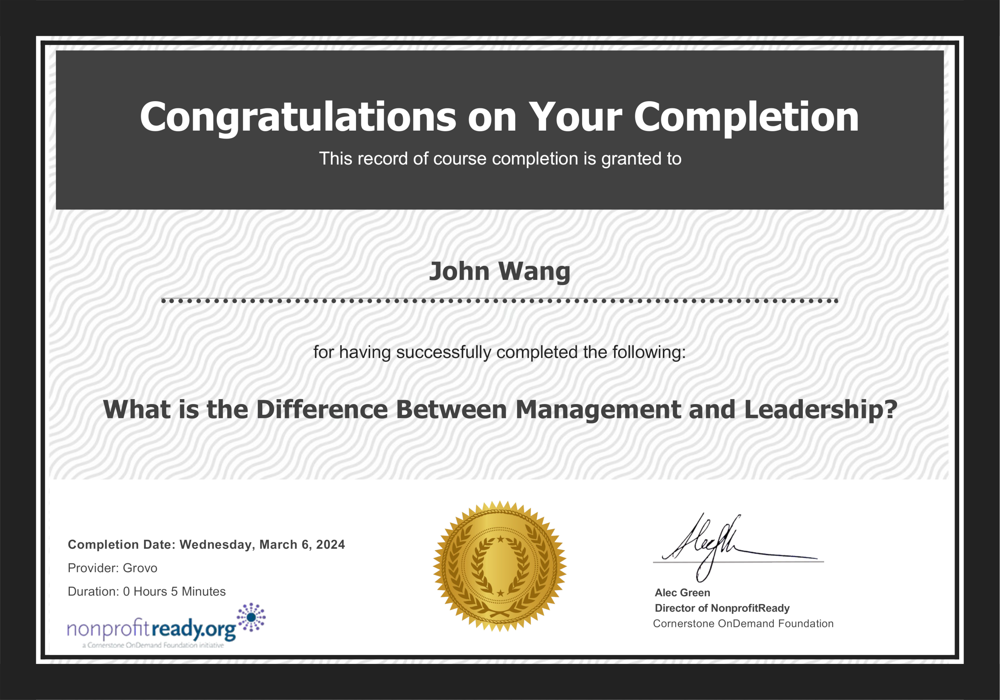
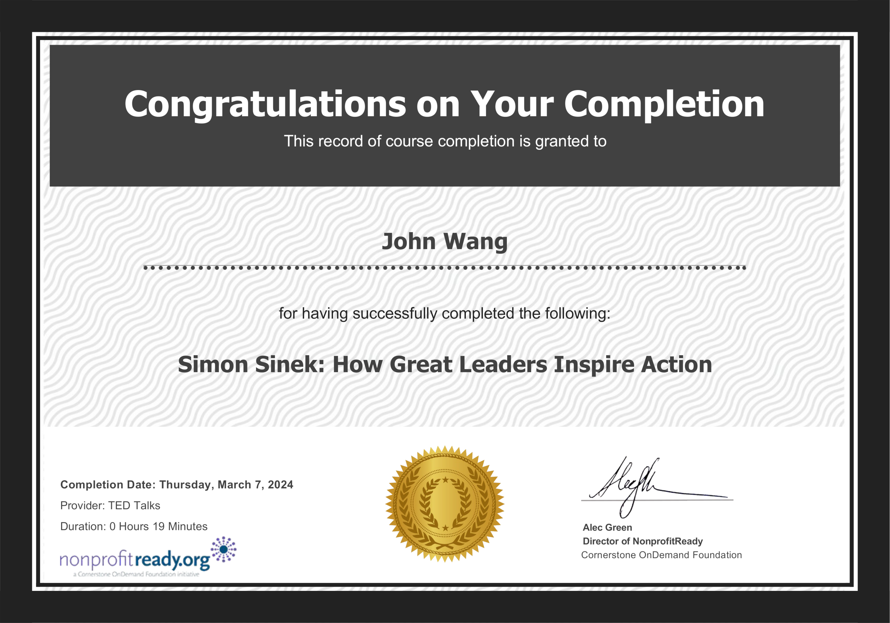

# John's Leadership Certificates
1. [Fundamentals](#fundamentals-5)
    1. [Stanford Executive Program (SEP) from Stanford](#stanford-executive-program-sep-from-stanford)
    1. [Becoming a Great Leader - Leadership Skills from EJ4](#becoming-a-great-leader-leadership-skills-from-ej4)
    1. [Are There Fixed Leadership Traits? from Grovo](#are-there-fixed-leadership-traits-from-grovo)
    1. [Why Leadership Isn't About the Leader from Grovo](#why-leadership-isnt-about-the-leader-from-grovo)
    1. [What is the Difference Between Management and Leadership from Grovo](#what-is-the-difference-between-management-and-leadership-from-grovo)
1. [Strategy](#strategy-1)
    1. [Successful Strategies for Emerging Leaders from NonprofitReady by The Jeff Havens Company](#successful-strategies-for-emerging-leaders-from-nonprofitready-by-the-jeff-havens-company)
1. [Inspiration](#inspiration-2)
    1. [Recognize Leadership in Others from NonprofitReady](#recognize-leadership-in-others-from-nonprofitready)
    1. [How Great Leaders Inspire Action from NonprofitReady by Simon Sinek](#how-great-leaders-inspire-action-from-nonprofitready-by-simon-sinek)
1. [Communications](#communications-1)
    1. [Using Generative AI to Refine Communications to Executives from Pluralsight by Ed Freitas](#using-generative-ai-to-refine-communications-to-executives-from-pluralsight-by-ed-freitas)
## Fundamentals (5)
### Stanford Executive Program (SEP) from Stanford

### Becoming a Great Leader - Leadership Skills from EJ4

### Are There Fixed Leadership Traits? from Grovo

### Why Leadership Isn't About the Leader from Grovo

### What is the Difference Between Management and Leadership from Grovo

## Strategy (1)
### Successful Strategies for Emerging Leaders from NonprofitReady by The Jeff Havens Company

## Inspiration (2)
### Recognize Leadership in Others from NonprofitReady

### How Great Leaders Inspire Action from NonprofitReady by Simon Sinek

## Communications (1)
### Using Generative AI to Refine Communications to Executives from Pluralsight by Ed Freitas

