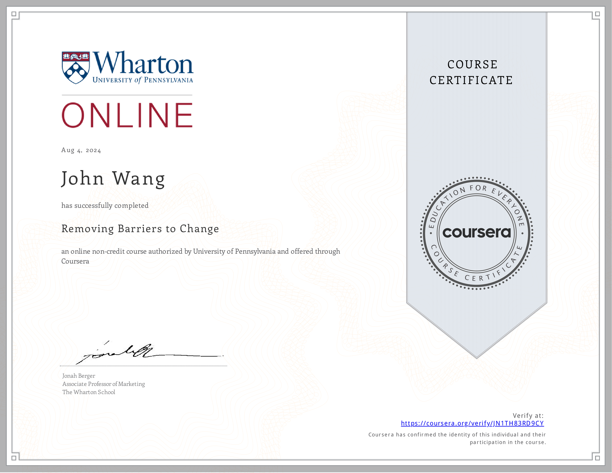

# John's Leadership Certificates
1. [Fundamentals](#fundamentals-6)
    1. [Stanford Executive Program (SEP) from Stanford](#stanford-executive-program-sep-from-stanford)
    1. [Sports Leadership and management from Udemy by Neal Pilson](#sports-leadership-and-management-from-udemy-by-neal-pilson)
    1. [Becoming a Great Leader - Leadership Skills from EJ4](#becoming-a-great-leader-leadership-skills-from-ej4)
    1. [Are There Fixed Leadership Traits? from Grovo](#are-there-fixed-leadership-traits-from-grovo)
    1. [Why Leadership Isn't About the Leader from Grovo](#why-leadership-isnt-about-the-leader-from-grovo)
    1. [What is the Difference Between Management and Leadership from Grovo](#what-is-the-difference-between-management-and-leadership-from-grovo)
1. [Strategy](#strategy-1)
    1. [Successful Strategies for Emerging Leaders from NonprofitReady by The Jeff Havens Company](#successful-strategies-for-emerging-leaders-from-nonprofitready-by-the-jeff-havens-company)
1. [High-Performance Culture](#high-performance-culture-1)
    1. [Unleashing High-Performance Culture with McLaren Racing from Udemy by Daniel Gallo, Ian James, Piers Thynne](#unleashing-high-performance-culture-with-mclaren-racing-from-udemy-by-daniel-gallo-ian-james-piers-thynne)
1. [Inspiration](#inspiration-2)
    1. [Recognize Leadership in Others from NonprofitReady](#recognize-leadership-in-others-from-nonprofitready)
    1. [How Great Leaders Inspire Action from NonprofitReady by Simon Sinek](#how-great-leaders-inspire-action-from-nonprofitready-by-simon-sinek)
1. [Change Management](#change-management-2)
    1. [Change Management from Packt](#change-management-from-packt)
    1. [Removing Barriers to Change from University of Pennsylvania, Wharton School by Jonah Berger](#removing-barriers-to-change-from-university-of-pennsylvania-wharton-school-by-jonah-berger)
1. [Communications](#communications-1)
    1. [Using Generative AI to Refine Communications to Executives from Pluralsight by Ed Freitas](#using-generative-ai-to-refine-communications-to-executives-from-pluralsight-by-ed-freitas)
1. [Industry Judge](#industry-judge-1)
    1. [Globee® Awards for Leadership - 2025 Industry Judge from Globee](#globee-awards-for-leadership-2025-industry-judge-from-globee)
## Fundamentals (6)
### Stanford Executive Program (SEP) from Stanford

### Sports Leadership and management from Udemy by Neal Pilson
* [John's Udemy online credential](http://ude.my/UC-3acc3aee-6463-4c7e-b8f8-2449aa3e9109/)

### Becoming a Great Leader - Leadership Skills from EJ4

### Are There Fixed Leadership Traits? from Grovo

### Why Leadership Isn't About the Leader from Grovo

### What is the Difference Between Management and Leadership from Grovo

## Strategy (1)
### Successful Strategies for Emerging Leaders from NonprofitReady by The Jeff Havens Company

## High-Performance Culture (1)
### Unleashing High-Performance Culture with McLaren Racing from Udemy by Daniel Gallo, Ian James, Piers Thynne
* [John's Udemy online credential](http://ude.my/UC-445d4710-ad37-40c3-b710-6491eca3adb3/)

## Inspiration (2)
### Recognize Leadership in Others from NonprofitReady

### How Great Leaders Inspire Action from NonprofitReady by Simon Sinek

## Change Management (2)
### Change Management from Packt
* [John's Packt online credential](https://coursera.org/verify/7O32Z9C9P3X5)

### Removing Barriers to Change from University of Pennsylvania, Wharton School by Jonah Berger
* [John's University of Pennsylvania, Wharton School online credential](https://coursera.org/verify/JN1TH83RD9CY)

## Communications (1)
### Using Generative AI to Refine Communications to Executives from Pluralsight by Ed Freitas

## Industry Judge (1)
### Globee® Awards for Leadership - 2025 Industry Judge from Globee
* [John's Globee online credential](https://credential.globeeawards.com/9400943b-d520-4ff5-a15b-c187cf5b3a69#acc.JWTq7MYZ)

