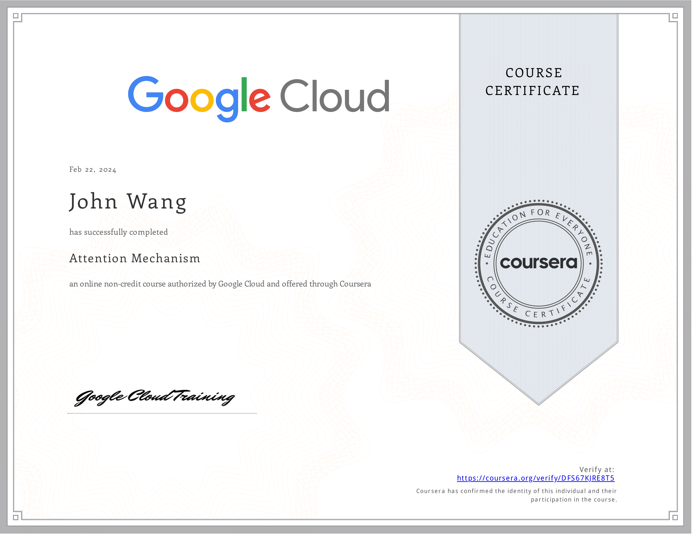
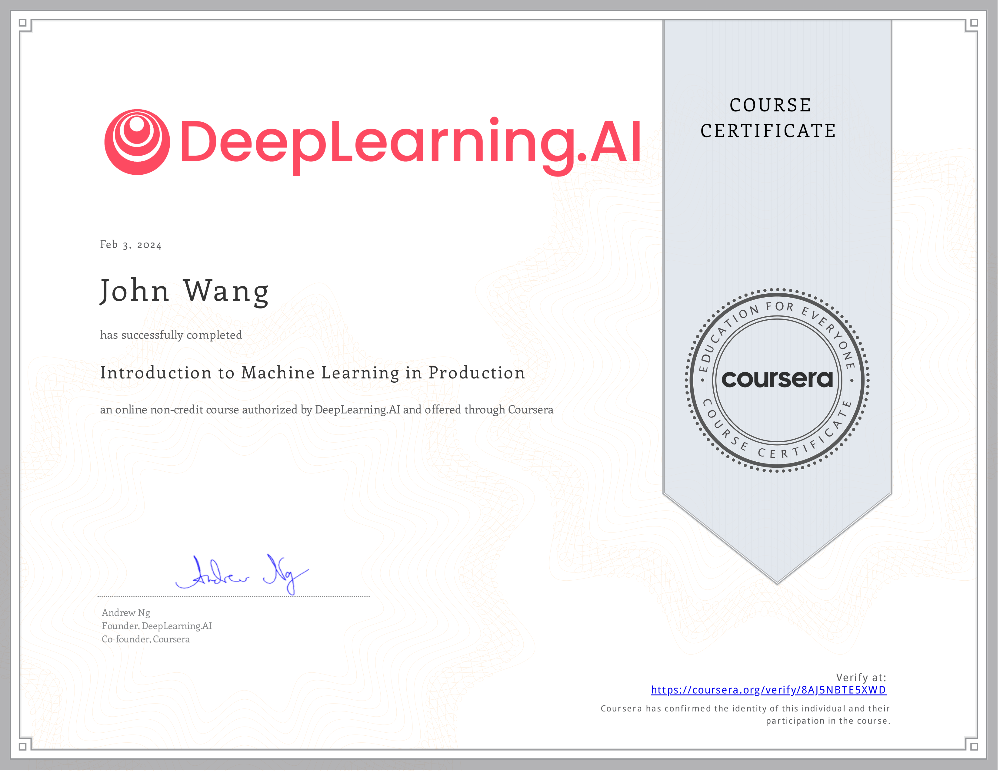

# John's Machine Learning Certificates
1. [Fundamentals](#fundamentals-1)
    1. [Jupyter Notebok from Great Learning Academy by Anirudh Rao](#jupyter-notebok-from-great-learning-academy-by-anirudh-rao)
1. [Product Management](#product-management-1)
    1. [Machine Learning Foundations for Product Managers from Duke University by Jon Reifschneider](#machine-learning-foundations-for-product-managers-from-duke-university-by-jon-reifschneider)
1. [Generative AI](#generative-ai-2)
    1. [Attention Mechanism from Google Cloud](#attention-mechanism-from-google-cloud)
    1. [Databricks Accredited Generative AI Fundamentals from Databricks](#databricks-accredited-generative-ai-fundamentals-from-databricks)
1. [MLOps](#mlops-2)
    1. [Introduction to Machine Learning in Production from DeepLearning.AI by Andrew Ng](#introduction-to-machine-learning-in-production-from-deeplearningai-by-andrew-ng)
    1. [AWS SageMaker from Great Learning Academy by Vishal Padghan](#aws-sagemaker-from-great-learning-academy-by-vishal-padghan)
1. [Architecture](#architecture-2)
    1. [Structuring Machine Learning Projects from DeepLearning.AI by Andrew Ng](#structuring-machine-learning-projects-from-deeplearningai-by-andrew-ng)
    1. [Databricks Accredited Lakehouse Fundamentals from Databricks](#databricks-accredited-lakehouse-fundamentals-from-databricks)
1. [Programming](#programming-1)
    1. [Machine Learning from Stanford by Andrew Ng](#machine-learning-from-stanford-by-andrew-ng)
## Fundamentals (1)
### Jupyter Notebok from Great Learning Academy by Anirudh Rao
* [John's Great Learning Academy online credential](https://verify.mygreatlearning.com/verify/WRHCURXB)

## Product Management (1)
### Machine Learning Foundations for Product Managers from Duke University by Jon Reifschneider
* [John's Duke University online credential](https://coursera.org/verify/NCRF8YSUYLSB)

## Generative AI (2)
### Attention Mechanism from Google Cloud
* [John's Google Cloud online credential](https://coursera.org/verify/DFS67KJRE8T5)

### Databricks Accredited Generative AI Fundamentals from Databricks
* [John's Databricks online profile](https://credentials.databricks.com/profile/grokify)
* [John's Databricks online credential](https://credentials.databricks.com/4ca910a4-6dd5-4e91-97a7-ccc7ed80424f)

## MLOps (2)
### Introduction to Machine Learning in Production from DeepLearning.AI by Andrew Ng
* [John's DeepLearning.AI online credential](https://coursera.org/verify/8AJ5NBTE5XWD)

### AWS SageMaker from Great Learning Academy by Vishal Padghan
* [John's Great Learning Academy online credential](https://verify.mygreatlearning.com/verify/OICYKGXZ)

## Architecture (2)
### Structuring Machine Learning Projects from DeepLearning.AI by Andrew Ng
* [John's DeepLearning.AI online credential](https://coursera.org/verify/8AXDP5G5K95U)

### Databricks Accredited Lakehouse Fundamentals from Databricks
* [John's Databricks online profile](https://credentials.databricks.com/profile/grokify)
* [John's Databricks online credential](https://credentials.databricks.com/a2736146-90aa-4679-9dda-90d465bf5537f)

## Programming (1)
### Machine Learning from Stanford by Andrew Ng

