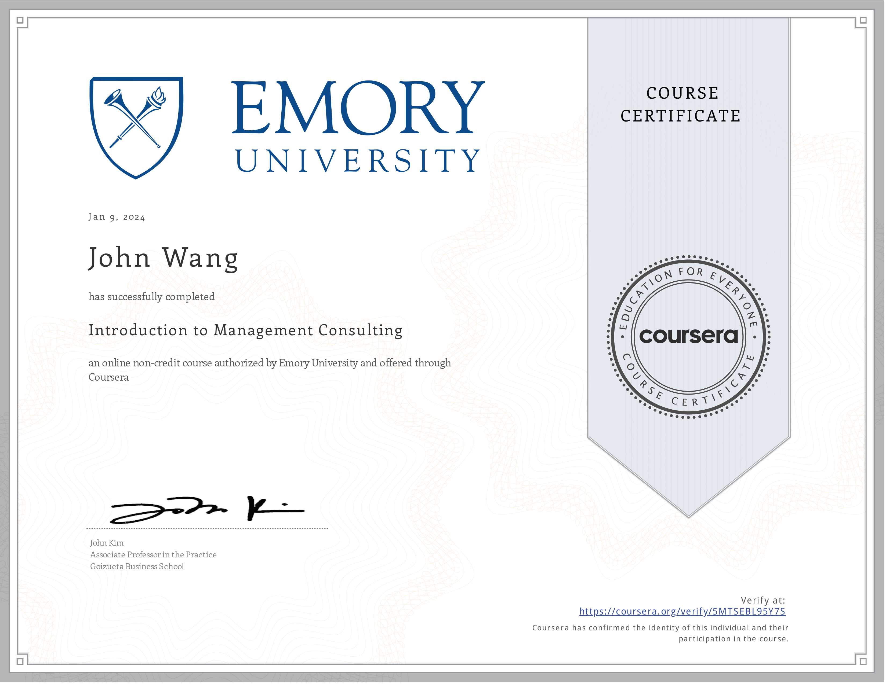
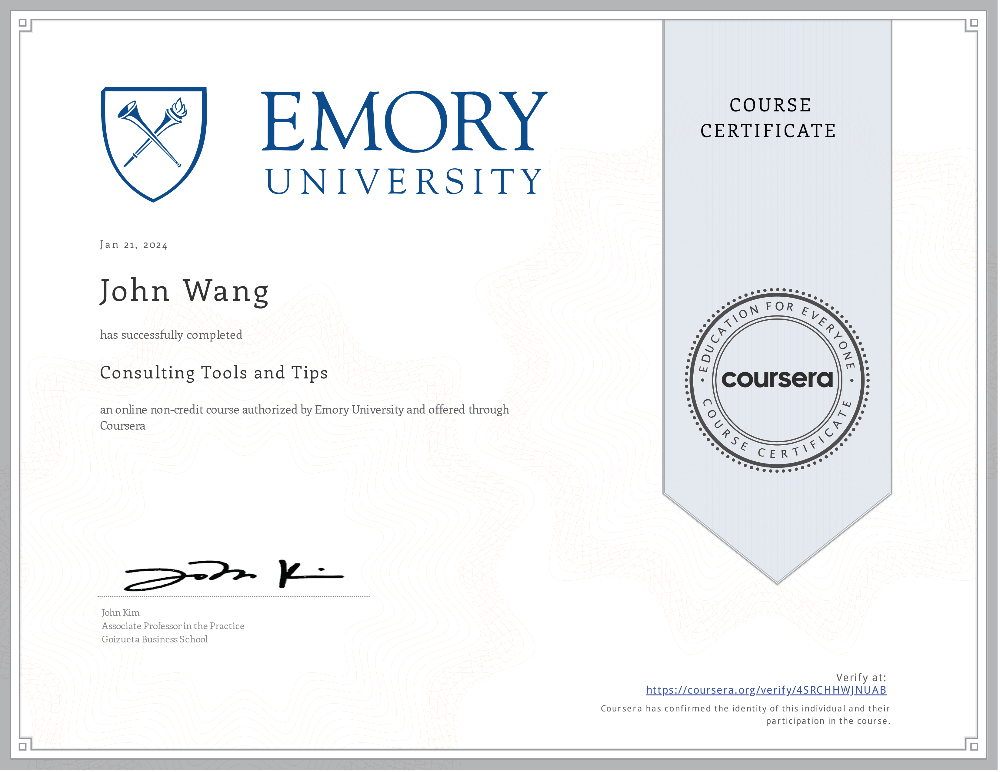

# John's Management Consulting Certificates
1. [Specialization](#specialization-1)
    1. [Management Consulting Specialization (5 Courses) from Emory University by John Kim](#management-consulting-specialization-5-courses-from-emory-university-by-john-kim)
1. [Fundamentals](#fundamentals-2)
    1. [Introduction to Management Consulting from Emory University by John Kim](#introduction-to-management-consulting-from-emory-university-by-john-kim)
    1. [Start Your Lifelong Learning from Accenture](#start-your-lifelong-learning-from-accenture)
1. [Career Guidance](#career-guidance-1)
    1. [Getting a Consulting Job from Emory University by John Kim](#getting-a-consulting-job-from-emory-university-by-john-kim)
1. [Problem Solving](#problem-solving-2)
    1. [Consulting Approach to Problem Solving from Emory University by John Kim](#consulting-approach-to-problem-solving-from-emory-university-by-john-kim)
    1. [Consulting Tools and Tips from Emory University by John Kim](#consulting-tools-and-tips-from-emory-university-by-john-kim)
1. [Presentations](#presentations-1)
    1. [Consulting Presentations and Storytelling from Emory University by John Kim](#consulting-presentations-and-storytelling-from-emory-university-by-john-kim)
## Specialization (1)
### Management Consulting Specialization (5 Courses) from Emory University by John Kim
* [John's Emory University online credential](https://coursera.org/verify/specialization/ZM5E4DBYR7QW)

## Fundamentals (2)
### Introduction to Management Consulting from Emory University by John Kim
* [John's Emory University online credential](https://coursera.org/verify/5MTSEBL95Y7S)

### Start Your Lifelong Learning from Accenture
* [John's Accenture online credential](https://coursera.org/verify/WVYWXG2LT3UX)

## Career Guidance (1)
### Getting a Consulting Job from Emory University by John Kim
* [John's Emory University online credential](https://coursera.org/verify/CJ6ARFYHPTE6)

## Problem Solving (2)
### Consulting Approach to Problem Solving from Emory University by John Kim
* [John's Emory University online credential](https://coursera.org/verify/ZT4LBT8TS8L4)

### Consulting Tools and Tips from Emory University by John Kim
* [John's Emory University online credential](https://coursera.org/verify/4SRCHHWJNUAB)

## Presentations (1)
### Consulting Presentations and Storytelling from Emory University by John Kim
* [John's Emory University online credential](https://coursera.org/verify/SN4XCP4FUZ9H)

