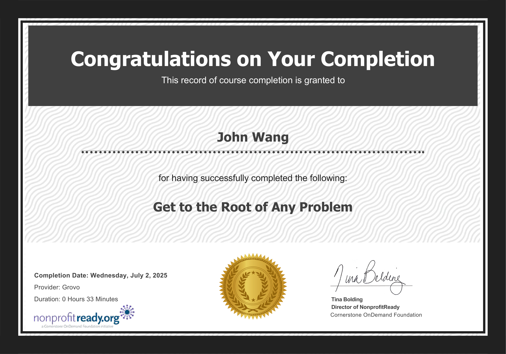
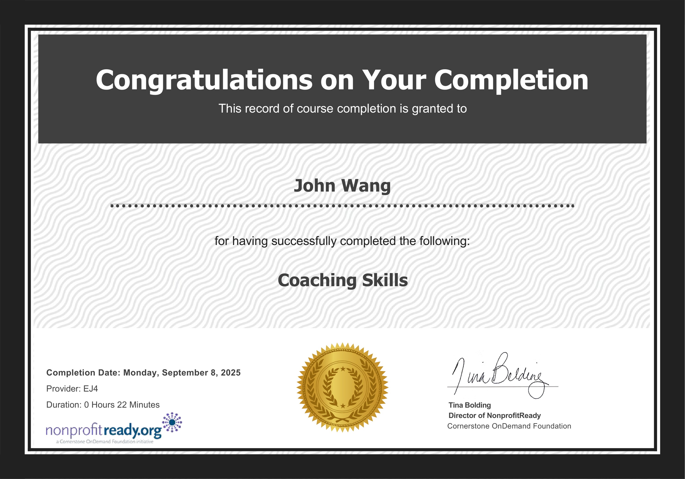

# John's Management Certificates
1. [General Management](#general-management-1)
    1. [Stanford Executive Program (SEP) from Stanford](#stanford-executive-program-sep-from-stanford)
1. [Fundamentals](#fundamentals-5)
    1. [Help Others Be Accountable from Grovo](#help-others-be-accountable-from-grovo)
    1. [The Management Styles from NonprofitReady by Cegos](#the-management-styles-from-nonprofitready-by-cegos)
    1. [Find Quick Wins as a New Manager from NonprofitReady by Grovo](#find-quick-wins-as-a-new-manager-from-nonprofitready-by-grovo)
    1. [Common Misconceptions of New Managers from NonprofitReady by Grovo](#common-misconceptions-of-new-managers-from-nonprofitready-by-grovo)
    1. [Stay Calm Under Pressure as a Manager from NonprofitReady by Grovo](#stay-calm-under-pressure-as-a-manager-from-nonprofitready-by-grovo)
1. [Project Management](#project-management-1)
    1. [Project Management Essentials Certified from Management and Strategy Institute](#project-management-essentials-certified-from-management-and-strategy-institute)
1. [Objectives and Key Results](#objectives-and-key-results-3)
    1. [Certified Professional In OKR (Objectives & Key Results) (CPOKR) from Scrum Institute by Yeliz Obergfell](#certified-professional-in-okr-objectives-key-results-cpokr-from-scrum-institute-by-yeliz-obergfell)
    1. [Product Management: Delivering on OKRs from Pluralsight by Keisha Johnson](#product-management-delivering-on-okrs-from-pluralsight-by-keisha-johnson)
    1. [Defining Key Performance Indicators from NonprofitReady by Cornerstone OnDemand Foundation](#defining-key-performance-indicators-from-nonprofitready-by-cornerstone-ondemand-foundation)
1. [Problem Solving](#problem-solving-3)
    1. [Get to the Root of Any Problem from Grovo by Alex Khurgin](#get-to-the-root-of-any-problem-from-grovo-by-alex-khurgin)
    1. [5W2H Problem-Solving Method from Management and Strategy Institute](#5w2h-problem-solving-method-from-management-and-strategy-institute)
    1. [Eight Disciplines (8D) Problem Solving Method from Management and Strategy Institute](#eight-disciplines-8d-problem-solving-method-from-management-and-strategy-institute)
1. [Team Building](#team-building-10)
    1. [Coaching Skills from Packt](#coaching-skills-from-packt)
    1. [Leading Effective 1-on-1 Meetings: Win loyalty and retention from Udemy by PracticalGrowth Inc.](#leading-effective-1-on-1-meetings-win-loyalty-and-retention-from-udemy-by-practicalgrowth-inc)
    1. [Coaching Skills from EJ4](#coaching-skills-from-ej4)
    1. [Planning an Effective Performance Appraisal from SkillSoft](#planning-an-effective-performance-appraisal-from-skillsoft)
    1. [Lead Your Virtual Team from Eleventure](#lead-your-virtual-team-from-eleventure)
    1. [Develop High-Potential Employees from NonprofitReady](#develop-high-potential-employees-from-nonprofitready)
    1. [Find the Root Cause of Performance Problems from NonprofitReady](#find-the-root-cause-of-performance-problems-from-nonprofitready)
    1. [Know What Your Direct Reports Really Care About from NonprofitReady](#know-what-your-direct-reports-really-care-about-from-nonprofitready)
    1. [Recognize Leadership in Others from NonprofitReady](#recognize-leadership-in-others-from-nonprofitready)
    1. [Strategies to Engage Your Team from Pluralsight by Ross Tartell](#strategies-to-engage-your-team-from-pluralsight-by-ross-tartell)
1. [Hiring](#hiring-4)
    1. [Interview Compliance and Fair Hiring V2.1 from Traliant](#interview-compliance-and-fair-hiring-v21-from-traliant)
    1. [Break Down Job Competencies Into Behaviors from Grovo](#break-down-job-competencies-into-behaviors-from-grovo)
    1. [Prepare for a Behavior-Based Interview from Grovo](#prepare-for-a-behavior-based-interview-from-grovo)
    1. [The Advantages of a Behavior-Based Interview from Grovo](#the-advantages-of-a-behavior-based-interview-from-grovo)
1. [Industry Judge](#industry-judge-1)
    1. [Globee® Awards for Business - 2025 Industry Judge from Globee](#globee-awards-for-business-2025-industry-judge-from-globee)
## General Management (1)
### Stanford Executive Program (SEP) from Stanford

## Fundamentals (5)
### Help Others Be Accountable from Grovo

### The Management Styles from NonprofitReady by Cegos

### Find Quick Wins as a New Manager from NonprofitReady by Grovo

### Common Misconceptions of New Managers from NonprofitReady by Grovo

### Stay Calm Under Pressure as a Manager from NonprofitReady by Grovo

## Project Management (1)
### Project Management Essentials Certified from Management and Strategy Institute
* [John's Management and Strategy Institute online credential](https://www.proprofs.com/quiz-school/user_certificate.php?id=350137056&qid=3593197)

## Objectives and Key Results (3)
### Certified Professional In OKR (Objectives & Key Results) (CPOKR) from Scrum Institute by Yeliz Obergfell
* [John's Scrum Institute online credential](https://www.scrum-institute.org/badges/34694795736577)

### Product Management: Delivering on OKRs from Pluralsight by Keisha Johnson

### Defining Key Performance Indicators from NonprofitReady by Cornerstone OnDemand Foundation

## Problem Solving (3)
### Get to the Root of Any Problem from Grovo by Alex Khurgin

### 5W2H Problem-Solving Method from Management and Strategy Institute
* [John's Management and Strategy Institute online credential](https://www.proprofs.com/quiz-school/user_certificate.php?id=347250403&qid=3927051)

### Eight Disciplines (8D) Problem Solving Method from Management and Strategy Institute
* [John's Management and Strategy Institute online credential](https://www.proprofs.com/quiz-school/user_certificate.php?id=347364167&qid=3930884)

## Team Building (10)
### Coaching Skills from Packt
* [John's Packt online credential](https://coursera.org/verify/DMFB53N7SAZK)

### Leading Effective 1-on-1 Meetings: Win loyalty and retention from Udemy by PracticalGrowth Inc.
* [John's Udemy online credential](http://ude.my/UC-21f78c07-3e97-496b-a513-a07c9270c9b2/)

### Coaching Skills from EJ4

### Planning an Effective Performance Appraisal from SkillSoft

### Lead Your Virtual Team from Eleventure

### Develop High-Potential Employees from NonprofitReady

### Find the Root Cause of Performance Problems from NonprofitReady

### Know What Your Direct Reports Really Care About from NonprofitReady

### Recognize Leadership in Others from NonprofitReady

### Strategies to Engage Your Team from Pluralsight by Ross Tartell

## Hiring (4)
### Interview Compliance and Fair Hiring V2.1 from Traliant

### Break Down Job Competencies Into Behaviors from Grovo

### Prepare for a Behavior-Based Interview from Grovo

### The Advantages of a Behavior-Based Interview from Grovo

## Industry Judge (1)
### Globee® Awards for Business - 2025 Industry Judge from Globee
* [John's Globee online credential](https://credential.globeeawards.com/dbad9415-8141-48c9-90a1-e41e583f6c88#acc.4jKmhyQI)

