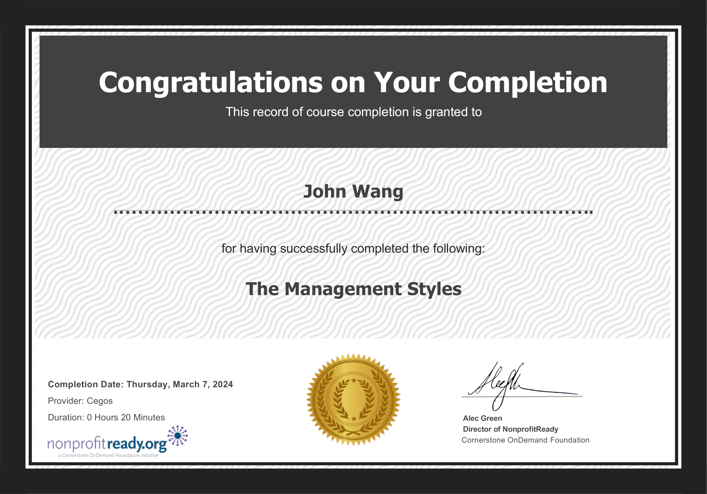
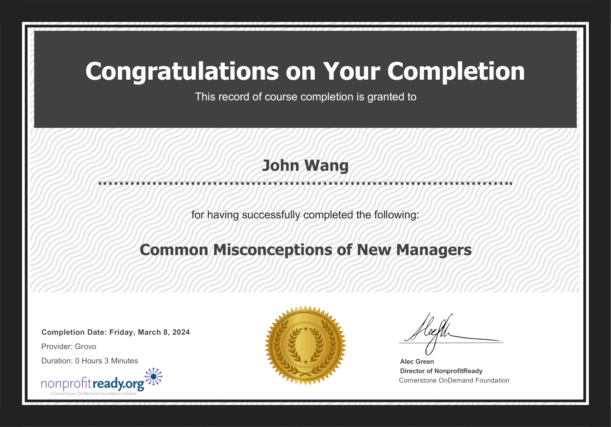
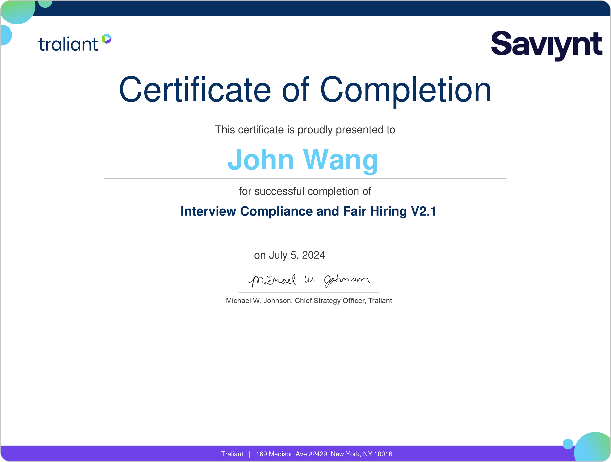
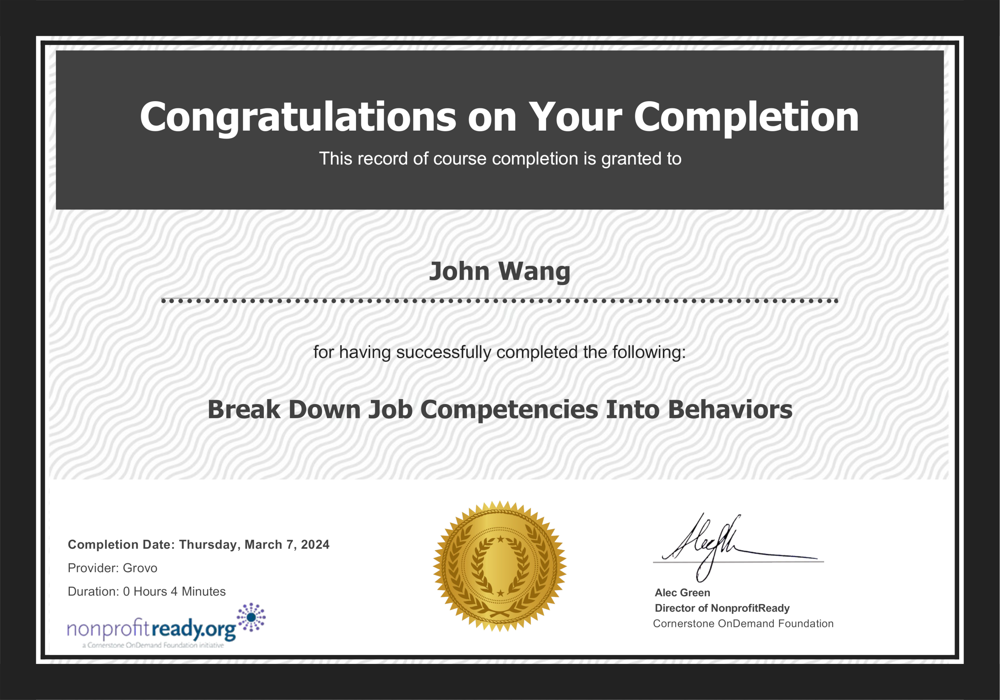
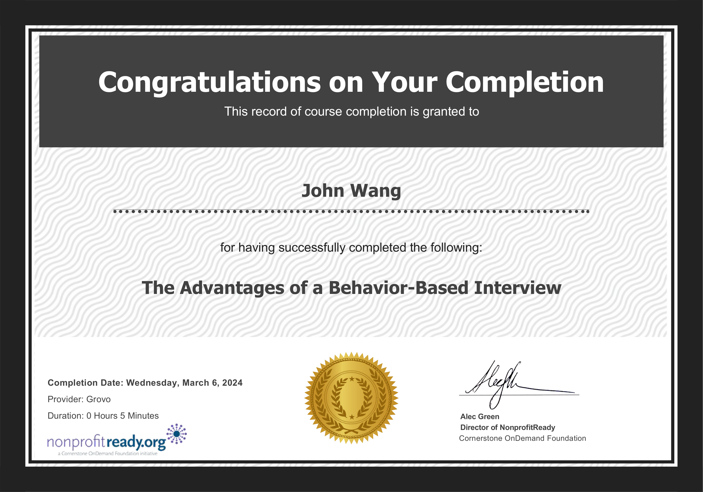

# John's Management Certificates
1. [General Management](#general-management-1)
    1. [Stanford Executive Program (SEP) from Stanford](#stanford-executive-program-sep-from-stanford)
1. [Fundamentals](#fundamentals-5)
    1. [Help Others Be Accountable from Grovo](#help-others-be-accountable-from-grovo)
    1. [The Management Styles from NonprofitReady by Cegos](#the-management-styles-from-nonprofitready-by-cegos)
    1. [Find Quick Wins as a New Manager from NonprofitReady by Grovo](#find-quick-wins-as-a-new-manager-from-nonprofitready-by-grovo)
    1. [Common Misconceptions of New Managers from NonprofitReady by Grovo](#common-misconceptions-of-new-managers-from-nonprofitready-by-grovo)
    1. [Stay Calm Under Pressure as a Manager from NonprofitReady by Grovo](#stay-calm-under-pressure-as-a-manager-from-nonprofitready-by-grovo)
1. [Objectives and Key Results](#objectives-and-key-results-2)
    1. [Certified Professional In OKR (Objectives & Key Results) (CPOKR) from Scrum Institute by Yeliz Obergfell](#certified-professional-in-okr-objectives-key-results-cpokr-from-scrum-institute-by-yeliz-obergfell)
    1. [Product Management: Delivering on OKRs from Pluralsight by Keisha Johnson](#product-management-delivering-on-okrs-from-pluralsight-by-keisha-johnson)
1. [Team Building](#team-building-7)
    1. [Planning an Effective Performance Appraisal from SkillSoft](#planning-an-effective-performance-appraisal-from-skillsoft)
    1. [Lead Your Virtual Team from Eleventure](#lead-your-virtual-team-from-eleventure)
    1. [Develop High-Potential Employees from NonprofitReady](#develop-high-potential-employees-from-nonprofitready)
    1. [Find the Root Cause of Performance Problems from NonprofitReady](#find-the-root-cause-of-performance-problems-from-nonprofitready)
    1. [Know What Your Direct Reports Really Care About from NonprofitReady](#know-what-your-direct-reports-really-care-about-from-nonprofitready)
    1. [Recognize Leadership in Others from NonprofitReady](#recognize-leadership-in-others-from-nonprofitready)
    1. [Strategies to Engage Your Team from Pluralsight by Ross Tartell](#strategies-to-engage-your-team-from-pluralsight-by-ross-tartell)
1. [Hiring](#hiring-4)
    1. [Interview Compliance and Fair Hiring V2.1 from Traliant](#interview-compliance-and-fair-hiring-v21-from-traliant)
    1. [Break Down Job Competencies Into Behaviors from Grovo](#break-down-job-competencies-into-behaviors-from-grovo)
    1. [Prepare for a Behavior-Based Interview from Grovo](#prepare-for-a-behavior-based-interview-from-grovo)
    1. [The Advantages of a Behavior-Based Interview from Grovo](#the-advantages-of-a-behavior-based-interview-from-grovo)
## General Management (1)
### Stanford Executive Program (SEP) from Stanford

## Fundamentals (5)
### Help Others Be Accountable from Grovo

### The Management Styles from NonprofitReady by Cegos

### Find Quick Wins as a New Manager from NonprofitReady by Grovo

### Common Misconceptions of New Managers from NonprofitReady by Grovo

### Stay Calm Under Pressure as a Manager from NonprofitReady by Grovo

## Objectives and Key Results (2)
### Certified Professional In OKR (Objectives & Key Results) (CPOKR) from Scrum Institute by Yeliz Obergfell
* [John's Scrum Institute online credential](https://www.scrum-institute.org/badges/34694795736577)

### Product Management: Delivering on OKRs from Pluralsight by Keisha Johnson

## Team Building (7)
### Planning an Effective Performance Appraisal from SkillSoft

### Lead Your Virtual Team from Eleventure

### Develop High-Potential Employees from NonprofitReady

### Find the Root Cause of Performance Problems from NonprofitReady

### Know What Your Direct Reports Really Care About from NonprofitReady

### Recognize Leadership in Others from NonprofitReady

### Strategies to Engage Your Team from Pluralsight by Ross Tartell

## Hiring (4)
### Interview Compliance and Fair Hiring V2.1 from Traliant

### Break Down Job Competencies Into Behaviors from Grovo

### Prepare for a Behavior-Based Interview from Grovo

### The Advantages of a Behavior-Based Interview from Grovo

