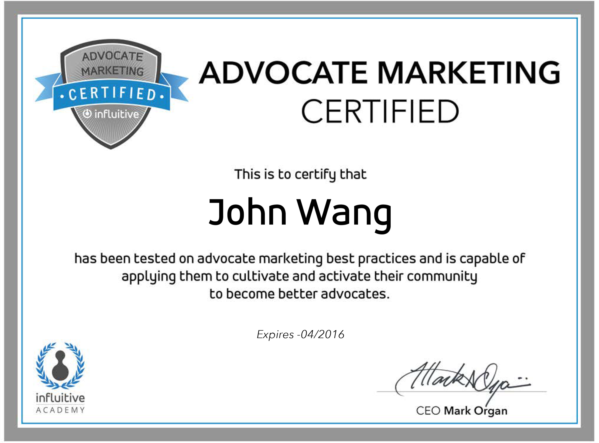
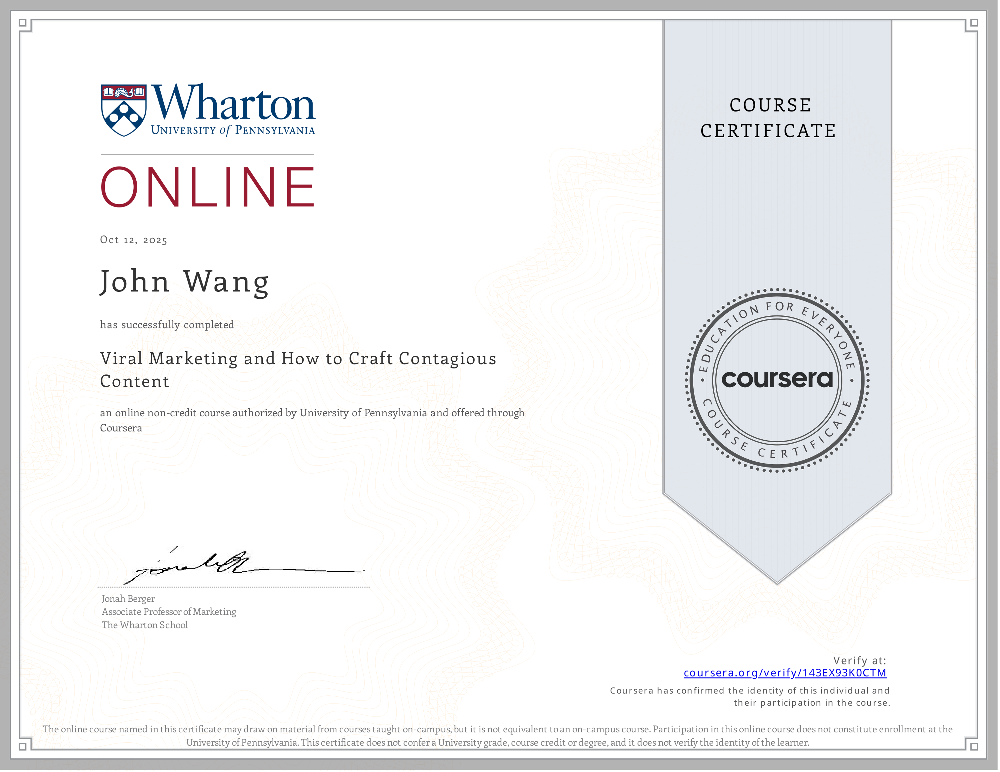

# John's Marketing Certificates
1. [Advocate Marketing](#advocate-marketing-1)
    1. [Advocate Marketing Certified from Influitive](#advocate-marketing-certified-from-influitive)
1. [Content Marketing](#content-marketing-1)
    1. [Content Marketing Basics from Great Learning Academy by Prajwal Rao](#content-marketing-basics-from-great-learning-academy-by-prajwal-rao)
1. [Influencer Marketing](#influencer-marketing-1)
    1. [Influencer Marketing from Great Learning Academy by Edwin Thomas](#influencer-marketing-from-great-learning-academy-by-edwin-thomas)
1. [Viral Marketing](#viral-marketing-1)
    1. [Viral Marketing and How to Craft Contagious Content from University of Pennsylvania, Wharton School by Jonah Berger](#viral-marketing-and-how-to-craft-contagious-content-from-university-of-pennsylvania-wharton-school-by-jonah-berger)
1. [Employer Branding](#employer-branding-1)
    1. [World-Class Employer Branding: The Fundamentals from Udemy by Anj Vera](#world-class-employer-branding-the-fundamentals-from-udemy-by-anj-vera)
1. [Personal Branding](#personal-branding-2)
    1. [Become a Celebrity in Your Industry on LinkedIn from Udemy by Rachel Meuleman](#become-a-celebrity-in-your-industry-on-linkedin-from-udemy-by-rachel-meuleman)
    1. [Developing Your Personal Brand from Pluralsight by Jason Alba](#developing-your-personal-brand-from-pluralsight-by-jason-alba)
## Advocate Marketing (1)
### Advocate Marketing Certified from Influitive

## Content Marketing (1)
### Content Marketing Basics from Great Learning Academy by Prajwal Rao
* [John's Great Learning Academy online credential](https://www.mygreatlearning.com/certificate/QDOPZWOV)

## Influencer Marketing (1)
### Influencer Marketing from Great Learning Academy by Edwin Thomas
* [John's Great Learning Academy online credential](https://www.mygreatlearning.com/certificate/OPDIXMKW)

## Viral Marketing (1)
### Viral Marketing and How to Craft Contagious Content from University of Pennsylvania, Wharton School by Jonah Berger
* [John's University of Pennsylvania, Wharton School online credential](https://coursera.org/verify/143EX93K0CTM)

## Employer Branding (1)
### World-Class Employer Branding: The Fundamentals from Udemy by Anj Vera
* [John's Udemy online credential](http://ude.my/UC-defc59c4-18d5-4a40-aac8-0c70cf1fd2d3/)

## Personal Branding (2)
### Become a Celebrity in Your Industry on LinkedIn from Udemy by Rachel Meuleman
* [John's Udemy online credential](http://ude.my/UC-f267f816-b787-4d98-a6f7-25191f0ed342/)

### Developing Your Personal Brand from Pluralsight by Jason Alba

