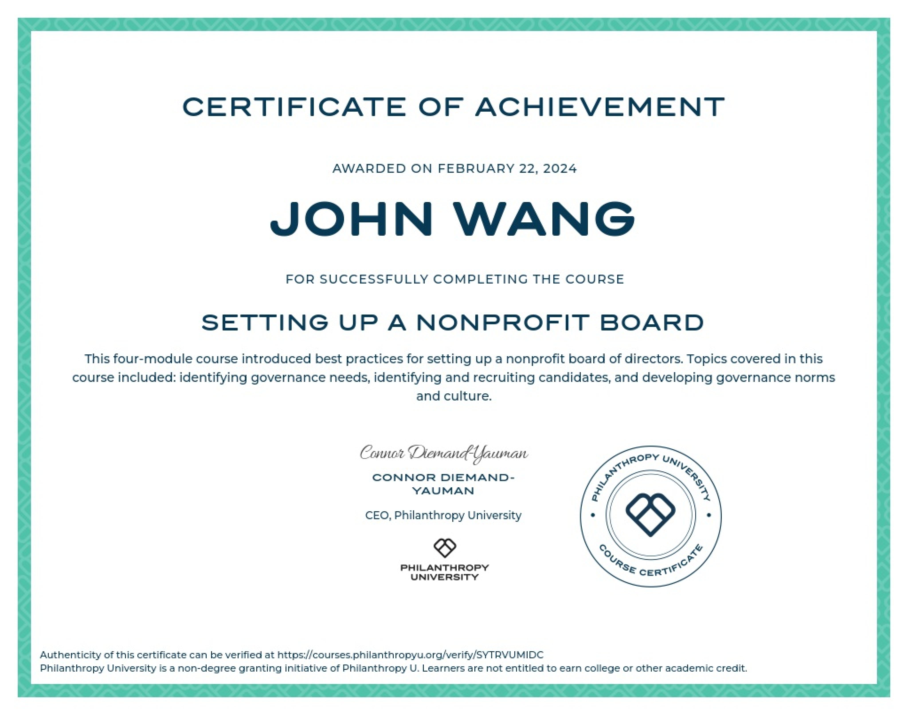

# John's Nonprofit Certificates
1. [Fundamentals](#fundamentals-1)
    1. [Nonprofit Essentials Certificate from NonprofitReady](#nonprofit-essentials-certificate-from-nonprofitready)
1. [Board of Directors](#board-of-directors-2)
    1. [Setting Up a Nonprofit Board from Philanthropy University](#setting-up-a-nonprofit-board-from-philanthropy-university)
    1. [Nonprofit Board Member Essentials Certificate from NonprofitReady](#nonprofit-board-member-essentials-certificate-from-nonprofitready)
## Fundamentals (1)
### Nonprofit Essentials Certificate from NonprofitReady

## Board of Directors (2)
### Setting Up a Nonprofit Board from Philanthropy University
* [John's Philanthropy University online credential](https://courses.philanthropyu.org/verify/SYTRVUMIDC)

### Nonprofit Board Member Essentials Certificate from NonprofitReady

