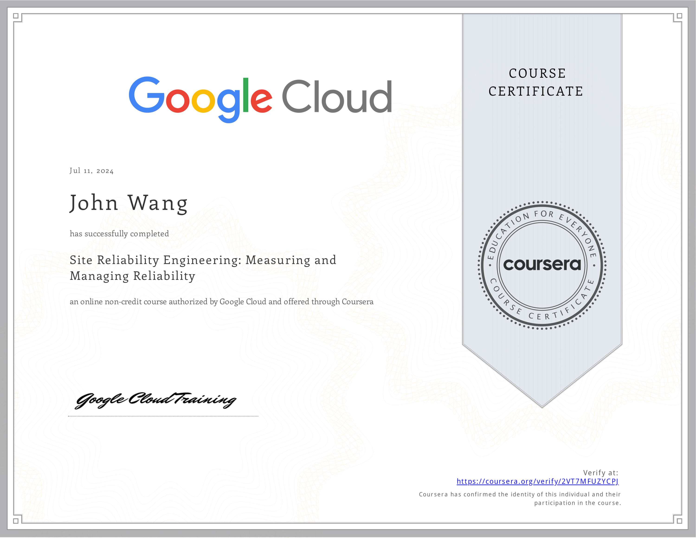
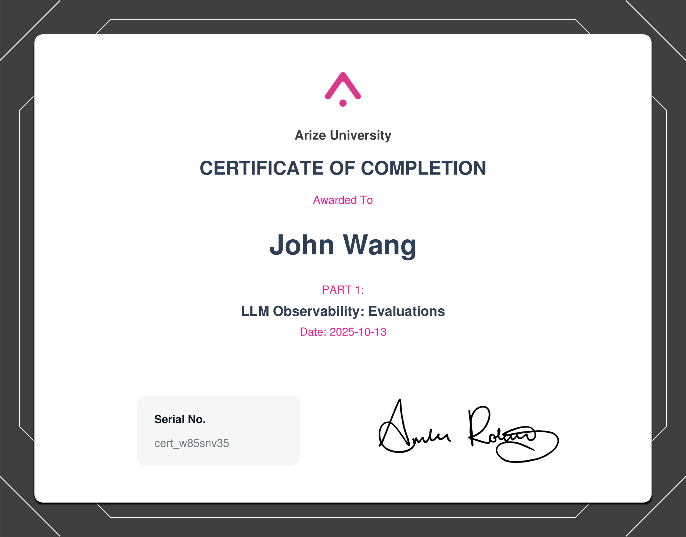
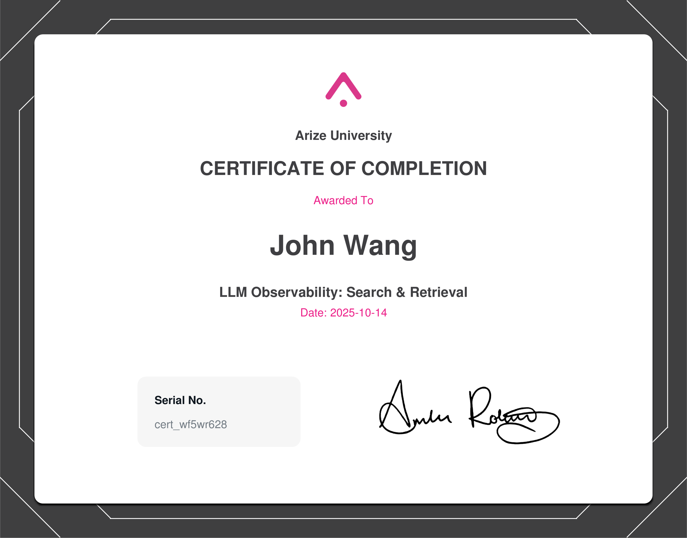
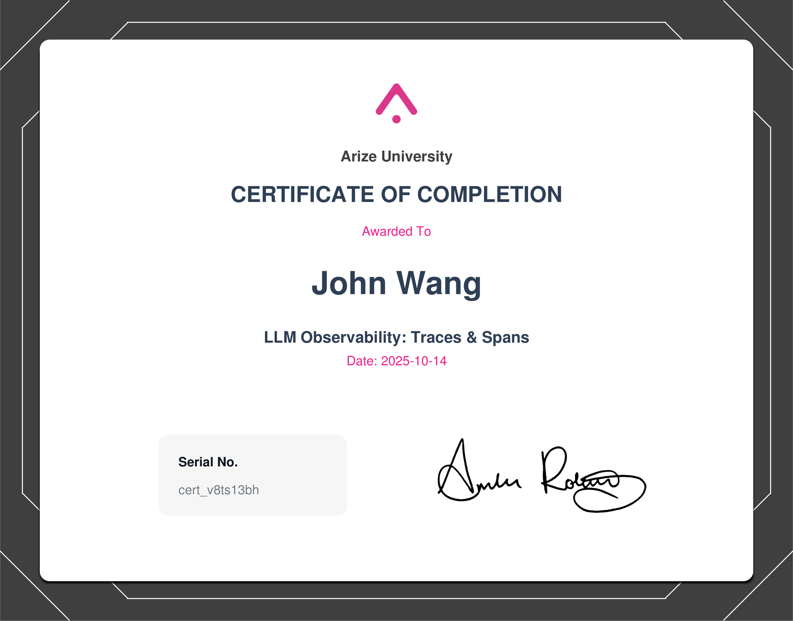

# John's Observability and Reliability Certificates
1. [Fundamentals](#fundamentals-1)
    1. [Building an Observable Infrastructure and Code from Pluralsight by Aravind Putrevu](#building-an-observable-infrastructure-and-code-from-pluralsight-by-aravind-putrevu)
1. [Site Reliability Engineering (SRE)](#site-reliability-engineering-sre-4)
    1. [Site Reliability Engineering: Measuring and Managing Reliability from Google Cloud](#site-reliability-engineering-measuring-and-managing-reliability-from-google-cloud)
    1. [Developing a Google SRE Culture from Google Cloud by Kiran Varma](#developing-a-google-sre-culture-from-google-cloud-by-kiran-varma)
    1. [Incorporating Site Reliability Engineering (SRE) in Your System Design from Pluralsight by Elton Stoneman](#incorporating-site-reliability-engineering-sre-in-your-system-design-from-pluralsight-by-elton-stoneman)
    1. [Microsoft Azure Solutions Architect: Design for High Availability from Pluralsight by Barry Luijbregts](#microsoft-azure-solutions-architect-design-for-high-availability-from-pluralsight-by-barry-luijbregts)
1. [OpenTelemetry (OTel)](#opentelemetry-otel-1)
    1. [Introduction to OpenTelemetry from Datadog](#introduction-to-opentelemetry-from-datadog)
1. [Large Language Models (LLMs)](#large-language-models-llms-4)
    1. [LLM Observability: Evaluations from Arize by Amber Roberts](#llm-observability-evaluations-from-arize-by-amber-roberts)
    1. [LLM Observability: Agents, Tools, and Chains from Arize by Amber Roberts](#llm-observability-agents-tools-and-chains-from-arize-by-amber-roberts)
    1. [LLM Observability: Search & Retrieval from Arize by Amber Roberts](#llm-observability-search-retrieval-from-arize-by-amber-roberts)
    1. [LLM Observability: Traces & Spans from Arize by Amber Roberts](#llm-observability-traces-spans-from-arize-by-amber-roberts)
1. [Datadog](#datadog-8)
    1. [Introduction to Observability from Datadog](#introduction-to-observability-from-datadog)
    1. [Introduction to Service Level Objectives from Datadog](#introduction-to-service-level-objectives-from-datadog)
    1. [Detect, Prioritize, and Remediate Cloud Security Risks with Datadog CSM from Datadog](#detect-prioritize-and-remediate-cloud-security-risks-with-datadog-csm-from-datadog)
    1. [Getting Started with APM Metrics & Traces from Datadog](#getting-started-with-apm-metrics-traces-from-datadog)
    1. [Diagnosing Application Bugs with Datadog APM from Datadog](#diagnosing-application-bugs-with-datadog-apm-from-datadog)
    1. [Monitoring a Kubernetes Cluster: Install the Agent from Datadog](#monitoring-a-kubernetes-cluster-install-the-agent-from-datadog)
    1. [Monitoring a Kubernetes Cluster: The Control Plane from Datadog](#monitoring-a-kubernetes-cluster-the-control-plane-from-datadog)
    1. [Monitoring a Kubernetes Cluster: Troubleshooting Workloads from Datadog](#monitoring-a-kubernetes-cluster-troubleshooting-workloads-from-datadog)
## Fundamentals (1)
### Building an Observable Infrastructure and Code from Pluralsight by Aravind Putrevu

## Site Reliability Engineering (SRE) (4)
### Site Reliability Engineering: Measuring and Managing Reliability from Google Cloud
* [John's Google Cloud online credential](https://coursera.org/verify/2VT7MFUZYCPJ)

### Developing a Google SRE Culture from Google Cloud by Kiran Varma
* [John's Google Cloud online credential](https://coursera.org/verify/ND9VWTRXTZXF)

### Incorporating Site Reliability Engineering (SRE) in Your System Design from Pluralsight by Elton Stoneman

### Microsoft Azure Solutions Architect: Design for High Availability from Pluralsight by Barry Luijbregts

## OpenTelemetry (OTel) (1)
### Introduction to OpenTelemetry from Datadog
* [John's Datadog online credential](https://learn.datadoghq.com/certificates/wahhhgg8ai)

## Large Language Models (LLMs) (4)
### LLM Observability: Evaluations from Arize by Amber Roberts

### LLM Observability: Agents, Tools, and Chains from Arize by Amber Roberts

### LLM Observability: Search & Retrieval from Arize by Amber Roberts

### LLM Observability: Traces & Spans from Arize by Amber Roberts

## Datadog (8)
### Introduction to Observability from Datadog
* [John's Datadog online credential](https://learn.datadoghq.com/certificates/yv6tc8ptwl)

### Introduction to Service Level Objectives from Datadog
* [John's Datadog online credential](https://learn.datadoghq.com/certificates/k0hkjemqbk)

### Detect, Prioritize, and Remediate Cloud Security Risks with Datadog CSM from Datadog
* [John's Datadog online credential](https://learn.datadoghq.com/certificates/jq29dawso1)

### Getting Started with APM Metrics & Traces from Datadog
* [John's Datadog online credential](https://learn.datadoghq.com/certificates/rcppjvns7a)

### Diagnosing Application Bugs with Datadog APM from Datadog
* [John's Datadog online credential](https://learn.datadoghq.com/certificates/ni63pus04h)

### Monitoring a Kubernetes Cluster: Install the Agent from Datadog
* [John's Datadog online credential](https://learn.datadoghq.com/certificates/jsko012qas)

### Monitoring a Kubernetes Cluster: The Control Plane from Datadog
* [John's Datadog online credential](https://learn.datadoghq.com/certificates/ehnz89oual)

### Monitoring a Kubernetes Cluster: Troubleshooting Workloads from Datadog
* [John's Datadog online credential](https://learn.datadoghq.com/certificates/8v4xiyb3tt)

