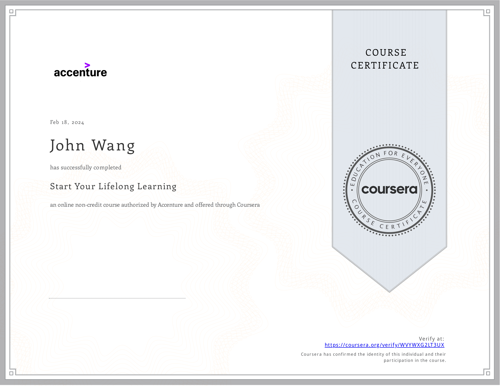

# John's Personal Development Certificates
1. [Goals](#goals-2)
    1. [Setting Goals - Your Guide to Focusing on What Is Important from Pluralsight by Tommy van Schaik](#setting-goals-your-guide-to-focusing-on-what-is-important-from-pluralsight-by-tommy-van-schaik)
    1. [Top Tips for Setting Authentic Career Goals from Pluralsight by Dr. Sweta Chawla](#top-tips-for-setting-authentic-career-goals-from-pluralsight-by-dr-sweta-chawla)
1. [Personal Branding](#personal-branding-1)
    1. [Developing Your Personal Brand from Pluralsight by Jason Alba](#developing-your-personal-brand-from-pluralsight-by-jason-alba)
1. [Mentorship](#mentorship-3)
    1. [Be a Great Mentor from Eleventure](#be-a-great-mentor-from-eleventure)
    1. [How to Be a Great Mentee: Get More Out of Mentoring from Pluralsight by Jason Alba](#how-to-be-a-great-mentee-get-more-out-of-mentoring-from-pluralsight-by-jason-alba)
    1. [Generative AI for Mentors and Coaches from Pluralsight by David Harris](#generative-ai-for-mentors-and-coaches-from-pluralsight-by-david-harris)
1. [Learning](#learning-2)
    1. [Start Your Lifelong Learning from Accenture](#start-your-lifelong-learning-from-accenture)
    1. [Keeping up with Technology from Pluralsight by Dan Appleman](#keeping-up-with-technology-from-pluralsight-by-dan-appleman)
1. [Resiliency](#resiliency-1)
    1. [Bounce Back From Failure from Eleventure](#bounce-back-from-failure-from-eleventure)
## Goals (2)
### Setting Goals - Your Guide to Focusing on What Is Important from Pluralsight by Tommy van Schaik

### Top Tips for Setting Authentic Career Goals from Pluralsight by Dr. Sweta Chawla

## Personal Branding (1)
### Developing Your Personal Brand from Pluralsight by Jason Alba

## Mentorship (3)
### Be a Great Mentor from Eleventure

### How to Be a Great Mentee: Get More Out of Mentoring from Pluralsight by Jason Alba

### Generative AI for Mentors and Coaches from Pluralsight by David Harris

## Learning (2)
### Start Your Lifelong Learning from Accenture
* [John's Accenture online credential](https://coursera.org/verify/WVYWXG2LT3UX)

### Keeping up with Technology from Pluralsight by Dan Appleman

## Resiliency (1)
### Bounce Back From Failure from Eleventure

