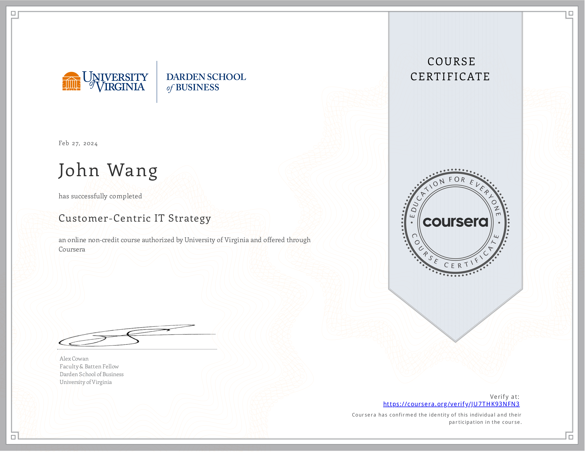
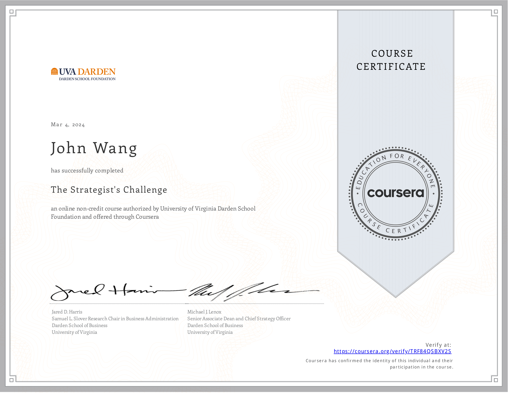
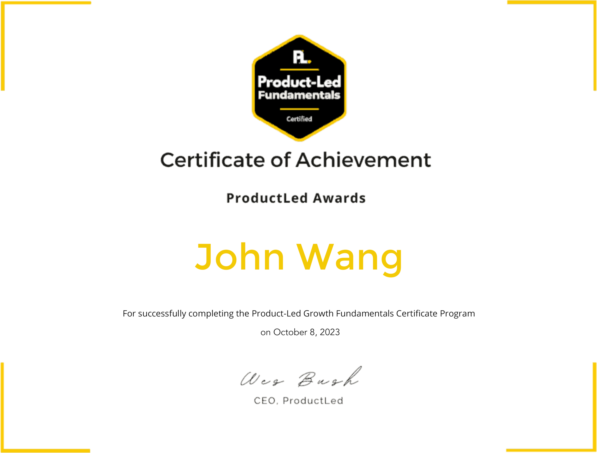
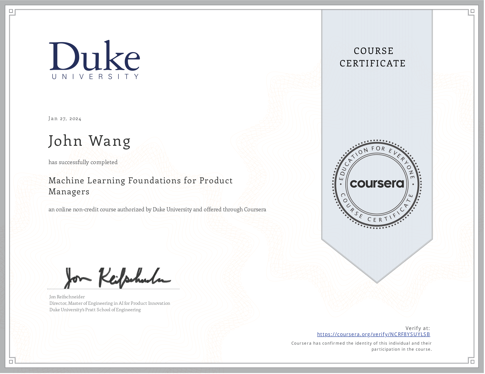

# John's Product Management Certificates
1. [Strategy](#strategy-1)
    1. [Product Management: Strategy and Vision from Pluralsight by Jeremy Jarrell](#product-management-strategy-and-vision-from-pluralsight-by-jeremy-jarrell)
1. [Frameworks](#frameworks-3)
    1. [Customer-Centric IT Strategy from University of Virginia, Darden School by Alex Cowan](#customer-centric-it-strategy-from-university-of-virginia-darden-school-by-alex-cowan)
    1. [The Strategist's Challenge from University of Virginia, Darden School Foundation by Michael Lenox, Jared Harris](#the-strategists-challenge-from-university-of-virginia-darden-school-foundation-by-michael-lenox-jared-harris)
    1. [Exploring Product Management Philosophies and Frameworks from Pluralsight by Dave Masom](#exploring-product-management-philosophies-and-frameworks-from-pluralsight-by-dave-masom)
1. [Roadmap](#roadmap-1)
    1. [Develop a Product Roadmap Using Generative AI from Pluralsight by Harit Himanshu](#develop-a-product-roadmap-using-generative-ai-from-pluralsight-by-harit-himanshu)
1. [Outcomes](#outcomes-3)
    1. [Certified Professional In OKR (Objectives & Key Results) (CPOKR) from Scrum Institute by Yeliz Obergfell](#certified-professional-in-okr-objectives-key-results-cpokr-from-scrum-institute-by-yeliz-obergfell)
    1. [Product Management: Delivering on OKRs from Pluralsight by Keisha Johnson](#product-management-delivering-on-okrs-from-pluralsight-by-keisha-johnson)
    1. [Exploring Envisioning Outcomes from Pluralsight by Lauren Gray](#exploring-envisioning-outcomes-from-pluralsight-by-lauren-gray)
1. [Product-Led Growth (PLG)](#product-led-growth-plg-1)
    1. [Product-Led Fundamentals from ProductLed](#product-led-fundamentals-from-productled)
1. [Machine Learning](#machine-learning-2)
    1. [Machine Learning Foundations for Product Managers from Duke University by Jon Reifschneider](#machine-learning-foundations-for-product-managers-from-duke-university-by-jon-reifschneider)
    1. [AI for Product Management from Pendo](#ai-for-product-management-from-pendo)
1. [Product Craft](#product-craft-1)
    1. [The Emotional Side of Product Management from Pluralsight by Nicole Castillo](#the-emotional-side-of-product-management-from-pluralsight-by-nicole-castillo)
1. [Product Owner](#product-owner-5)
    1. [Certified Scrum Product Owner (CSPO) from Scrum Alliance](#certified-scrum-product-owner-cspo-from-scrum-alliance)
    1. [Professional Scrum Product Owner I (PSPO I) from Scrum.org](#professional-scrum-product-owner-i-pspo-i-from-scrumorg)
    1. [Scrum Product Owner Accredited Certification (SPOAC) from Scrum Institute](#scrum-product-owner-accredited-certification-spoac-from-scrum-institute)
    1. [Certified DevOps Product Owner (DevOps-PO) from DevOps Academy](#certified-devops-product-owner-devops-po-from-devops-academy)
    1. [Becoming a Great Product Owner from Pluralsight by Jeremy Jarrell](#becoming-a-great-product-owner-from-pluralsight-by-jeremy-jarrell)
1. [Documentation](#documentation-1)
    1. [Create AI-assisted Product Documentation from Pluralsight by Xavier Morera](#create-ai-assisted-product-documentation-from-pluralsight-by-xavier-morera)
## Strategy (1)
### Product Management: Strategy and Vision from Pluralsight by Jeremy Jarrell

## Frameworks (3)
### Customer-Centric IT Strategy from University of Virginia, Darden School by Alex Cowan
* [John's University of Virginia, Darden School online credential](https://coursera.org/verify/JU7THK93NFN3)

### The Strategist's Challenge from University of Virginia, Darden School Foundation by Michael Lenox, Jared Harris
* [John's University of Virginia, Darden School Foundation online credential](https://coursera.org/verify/TRF84QSBXV2S)

### Exploring Product Management Philosophies and Frameworks from Pluralsight by Dave Masom

## Roadmap (1)
### Develop a Product Roadmap Using Generative AI from Pluralsight by Harit Himanshu

## Outcomes (3)
### Certified Professional In OKR (Objectives & Key Results) (CPOKR) from Scrum Institute by Yeliz Obergfell
* [John's Scrum Institute online credential](https://www.scrum-institute.org/badges/34694795736577)

### Product Management: Delivering on OKRs from Pluralsight by Keisha Johnson

### Exploring Envisioning Outcomes from Pluralsight by Lauren Gray

## Product-Led Growth (PLG) (1)
### Product-Led Fundamentals from ProductLed

## Machine Learning (2)
### Machine Learning Foundations for Product Managers from Duke University by Jon Reifschneider
* [John's Duke University online credential](https://coursera.org/verify/NCRF8YSUYLSB)

### AI for Product Management from Pendo
* [John's Credly online profile](https://www.credly.com/users/grokify/)
* [John's Pendo online credential](https://www.credly.com/badges/64f1712e-652a-4f49-b392-209f420f5b38)

## Product Craft (1)
### The Emotional Side of Product Management from Pluralsight by Nicole Castillo

## Product Owner (5)
### Certified Scrum Product Owner (CSPO) from Scrum Alliance
* [John's Scrum Alliance online profile](https://www.scrumalliance.org/community/profile/jwang96)

### Professional Scrum Product Owner I (PSPO I) from Scrum.org
* [John's Scrum.org online profile](https://www.scrum.org/user/16066/)
* [John's Credly online profile](https://www.credly.com/users/grokify/)

### Scrum Product Owner Accredited Certification (SPOAC) from Scrum Institute
* [John's Scrum Institute online credential](https://www.scrum-institute.org/badges/79982314947061)

### Certified DevOps Product Owner (DevOps-PO) from DevOps Academy
* [John's DevOps Academy online credential](https://www.devops-certification.org/badges/36722377107944)

### Becoming a Great Product Owner from Pluralsight by Jeremy Jarrell

## Documentation (1)
### Create AI-assisted Product Documentation from Pluralsight by Xavier Morera

