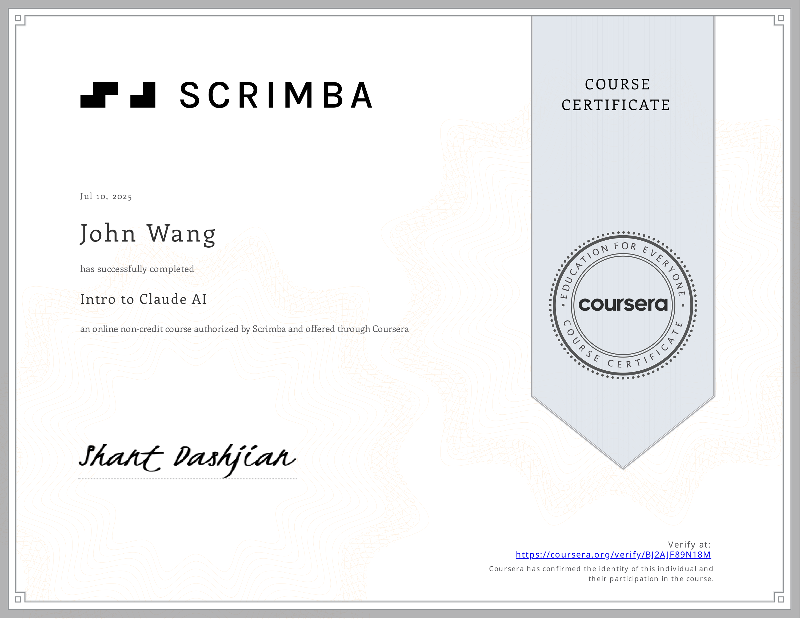
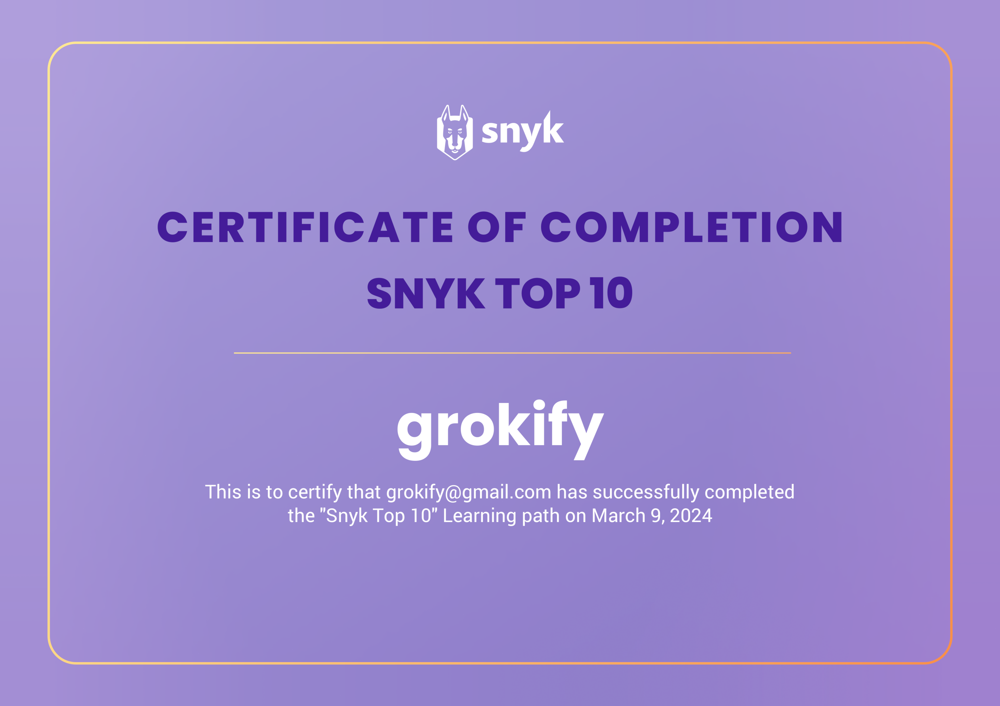

# John's Programming Certificates
1. [Fundamentals](#fundamentals-1)
    1. [Software Design Principles from Codecademy](#software-design-principles-from-codecademy)
1. [Generative AI](#generative-ai-1)
    1. [Intro to Claude AI from Scrimba by Shant Dashjian](#intro-to-claude-ai-from-scrimba-by-shant-dashjian)
1. [Vibe Coding](#vibe-coding-4)
    1. [Vibe Coding with Cursor AI from Scrimba by Maham Codes](#vibe-coding-with-cursor-ai-from-scrimba-by-maham-codes)
    1. [Build AI Apps with Lovable: Vibe Coding for Web Dev from Udemy by Pavan Kumar, Manish Patel](#build-ai-apps-with-lovable-vibe-coding-for-web-dev-from-udemy-by-pavan-kumar-manish-patel)
    1. [Vibe Coding with Replit from Analytics Vidhya by Kunal Jain](#vibe-coding-with-replit-from-analytics-vidhya-by-kunal-jain)
    1. [Guide to Vibe Coding in Windsurf from Analytics Vidhya by Apoorv Vishnoi](#guide-to-vibe-coding-in-windsurf-from-analytics-vidhya-by-apoorv-vishnoi)
1. [Algorithms](#algorithms-1)
    1. [Problem Solving (Basic) from HackerRank](#problem-solving-basic-from-hackerrank)
1. [API](#api-1)
    1. [Rest API (Intermediate) from HackerRank](#rest-api-intermediate-from-hackerrank)
1. [Artificial Intelligence: ML](#artificial-intelligence-ml-1)
    1. [Machine Learning from Stanford by Andrew Ng](#machine-learning-from-stanford-by-andrew-ng)
1. [Refactoring](#refactoring-1)
    1. [ICAgile (ICP-PRG): Improving and Refactoring Code from Pluralsight by Jeremy Jarrell](#icagile-icp-prg-improving-and-refactoring-code-from-pluralsight-by-jeremy-jarrell)
1. [Security](#security-7)
    1. [OWASP Top 10 from Snyk](#owasp-top-10-from-snyk)
    1. [Snyk Top 10 from Snyk](#snyk-top-10-from-snyk)
    1. [Security for Developers from Snyk](#security-for-developers-from-snyk)
    1. [OWASP Top 10: Broken Access Control from Codecademy](#owasp-top-10-broken-access-control-from-codecademy)
    1. [OWASP Top 10: Identification and Authentication Failures from Codecademy](#owasp-top-10-identification-and-authentication-failures-from-codecademy)
    1. [Learn to Prevent Cross-Site Scripting (XSS) with Node.js from Codecademy](#learn-to-prevent-cross-site-scripting-xss-with-nodejs-from-codecademy)
    1. [Learn about CSRF Attacks from Codecademy](#learn-about-csrf-attacks-from-codecademy)
1. [OAuth 2.0 and OpenID Connect (OIDC)](#oauth-20-and-openid-connect-oidc-2)
    1. [Introduction to OAuth 2.0 and OpenID Connect from Pragmatic Web Security by Dr. Philippe De Ryck](#introduction-to-oauth-20-and-openid-connect-from-pragmatic-web-security-by-dr-philippe-de-ryck)
    1. [OAuth2 and OpenID Connect: Easy Now from Pluralsight by Roland Guijt](#oauth2-and-openid-connect-easy-now-from-pluralsight-by-roland-guijt)
1. [C#](#c-1)
    1. [C# (Basic) from HackerRank](#c-basic-from-hackerrank)
1. [Go](#go-4)
    1. [Go (Basic) from HackerRank](#go-basic-from-hackerrank)
    1. [Concurrency in Go from University of California, Irvine by Ian Harris](#concurrency-in-go-from-university-of-california-irvine-by-ian-harris)
    1. [Concurrent Programming in Go from Pluralsight by Mike Van Sickle](#concurrent-programming-in-go-from-pluralsight-by-mike-van-sickle)
    1. [Accessing Non-relational Databases in Go from Pluralsight by Pinal Dave](#accessing-non-relational-databases-in-go-from-pluralsight-by-pinal-dave)
1. [Java](#java-2)
    1. [Java Performance Tuning from Pluralsight by Tim Ojo](#java-performance-tuning-from-pluralsight-by-tim-ojo)
    1. [Refactoring to SOLID Java from Pluralsight by Dan Geabunea](#refactoring-to-solid-java-from-pluralsight-by-dan-geabunea)
1. [Python](#python-1)
    1. [Python (Basic) from HackerRank](#python-basic-from-hackerrank)
1. [SQL](#sql-3)
    1. [SQL (Advanced) from HackerRank](#sql-advanced-from-hackerrank)
    1. [SQL (Intermediate) from HackerRank](#sql-intermediate-from-hackerrank)
    1. [SQL (Basic) from HackerRank](#sql-basic-from-hackerrank)
1. [Front-End](#front-end-3)
    1. [Learn Svelte from Scrimba by Noah Kaufman](#learn-svelte-from-scrimba-by-noah-kaufman)
    1. [React 18: The Big Picture from Pluralsight by Cory House](#react-18-the-big-picture-from-pluralsight-by-cory-house)
    1. [Next.js 12: The Big Picture from Pluralsight by Cory House](#nextjs-12-the-big-picture-from-pluralsight-by-cory-house)
1. [Salesforce](#salesforce-1)
    1. [Getting Started with Salesforce Lightning Web Components from Pluralsight by Sara Morgan Nettles](#getting-started-with-salesforce-lightning-web-components-from-pluralsight-by-sara-morgan-nettles)
## Fundamentals (1)
### Software Design Principles from Codecademy

## Generative AI (1)
### Intro to Claude AI from Scrimba by Shant Dashjian
* [John's Scrimba online credential](https://www.coursera.org/verify/BJ2AJF89N18M)

## Vibe Coding (4)
### Vibe Coding with Cursor AI from Scrimba by Maham Codes
* [John's Scrimba online credential](https://www.coursera.org/verify/YYQ26P22WQQF)

### Build AI Apps with Lovable: Vibe Coding for Web Dev from Udemy by Pavan Kumar, Manish Patel
* [John's Udemy online credential](https://www.udemy.com/certificate/UC-054ec269-a6c0-4c85-90ff-5539102c80a7/)

### Vibe Coding with Replit from Analytics Vidhya by Kunal Jain
* [John's Analytics Vidhya online credential](https://courses.analyticsvidhya.com/certificates/jf8ns9xz2w)

### Guide to Vibe Coding in Windsurf from Analytics Vidhya by Apoorv Vishnoi
* [John's Analytics Vidhya online credential](https://courses.analyticsvidhya.com/certificates/edmxgsnnvy)

## Algorithms (1)
### Problem Solving (Basic) from HackerRank
* [John's HackerRank online profile](https://www.hackerrank.com/profile/grokify)
* [John's HackerRank online credential](https://www.hackerrank.com/certificates/354553bb6ea7)

## API (1)
### Rest API (Intermediate) from HackerRank
* [John's HackerRank online profile](https://www.hackerrank.com/profile/grokify)
* [John's HackerRank online credential](https://www.hackerrank.com/certificates/4c5d7cc60c64)

## Artificial Intelligence: ML (1)
### Machine Learning from Stanford by Andrew Ng

## Refactoring (1)
### ICAgile (ICP-PRG): Improving and Refactoring Code from Pluralsight by Jeremy Jarrell

## Security (7)
### OWASP Top 10 from Snyk

### Snyk Top 10 from Snyk

### Security for Developers from Snyk

### OWASP Top 10: Broken Access Control from Codecademy

### OWASP Top 10: Identification and Authentication Failures from Codecademy

### Learn to Prevent Cross-Site Scripting (XSS) with Node.js from Codecademy

### Learn about CSRF Attacks from Codecademy

## OAuth 2.0 and OpenID Connect (OIDC) (2)
### Introduction to OAuth 2.0 and OpenID Connect from Pragmatic Web Security by Dr. Philippe De Ryck
* [John's Pragmatic Web Security online profile](https://courses.pragmaticwebsecurity.com/certificates/ismezbjb1w)

### OAuth2 and OpenID Connect: Easy Now from Pluralsight by Roland Guijt

## C# (1)
### C# (Basic) from HackerRank
* [John's HackerRank online profile](https://www.hackerrank.com/profile/grokify)
* [John's HackerRank online credential](https://www.hackerrank.com/certificates/0b44cb39a3b8)

## Go (4)
### Go (Basic) from HackerRank
* [John's HackerRank online profile](https://www.hackerrank.com/profile/grokify)
* [John's HackerRank online credential](https://www.hackerrank.com/certificates/7666f51dbcdf)

### Concurrency in Go from University of California, Irvine by Ian Harris
* [John's University of California, Irvine online credential](https://coursera.org/verify/V69VBBWW7CFJ)

### Concurrent Programming in Go from Pluralsight by Mike Van Sickle

### Accessing Non-relational Databases in Go from Pluralsight by Pinal Dave

## Java (2)
### Java Performance Tuning from Pluralsight by Tim Ojo

### Refactoring to SOLID Java from Pluralsight by Dan Geabunea

## Python (1)
### Python (Basic) from HackerRank
* [John's HackerRank online profile](https://www.hackerrank.com/profile/grokify)
* [John's HackerRank online credential](https://www.hackerrank.com/certificates/b72ee71f1292)

## SQL (3)
### SQL (Advanced) from HackerRank
* [John's HackerRank online profile](https://www.hackerrank.com/profile/grokify)
* [John's HackerRank online credential](https://www.hackerrank.com/certificates/3398beadc245)

### SQL (Intermediate) from HackerRank
* [John's HackerRank online profile](https://www.hackerrank.com/profile/grokify)
* [John's HackerRank online credential](https://www.hackerrank.com/certificates/7326755aba4a)

### SQL (Basic) from HackerRank
* [John's HackerRank online profile](https://www.hackerrank.com/profile/grokify)
* [John's HackerRank online credential](https://www.hackerrank.com/certificates/85d3ebe85d24)

## Front-End (3)
### Learn Svelte from Scrimba by Noah Kaufman
* [John's Scrimba online credential](https://coursera.org/verify/ESL29XQVVGRC)

### React 18: The Big Picture from Pluralsight by Cory House

### Next.js 12: The Big Picture from Pluralsight by Cory House

## Salesforce (1)
### Getting Started with Salesforce Lightning Web Components from Pluralsight by Sara Morgan Nettles

