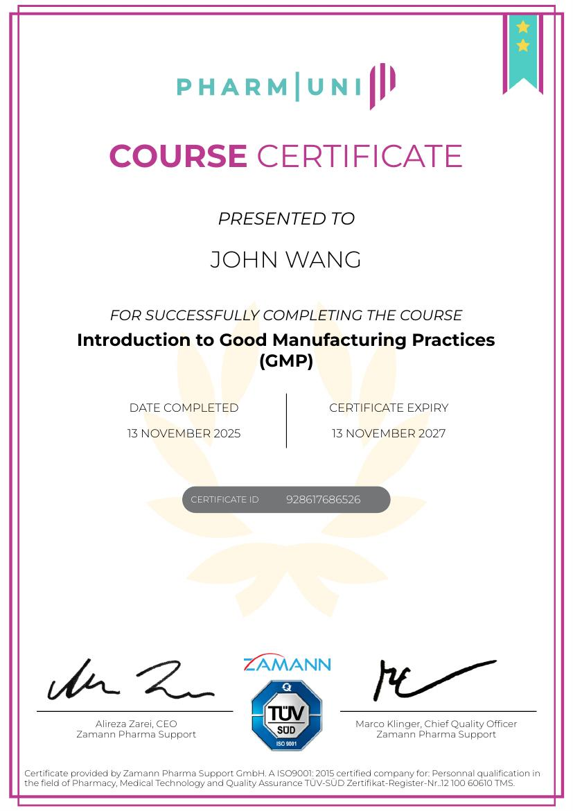

# John's Quality Assurance Certificates
1. [Fundamentals](#fundamentals-1)
    1. [Error Proofing Techniques from Management and Strategy Institute](#error-proofing-techniques-from-management-and-strategy-institute)
1. [Six Sigma](#six-sigma-1)
    1. [Lean Six Sigma White Belt from Management and Strategy Institute](#lean-six-sigma-white-belt-from-management-and-strategy-institute)
1. [Compliance](#compliance-3)
    1. [Introduction to Good Manufacturing Practices (GMP) from Pharmuni](#introduction-to-good-manufacturing-practices-gmp-from-pharmuni)
    1. [Introduction to GMP Annex 1 from Pharmuni](#introduction-to-gmp-annex-1-from-pharmuni)
    1. [21 CFR Part 11 Fundamentals from 21 CFR Part 11 Compliance](#21-cfr-part-11-fundamentals-from-21-cfr-part-11-compliance)
## Fundamentals (1)
### Error Proofing Techniques from Management and Strategy Institute
* [John's Management and Strategy Institute online credential](https://www.proprofs.com/quiz-school/user_certificate.php?id=349247773&qid=4363758)

## Six Sigma (1)
### Lean Six Sigma White Belt from Management and Strategy Institute
* [John's Management and Strategy Institute online credential](https://www.proprofs.com/quiz-school/user_certificate.php?id=347254040&qid=3592982)

## Compliance (3)
### Introduction to Good Manufacturing Practices (GMP) from Pharmuni

### Introduction to GMP Annex 1 from Pharmuni

### 21 CFR Part 11 Fundamentals from 21 CFR Part 11 Compliance
* [John's 21 CFR Part 11 Compliance online credential](https://www.part11compliance.com/quiz/verify-certificate?uuid=5c67990f-8e70-4b09-a5f0-4ccf95ef6d16)

