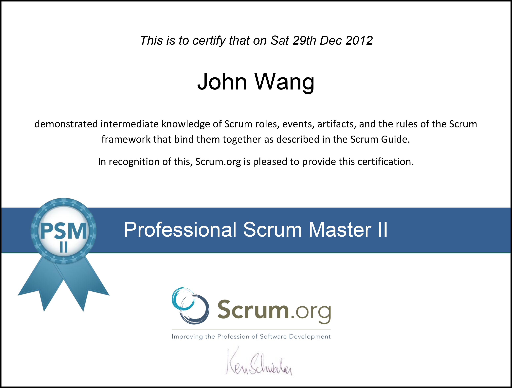
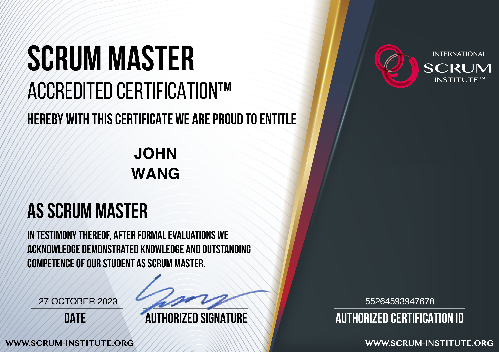
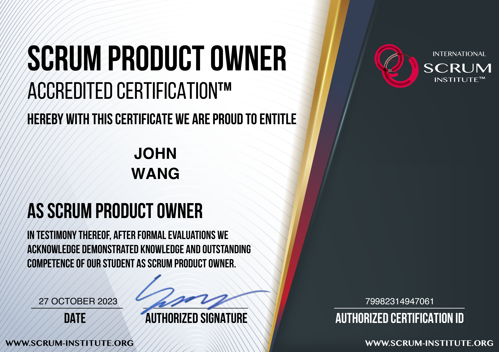
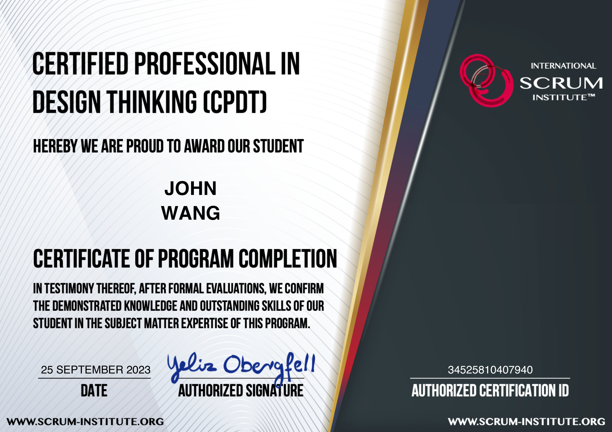
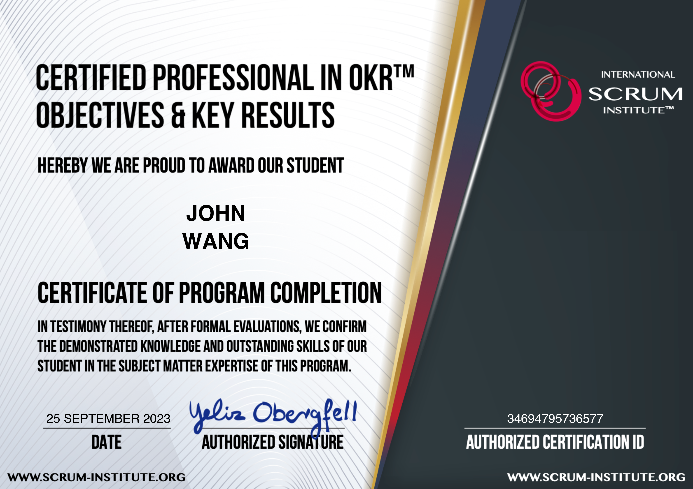
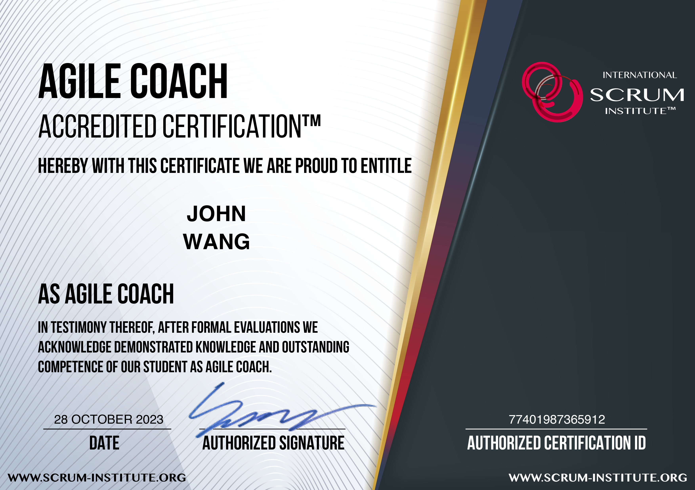

# John's Scrum Certificates
1. [Scrum Master](#scrum-master-6)
    1. [Certified ScrumMaster (CSM) from Scrum Alliance by](#certified-scrummaster-csm-from-scrum-alliance-by)
    1. [Professional Scrum Master III (PSM III) from Scrum.org by](#professional-scrum-master-iii-psm-iii-from-scrumorg-by)
    1. [Professional Scrum Master II (PSM II) from Scrum.org by](#professional-scrum-master-ii-psm-ii-from-scrumorg-by)
    1. [Professional Scrum Master I (PSM I) from Scrum.org by](#professional-scrum-master-i-psm-i-from-scrumorg-by)
    1. [Scrum Master Accredited Certification (SMAC) from Scrum Institute by](#scrum-master-accredited-certification-smac-from-scrum-institute-by)
    1. [Implementing Scrum and Avoiding Scrum Anti-Patterns from Pluralsight by Derek Davidson](#implementing-scrum-and-avoiding-scrum-anti-patterns-from-pluralsight-by-derek-davidson)
1. [Product Owner](#product-owner-4)
    1. [Certified Scrum Product Owner (CSPO) from Scrum Alliance by](#certified-scrum-product-owner-cspo-from-scrum-alliance-by)
    1. [Professional Scrum Product Owner I (PSPO I) from Scrum.org by](#professional-scrum-product-owner-i-pspo-i-from-scrumorg-by)
    1. [Scrum Product Owner Accredited Certification (SPOAC) from Scrum Institute by](#scrum-product-owner-accredited-certification-spoac-from-scrum-institute-by)
    1. [Becoming a Great Product Owner from Pluralsight by Jeremy Jarrell](#becoming-a-great-product-owner-from-pluralsight-by-jeremy-jarrell)
1. [Developer](#developer-2)
    1. [Professional Scrum Developer (PSD) from Scrum.org by](#professional-scrum-developer-psd-from-scrumorg-by)
    1. [Certified Professional In Design Thinking (CPDT) from Scrum Institute by Yeliz Obergfell](#certified-professional-in-design-thinking-cpdt-from-scrum-institute-by-yeliz-obergfell)
1. [Kanban](#kanban-1)
    1. [Certified Kanban Expert from Scrum Institute by](#certified-kanban-expert-from-scrum-institute-by)
1. [Scaled Scrum](#scaled-scrum-2)
    1. [Scaled Professional Scrum (SPS) from Scrum.org by](#scaled-professional-scrum-sps-from-scrumorg-by)
    1. [Scaled Scrum Expert (SSEAC) from Scrum Institute by](#scaled-scrum-expert-sseac-from-scrum-institute-by)
1. [Leadership](#leadership-3)
    1. [Professional Agile Leadership - Evidence-Based Management (PAL-EBM) from Scrum.org by](#professional-agile-leadership-evidence-based-management-pal-ebm-from-scrumorg-by)
    1. [Professional Agile Leadership I (PAL I) from Scrum.org by](#professional-agile-leadership-i-pal-i-from-scrumorg-by)
    1. [Certified Professional In OKR (Objectives & Key Results) (CPOKR) from Scrum Institute by Yeliz Obergfell](#certified-professional-in-okr-objectives-key-results-cpokr-from-scrum-institute-by-yeliz-obergfell)
1. [Coach](#coach-1)
    1. [Agile Coach Accredited Certification (ACAC) from Scrum Institute by](#agile-coach-accredited-certification-acac-from-scrum-institute-by)
## Articles

1. [Renewing Scrum Alliance Certificates](../scrum_scrumalliance-renewal)
1. [How to Pass Scrum.org Assessments](../scrum_how-to-pass-scrum-org-assessments)
## Resources

1. [Design Thinking Resource Links](../design-thinking_resource-links)
1. [OKR Reading List](../okr_resource-links)
1. [Scrum Reading List](../scrum_resource-links)
## Scrum Master (6)
### Certified ScrumMaster (CSM) from Scrum Alliance by 
* [John's Scrum Alliance online profile](https://www.scrumalliance.org/community/profile/jwang96)

### Professional Scrum Master III (PSM III) from Scrum.org by 
* [John's Scrum.org online profile](https://www.scrum.org/user/16066/)
* [John's Credly online profile](https://www.credly.com/users/grokify/)

### Professional Scrum Master II (PSM II) from Scrum.org by 
* [John's Scrum.org online profile](https://www.scrum.org/user/16066/)
* [John's Credly online profile](https://www.credly.com/users/grokify/)

### Professional Scrum Master I (PSM I) from Scrum.org by 
* [John's Scrum.org online profile](https://www.scrum.org/user/16066/)
* [John's Credly online profile](https://www.credly.com/users/grokify/)

### Scrum Master Accredited Certification (SMAC) from Scrum Institute by 
* [John's Scrum Institute online credential](https://www.scrum-institute.org/badges/55264593947678)

### Implementing Scrum and Avoiding Scrum Anti-Patterns from Pluralsight by Derek Davidson

## Product Owner (4)
### Certified Scrum Product Owner (CSPO) from Scrum Alliance by 
* [John's Scrum Alliance online profile](https://www.scrumalliance.org/community/profile/jwang96)

### Professional Scrum Product Owner I (PSPO I) from Scrum.org by 
* [John's Scrum.org online profile](https://www.scrum.org/user/16066/)
* [John's Credly online profile](https://www.credly.com/users/grokify/)

### Scrum Product Owner Accredited Certification (SPOAC) from Scrum Institute by 
* [John's Scrum Institute online credential](https://www.scrum-institute.org/badges/79982314947061)

### Becoming a Great Product Owner from Pluralsight by Jeremy Jarrell

## Developer (2)
### Professional Scrum Developer (PSD) from Scrum.org by 
* [John's Scrum.org online profile](https://www.scrum.org/user/16066/)
* [John's Credly online profile](https://www.credly.com/users/grokify/)

### Certified Professional In Design Thinking (CPDT) from Scrum Institute by Yeliz Obergfell
* [John's Scrum Institute online credential](https://www.scrum-institute.org/badges/34525810407940)

## Kanban (1)
### Certified Kanban Expert from Scrum Institute by 
* [John's Scrum Institute online credential](https://www.scrum-institute.org/badges/13089873244985)

## Scaled Scrum (2)
### Scaled Professional Scrum (SPS) from Scrum.org by 
* [John's Scrum.org online profile](https://www.scrum.org/user/16066/)
* [John's Credly online profile](https://www.credly.com/users/grokify/)

### Scaled Scrum Expert (SSEAC) from Scrum Institute by 
* [John's Scrum Institute online credential](https://www.scrum-institute.org/badges/85935887341853)

## Leadership (3)
### Professional Agile Leadership - Evidence-Based Management (PAL-EBM) from Scrum.org by 
* [John's Scrum.org online profile](https://www.scrum.org/user/16066/)
* [John's Credly online profile](https://www.credly.com/users/grokify/)

### Professional Agile Leadership I (PAL I) from Scrum.org by 
* [John's Scrum.org online profile](https://www.scrum.org/user/16066/)
* [John's Credly online profile](https://www.credly.com/users/grokify/)

### Certified Professional In OKR (Objectives & Key Results) (CPOKR) from Scrum Institute by Yeliz Obergfell
* [John's Scrum Institute online credential](https://www.scrum-institute.org/badges/34694795736577)

## Coach (1)
### Agile Coach Accredited Certification (ACAC) from Scrum Institute by 
* [John's Scrum Institute online credential](https://www.scrum-institute.org/badges/77401987365912)

