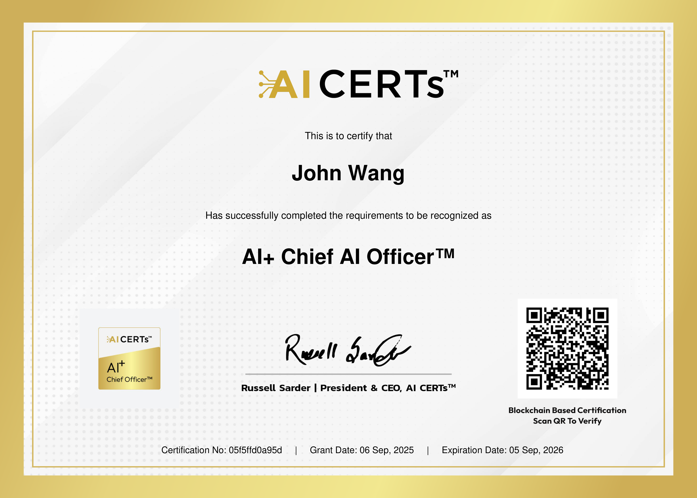

# John's Security: AI Certificates
1. [Chief Artificial Intelligence Officer (CAIO)](#chief-artificial-intelligence-officer-caio-1)
    1. [AI+ Chief AI Officer™ from AI CERTs](#ai-chief-ai-officertm-from-ai-certs)
1. [Fundamentals](#fundamentals-2)
    1. [Defending Against AI-Generated Attacks from Codecademy](#defending-against-ai-generated-attacks-from-codecademy)
    1. [AI Security from Lakera](#ai-security-from-lakera)
1. [AI Agents](#ai-agents-1)
    1. [Agentic AI - Risk and Cybersecurity Masterclass 2025 from Udemy by Taimur Ijlal](#agentic-ai-risk-and-cybersecurity-masterclass-2025-from-udemy-by-taimur-ijlal)
1. [AI Assistants](#ai-assistants-1)
    1. [Secure Coding with Amazon Q Developer from Pluralsight by Tom Taulli](#secure-coding-with-amazon-q-developer-from-pluralsight-by-tom-taulli)
1. [Generative AI](#generative-ai-6)
    1. [AI Security Bootcamp: LLM Hacking Basics from Udemy by Naveen Konrajankuppam Mahavishnu, Mohankumar Vengatachalam](#ai-security-bootcamp-llm-hacking-basics-from-udemy-by-naveen-konrajankuppam-mahavishnu-mohankumar-vengatachalam)
    1. [Security Hot Takes: ChatGPT from Pluralsight by Xavier Morera](#security-hot-takes-chatgpt-from-pluralsight-by-xavier-morera)
    1. [OpenAI Security and Moderations from Pluralsight by Chris Jackson](#openai-security-and-moderations-from-pluralsight-by-chris-jackson)
    1. [Security Hot Takes: ChatGPT from Pluralsight by Michael Teske, Aaron Rosenmund](#security-hot-takes-chatgpt-from-pluralsight-by-michael-teske-aaron-rosenmund)
    1. [Security Risks and Privacy Concerns Using Generative AI from Pluralsight by Dr. Shaila Rana](#security-risks-and-privacy-concerns-using-generative-ai-from-pluralsight-by-dr-shaila-rana)
    1. [Generative AI: Intelligent and Dangerous? from KnowBe4 by Dr. Swantje Westpfahl](#generative-ai-intelligent-and-dangerous-from-knowbe4-by-dr-swantje-westpfahl)
1. [InfoSec](#infosec-2)
    1. [Building the AI Security Roadmap from Silicon Valley Certification Hub by Tiffany Saade](#building-the-ai-security-roadmap-from-silicon-valley-certification-hub-by-tiffany-saade)
    1. [AI, Phishing, and Cybersafety from KnowBe4](#ai-phishing-and-cybersafety-from-knowbe4)
## Chief Artificial Intelligence Officer (CAIO) (1)
### AI+ Chief AI Officer™ from AI CERTs
* [John's AI CERTs online credential](https://verify.certs365.io/?=05f5ffd0a95d)

## Fundamentals (2)
### Defending Against AI-Generated Attacks from Codecademy

### AI Security from Lakera
* [John's Lakera online credential](https://security.certificates.lakera.ai/credentials/53495805-342d-41b7-b9bf-5923ae00422d)

## AI Agents (1)
### Agentic AI - Risk and Cybersecurity Masterclass 2025 from Udemy by Taimur Ijlal
* [John's Udemy online credential](http://ude.my/UC-ab54d286-b26e-4cd6-bae5-3c7f5e4c975e)

## AI Assistants (1)
### Secure Coding with Amazon Q Developer from Pluralsight by Tom Taulli

## Generative AI (6)
### AI Security Bootcamp: LLM Hacking Basics from Udemy by Naveen Konrajankuppam Mahavishnu, Mohankumar Vengatachalam
* [John's Udemy online credential](http://ude.my/UC-e1b44f95-516d-41e1-af3e-686c0dbb38e1)

### Security Hot Takes: ChatGPT from Pluralsight by Xavier Morera

### OpenAI Security and Moderations from Pluralsight by Chris Jackson

### Security Hot Takes: ChatGPT from Pluralsight by Michael Teske, Aaron Rosenmund

### Security Risks and Privacy Concerns Using Generative AI from Pluralsight by Dr. Shaila Rana

### Generative AI: Intelligent and Dangerous? from KnowBe4 by Dr. Swantje Westpfahl

## InfoSec (2)
### Building the AI Security Roadmap from Silicon Valley Certification Hub by Tiffany Saade
* [John's Silicon Valley Certification Hub online credential](https://svch.io/tutor-certificate-2-2/?cert_hash=415e03ea4ad86a07)

### AI, Phishing, and Cybersafety from KnowBe4

