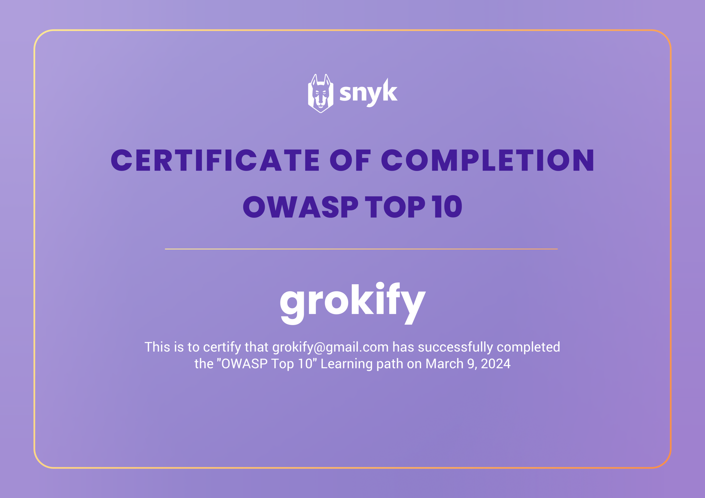
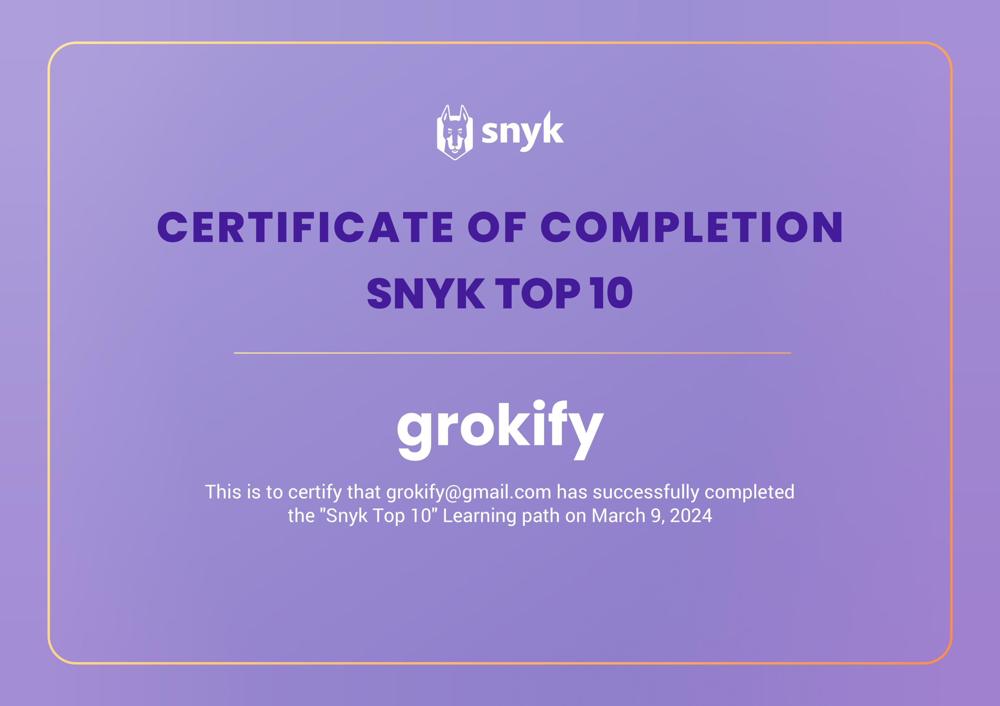
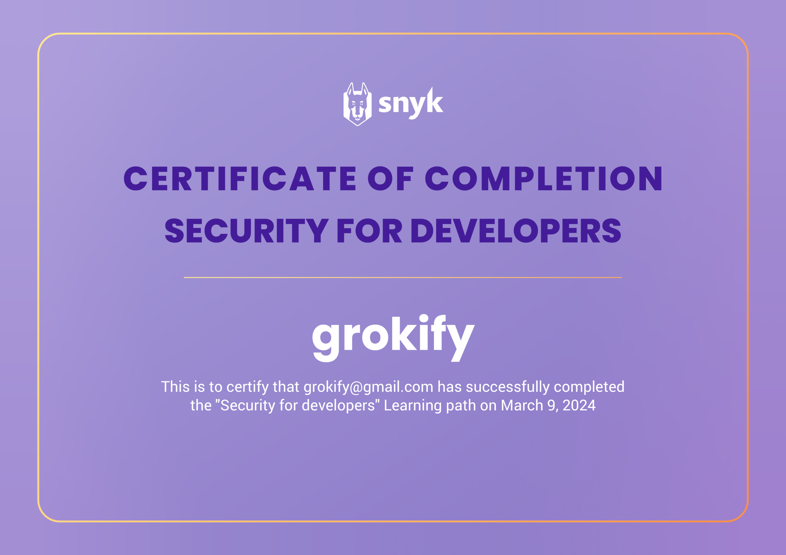
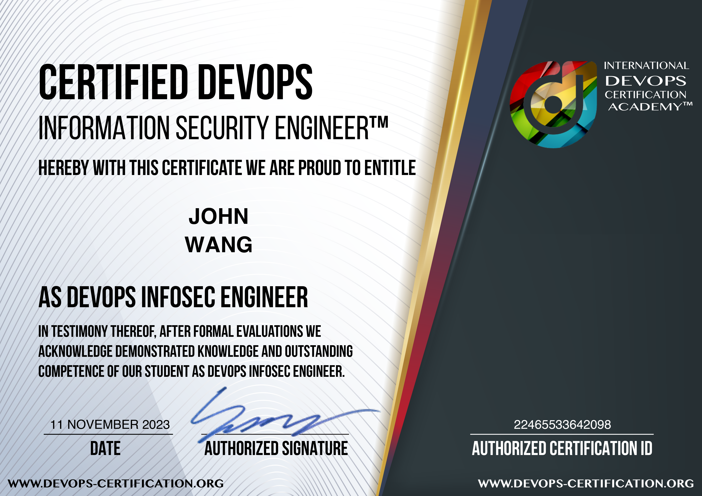

# John's Security: AppSec Certificates
1. [Strategy](#strategy-1)
    1. [Security Framework: NIST CSF from Pluralsight by Mike Woolard](#security-framework-nist-csf-from-pluralsight-by-mike-woolard)
1. [CSSLP](#csslp-3)
    1. [Secure Software Concepts for CSSLP® from Pluralsight by Kevin Henry](#secure-software-concepts-for-csslp-from-pluralsight-by-kevin-henry)
    1. [Secure Software Supply Chain for CSSLP from Pluralsight by Kevin Henry](#secure-software-supply-chain-for-csslp-from-pluralsight-by-kevin-henry)
    1. [Secure Software Testing for CSSLP® from Pluralsight by Kevin Henry](#secure-software-testing-for-csslp-from-pluralsight-by-kevin-henry)
1. [Security Champion](#security-champion-2)
    1. [Introduction to Security Champion for Developers from Pluralsight by Kat DeLorean Seymour](#introduction-to-security-champion-for-developers-from-pluralsight-by-kat-delorean-seymour)
    1. [Developer Security Champion: OWASP Top 10 from Pluralsight by Kat DeLorean Seymour](#developer-security-champion-owasp-top-10-from-pluralsight-by-kat-delorean-seymour)
1. [Programming](#programming-6)
    1. [OWASP Top 10: Broken Access Control from Codecademy](#owasp-top-10-broken-access-control-from-codecademy)
    1. [OWASP Top 10: Identification and Authentication Failures from Codecademy](#owasp-top-10-identification-and-authentication-failures-from-codecademy)
    1. [Learn about CSRF Attacks from Codecademy](#learn-about-csrf-attacks-from-codecademy)
    1. [OWASP Top 10 from Snyk](#owasp-top-10-from-snyk)
    1. [Snyk Top 10 from Snyk](#snyk-top-10-from-snyk)
    1. [Security for Developers from Snyk](#security-for-developers-from-snyk)
1. [Access](#access-2)
    1. [Introduction to OAuth 2.0 and OpenID Connect from Pragmatic Web Security by Dr. Philippe De Ryck](#introduction-to-oauth-20-and-openid-connect-from-pragmatic-web-security-by-dr-philippe-de-ryck)
    1. [OAuth2 and OpenID Connect: Easy Now from Pluralsight by Roland Guijt](#oauth2-and-openid-connect-easy-now-from-pluralsight-by-roland-guijt)
1. [API](#api-1)
    1. [API Security Architect from API Academy](#api-security-architect-from-api-academy)
1. [Software Supply Chain Security (SSCS)](#software-supply-chain-security-sscs-3)
    1. [Secure Coding: Using Components with Known Vulnerabilities from Pluralsight by Peter Mosmans](#secure-coding-using-components-with-known-vulnerabilities-from-pluralsight-by-peter-mosmans)
    1. [Security Hot Takes: SBOMs from Pluralsight by Aaron Rosenmund, Brandon DeVault](#security-hot-takes-sboms-from-pluralsight-by-aaron-rosenmund-brandon-devault)
    1. [Saviynt Supply Chain Risk Management Training from KnowBe4](#saviynt-supply-chain-risk-management-training-from-knowbe4)
1. [Kubernetes](#kubernetes-4)
    1. [Kubernetes Security: Cluster Setup from Pluralsight by Antonio Jesús Piedra](#kubernetes-security-cluster-setup-from-pluralsight-by-antonio-jess-piedra)
    1. [Kubernetes Security: Cluster Hardening from Pluralsight by Erik Whitaker](#kubernetes-security-cluster-hardening-from-pluralsight-by-erik-whitaker)
    1. [Kubernetes Security: Minimizing Microservice Vulnerabilities from Pluralsight by Justin Boyer](#kubernetes-security-minimizing-microservice-vulnerabilities-from-pluralsight-by-justin-boyer)
    1. [Kubernetes Security: Implementing Supply Chain Security from Pluralsight by Antonio Jesús Piedra](#kubernetes-security-implementing-supply-chain-security-from-pluralsight-by-antonio-jess-piedra)
1. [DevOps](#devops-2)
    1. [Certified DevOps Information Security Engineer (DevOps-SEC) from DevOps Academy](#certified-devops-information-security-engineer-devops-sec-from-devops-academy)
    1. [Container Infrastructure Analysis with Trivy from Pluralsight by Zach Roof](#container-infrastructure-analysis-with-trivy-from-pluralsight-by-zach-roof)
1. [SecOps](#secops-4)
    1. [Red Team Operations: Target and Capability Development from Pluralsight by Aaron Rosenmund](#red-team-operations-target-and-capability-development-from-pluralsight-by-aaron-rosenmund)
    1. [Red Team Tools for Emulated Adversary Techniques with MITRE ATT&CK from Pluralsight by Aaron Rosenmund](#red-team-tools-for-emulated-adversary-techniques-with-mitre-attck-from-pluralsight-by-aaron-rosenmund)
    1. [Blue Team Tools: Defense against Adversary Activity Using MITRE Techniques from Pluralsight by Aaron Rosenmund](#blue-team-tools-defense-against-adversary-activity-using-mitre-techniques-from-pluralsight-by-aaron-rosenmund)
    1. [Detect, Prioritize, and Remediate Cloud Security Risks with Datadog CSM from Datadog](#detect-prioritize-and-remediate-cloud-security-risks-with-datadog-csm-from-datadog)
1. [AWS](#aws-6)
    1. [AWS: Identity and Access Management from Whizlabs](#aws-identity-and-access-management-from-whizlabs)
    1. [Introduction to AWS Identity and Access Management (IAM) from Simplilearn](#introduction-to-aws-identity-and-access-management-iam-from-simplilearn)
    1. [Introduction to AWS Trusted Advisor from Simplilearn](#introduction-to-aws-trusted-advisor-from-simplilearn)
    1. [Getting Started with AWS Security Hub from Simplilearn](#getting-started-with-aws-security-hub-from-simplilearn)
    1. [Introduction to AWS Security Token Services (STS) from Simplilearn](#introduction-to-aws-security-token-services-sts-from-simplilearn)
    1. [Getting Started with AWS Control Tower from Simplilearn](#getting-started-with-aws-control-tower-from-simplilearn)
1. [Snyk](#snyk-1)
    1. [Application Analysis with Snyk from Pluralsight by Hiren Gadhvi](#application-analysis-with-snyk-from-pluralsight-by-hiren-gadhvi)
1. [Vulnerability Examples](#vulnerability-examples-1)
    1. [XZ Backdoor Supply Chain Vulnerability: What You Should Know from Pluralsight by Aaron Rosenmund, Matthew Lloyd Davies](#xz-backdoor-supply-chain-vulnerability-what-you-should-know-from-pluralsight-by-aaron-rosenmund-matthew-lloyd-davies)
## Strategy (1)
### Security Framework: NIST CSF from Pluralsight by Mike Woolard

## CSSLP (3)
### Secure Software Concepts for CSSLP® from Pluralsight by Kevin Henry

### Secure Software Supply Chain for CSSLP from Pluralsight by Kevin Henry

### Secure Software Testing for CSSLP® from Pluralsight by Kevin Henry

## Security Champion (2)
### Introduction to Security Champion for Developers from Pluralsight by Kat DeLorean Seymour

### Developer Security Champion: OWASP Top 10 from Pluralsight by Kat DeLorean Seymour

## Programming (6)
### OWASP Top 10: Broken Access Control from Codecademy

### OWASP Top 10: Identification and Authentication Failures from Codecademy

### Learn about CSRF Attacks from Codecademy

### OWASP Top 10 from Snyk

### Snyk Top 10 from Snyk

### Security for Developers from Snyk

## Access (2)
### Introduction to OAuth 2.0 and OpenID Connect from Pragmatic Web Security by Dr. Philippe De Ryck
* [John's Pragmatic Web Security online profile](https://courses.pragmaticwebsecurity.com/certificates/ismezbjb1w)

### OAuth2 and OpenID Connect: Easy Now from Pluralsight by Roland Guijt

## API (1)
### API Security Architect from API Academy

## Software Supply Chain Security (SSCS) (3)
### Secure Coding: Using Components with Known Vulnerabilities from Pluralsight by Peter Mosmans

### Security Hot Takes: SBOMs from Pluralsight by Aaron Rosenmund, Brandon DeVault

### Saviynt Supply Chain Risk Management Training from KnowBe4

## Kubernetes (4)
### Kubernetes Security: Cluster Setup from Pluralsight by Antonio Jesús Piedra

### Kubernetes Security: Cluster Hardening from Pluralsight by Erik Whitaker

### Kubernetes Security: Minimizing Microservice Vulnerabilities from Pluralsight by Justin Boyer

### Kubernetes Security: Implementing Supply Chain Security from Pluralsight by Antonio Jesús Piedra

## DevOps (2)
### Certified DevOps Information Security Engineer (DevOps-SEC) from DevOps Academy
* [John's DevOps Academy online credential](https://www.devops-certification.org/badges/22465533642098)

### Container Infrastructure Analysis with Trivy from Pluralsight by Zach Roof

## SecOps (4)
### Red Team Operations: Target and Capability Development from Pluralsight by Aaron Rosenmund

### Red Team Tools for Emulated Adversary Techniques with MITRE ATT&CK from Pluralsight by Aaron Rosenmund

### Blue Team Tools: Defense against Adversary Activity Using MITRE Techniques from Pluralsight by Aaron Rosenmund

### Detect, Prioritize, and Remediate Cloud Security Risks with Datadog CSM from Datadog
* [John's Datadog online credential](https://learn.datadoghq.com/certificates/jq29dawso1)

## AWS (6)
### AWS: Identity and Access Management from Whizlabs
* [John's Whizlabs online credential](https://coursera.org/verify/QRD93E7CVUMP)

### Introduction to AWS Identity and Access Management (IAM) from Simplilearn

### Introduction to AWS Trusted Advisor from Simplilearn

### Getting Started with AWS Security Hub from Simplilearn

### Introduction to AWS Security Token Services (STS) from Simplilearn

### Getting Started with AWS Control Tower from Simplilearn

## Snyk (1)
### Application Analysis with Snyk from Pluralsight by Hiren Gadhvi

## Vulnerability Examples (1)
### XZ Backdoor Supply Chain Vulnerability: What You Should Know from Pluralsight by Aaron Rosenmund, Matthew Lloyd Davies

