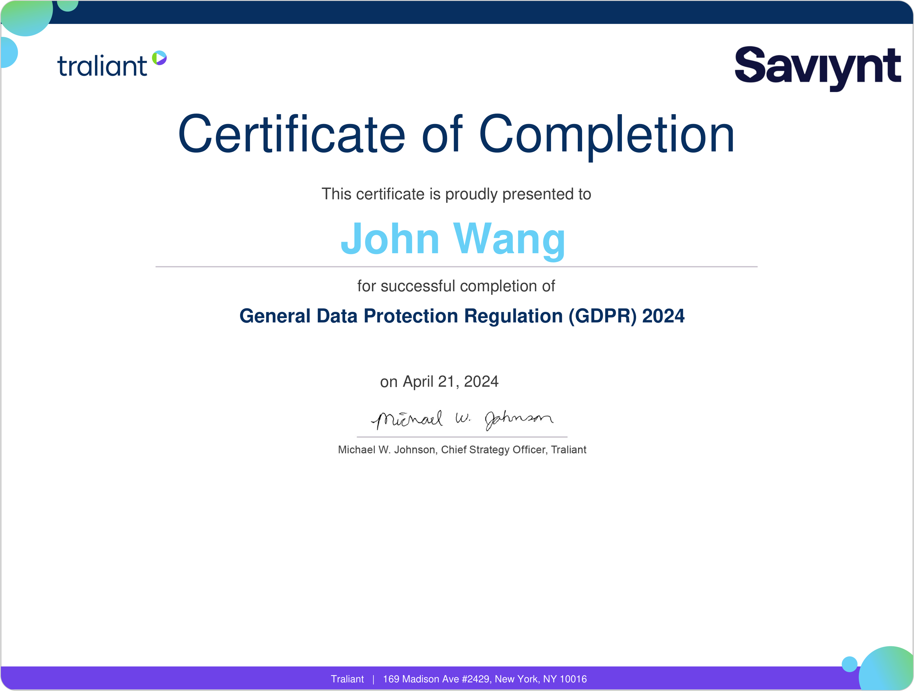

# John's Security: Compliance Certificates
1. [Federal](#federal-4)
    1. [Saviynt Security Awareness and Federal Data Protection Training from Saviynt](#saviynt-security-awareness-and-federal-data-protection-training-from-saviynt)
    1. [[FedRAMP] Saviynt Anti-Counterfeit Procedures from Saviynt](#fedramp-saviynt-anti-counterfeit-procedures-from-saviynt)
    1. [[FedRAMP] Saviynt Social Mining Training from Saviynt](#fedramp-saviynt-social-mining-training-from-saviynt)
    1. [Security Compliance: FedRAMP from Pluralsight by Richard Harpur](#security-compliance-fedramp-from-pluralsight-by-richard-harpur)
1. [General Data Protection Regulation (GDPR)](#general-data-protection-regulation-gdpr-2)
    1. [General Data Protection Regulation (GDPR) 2024 from Traliant](#general-data-protection-regulation-gdpr-2024-from-traliant)
    1. [General Data Protection Regulation (GDPR) "2023" from Traliant](#general-data-protection-regulation-gdpr-2023-from-traliant)
1. [California Consumer Privacy Act (CCPA)](#california-consumer-privacy-act-ccpa-1)
    1. [California Consumer Privacy Act (CCPA & CPRA) V2 from Traliant](#california-consumer-privacy-act-ccpa-cpra-v2-from-traliant)
## Federal (4)
### Saviynt Security Awareness and Federal Data Protection Training from Saviynt

### [FedRAMP] Saviynt Anti-Counterfeit Procedures from Saviynt

### [FedRAMP] Saviynt Social Mining Training from Saviynt

### Security Compliance: FedRAMP from Pluralsight by Richard Harpur

## General Data Protection Regulation (GDPR) (2)
### General Data Protection Regulation (GDPR) 2024 from Traliant

### General Data Protection Regulation (GDPR) "2023" from Traliant

## California Consumer Privacy Act (CCPA) (1)
### California Consumer Privacy Act (CCPA & CPRA) V2 from Traliant

