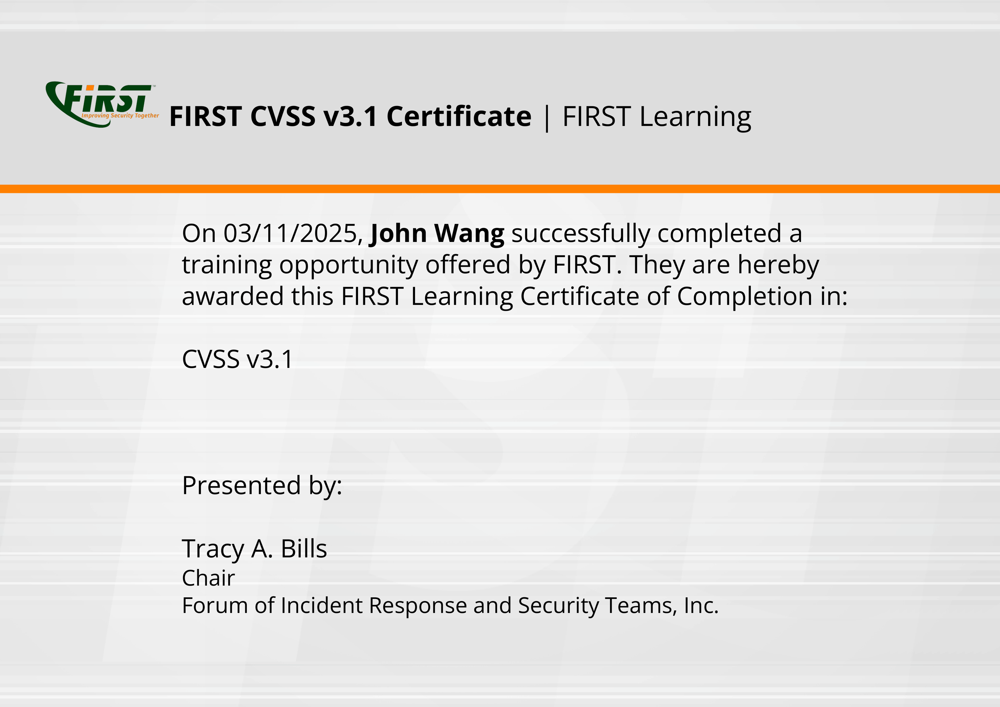
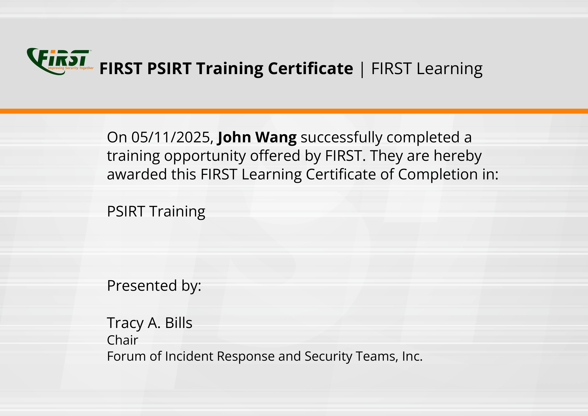

# John's Security: InfoSec Certificates
1. [CISSP](#cissp-1)
    1. [Asset Security for CISSP® from Pluralsight by Kevin Henry](#asset-security-for-cissp-from-pluralsight-by-kevin-henry)
1. [Fundamentals](#fundamentals-7)
    1. [Corporate Information Security Awareness - Proofpoint 2014 from Proofpoint](#corporate-information-security-awareness-proofpoint-2014-from-proofpoint)
    1. [Saviynt Information Security Annual Training from Saviynt](#saviynt-information-security-annual-training-from-saviynt)
    1. [2024 Kevin Mitnick Security Awareness Training from KnowBe4 by Kevin Mitnick](#2024-kevin-mitnick-security-awareness-training-from-knowbe4-by-kevin-mitnick)
    1. [2024 Common Threats from KnowBe4](#2024-common-threats-from-knowbe4)
    1. [Top 5 Security Awareness Fundamentals from KnowBe4](#top-5-security-awareness-fundamentals-from-knowbe4)
    1. [Cybersecurity: Every second counts from KnowBe4](#cybersecurity-every-second-counts-from-knowbe4)
    1. [Non-Technical Security from KnowBe4](#non-technical-security-from-knowbe4)
1. [Concepts](#concepts-2)
    1. [How to Become a Human Firewall from KnowBe4](#how-to-become-a-human-firewall-from-knowbe4)
    1. [Voice on Security: Piggybacking from KnowBe4](#voice-on-security-piggybacking-from-knowbe4)
1. [Risk Management](#risk-management-2)
    1. [CVSS v3.1 from FIRST](#cvss-v31-from-first)
    1. [CVSS v4.0 from FIRST](#cvss-v40-from-first)
1. [Phishing](#phishing-3)
    1. [Microsoft Teams Phishing Demo from KnowBe4](#microsoft-teams-phishing-demo-from-knowbe4)
    1. [Video: Reality Bytes: Vishing from KnowBe4](#video-reality-bytes-vishing-from-knowbe4)
    1. [The Art of Phishing from KnowBe4](#the-art-of-phishing-from-knowbe4)
1. [Two-Factor Authentication](#two-factor-authentication-4)
    1. [Kevin Mitnick - Two-Factor Authentication Attack from KnowBe4 by Kevin Mitnick](#kevin-mitnick-two-factor-authentication-attack-from-knowbe4-by-kevin-mitnick)
    1. [Social Engineering Two-Factor Authentication Access Demonstration from KnowBe4 by Kevin Mitnick](#social-engineering-two-factor-authentication-access-demonstration-from-knowbe4-by-kevin-mitnick)
    1. [Don't Be Like Rick: Two-Factor Authentication from KnowBe4](#dont-be-like-rick-two-factor-authentication-from-knowbe4)
    1. [Don't Be Like Rick: Two-Factor Authentication from KnowBe4](#dont-be-like-rick-two-factor-authentication-from-knowbe4)
1. [Zero Trust](#zero-trust-3)
    1. [Zero Trust Architecture (ZTA): Getting Started from Pluralsight by Dr. Lyron H. Andrews](#zero-trust-architecture-zta-getting-started-from-pluralsight-by-dr-lyron-h-andrews)
    1. [Zero Trust Architecture (ZTA): Strategize and Establish from Pluralsight by Dr. Lyron H. Andrews](#zero-trust-architecture-zta-strategize-and-establish-from-pluralsight-by-dr-lyron-h-andrews)
    1. [Zero Trust Architecture Foundational Concepts from Pluralsight by Cristian Pascariu](#zero-trust-architecture-foundational-concepts-from-pluralsight-by-cristian-pascariu)
1. [Passwords](#passwords-1)
    1. [Secure Passwords With Quiz from KnowBe4](#secure-passwords-with-quiz-from-knowbe4)
1. [Email Protection](#email-protection-11)
    1. [2024 Kevin Mitnick Enabled Content Demonstration from KnowBe4 by Kevin Mitnick](#2024-kevin-mitnick-enabled-content-demonstration-from-knowbe4-by-kevin-mitnick)
    1. [Fake Meeting Request Demonstration from KnowBe4 by Kevin Mitnick](#fake-meeting-request-demonstration-from-knowbe4-by-kevin-mitnick)
    1. [Phil Hendrie & Kevin Mitnick Pretexting - Credential Harvesting Attack from KnowBe4 by Kevin Mitnick](#phil-hendrie-kevin-mitnick-pretexting-credential-harvesting-attack-from-knowbe4-by-kevin-mitnick)
    1. [AI, Phishing, and Cybersafety from KnowBe4](#ai-phishing-and-cybersafety-from-knowbe4)
    1. [Spear Phishing in Action from KnowBe4](#spear-phishing-in-action-from-knowbe4)
    1. [Phish or Treat? - Phishing Edition from KnowBe4](#phish-or-treat-phishing-edition-from-knowbe4)
    1. [Callback Phishing: Email and Phone-Based Cyberattacks from KnowBe4](#callback-phishing-email-and-phone-based-cyberattacks-from-knowbe4)
    1. [Business Email Compromise: Not Just for Execs and Finance Anymore from KnowBe4](#business-email-compromise-not-just-for-execs-and-finance-anymore-from-knowbe4)
    1. [What is CEO Fraud? from KnowBe4](#what-is-ceo-fraud-from-knowbe4)
    1. [Criminal Minds: Spear Phishing from KnowBe4](#criminal-minds-spear-phishing-from-knowbe4)
    1. [Browser-in-the-Browser Attacks from KnowBe4](#browser-in-the-browser-attacks-from-knowbe4)
1. [Web Surfing](#web-surfing-1)
    1. [Safe Surfing 101 from KnowBe4](#safe-surfing-101-from-knowbe4)
1. [Applications](#applications-1)
    1. [Do You Know What Third-Party Apps Are? from KnowBe4](#do-you-know-what-third-party-apps-are-from-knowbe4)
1. [Endpoints](#endpoints-1)
    1. [Dangers of USBs from KnowBe4](#dangers-of-usbs-from-knowbe4)
1. [Mobile](#mobile-1)
    1. [Protect Your Mobile Device from Attack from Grovo](#protect-your-mobile-device-from-attack-from-grovo)
1. [Malware](#malware-1)
    1. [Malware as a Service from KnowBe4](#malware-as-a-service-from-knowbe4)
1. [Ransomware](#ransomware-2)
    1. [Ransomware: Blackmail Using Encrypted Data from KnowBe4](#ransomware-blackmail-using-encrypted-data-from-knowbe4)
    1. [World Wild Web: Ransomware from KnowBe4](#world-wild-web-ransomware-from-knowbe4)
1. [Social Engineering](#social-engineering-1)
    1. [Pretexting - "Tech Support" Social Engineering? from KnowBe4](#pretexting-tech-support-social-engineering-from-knowbe4)
1. [Business Continuity Planning (BCP)](#business-continuity-planning-bcp-2)
    1. [Saviynt Contingency Planning and Incident Response Training from Saviynt](#saviynt-contingency-planning-and-incident-response-training-from-saviynt)
    1. [Security and Disaster Preparedness from KnowBe4](#security-and-disaster-preparedness-from-knowbe4)
1. [Product Security](#product-security-1)
    1. [PSIRT Training from FIRST by Josh Dembling, Peter Allor, Christopher Robinson, Jerry Bryant, Lisa Bradley, Beverly Miller Finch, Tania Ward, Darius Wiles, Jeff Hahn](#psirt-training-from-first-by-josh-dembling-peter-allor-christopher-robinson-jerry-bryant-lisa-bradley-beverly-miller-finch-tania-ward-darius-wiles-jeff-hahn)
1. [Personas](#personas-1)
    1. [How Security Awareness Applies to Me: Educators from KnowBe4](#how-security-awareness-applies-to-me-educators-from-knowbe4)
1. [Microsoft](#microsoft-1)
    1. [Microsoft Defender: Introduction from Pluralsight by Rishalin Pillay](#microsoft-defender-introduction-from-pluralsight-by-rishalin-pillay)
1. [Proofpoint](#proofpoint-1)
    1. [Enterprise Protection/Privacy Accredited Engineer from Proofpoint](#enterprise-protectionprivacy-accredited-engineer-from-proofpoint)
1. [Case Studies](#case-studies-2)
    1. [Security Hot Takes: CrowdStrike Outage Post-mortem from Pluralsight by Michael Teske, Aaron Rosenmund, Bri Frost](#security-hot-takes-crowdstrike-outage-post-mortem-from-pluralsight-by-michael-teske-aaron-rosenmund-bri-frost)
    1. [Security Hot Takes: Rackspace Breach from Pluralsight by Aaron Rosenmund, Bri Frost](#security-hot-takes-rackspace-breach-from-pluralsight-by-aaron-rosenmund-bri-frost)
## CISSP (1)
### Asset Security for CISSP® from Pluralsight by Kevin Henry

## Fundamentals (7)
### Corporate Information Security Awareness - Proofpoint 2014 from Proofpoint

### Saviynt Information Security Annual Training from Saviynt

### 2024 Kevin Mitnick Security Awareness Training from KnowBe4 by Kevin Mitnick

### 2024 Common Threats from KnowBe4

### Top 5 Security Awareness Fundamentals from KnowBe4

### Cybersecurity: Every second counts from KnowBe4

### Non-Technical Security from KnowBe4

## Concepts (2)
### How to Become a Human Firewall from KnowBe4

### Voice on Security: Piggybacking from KnowBe4

## Risk Management (2)
### CVSS v3.1 from FIRST

### CVSS v4.0 from FIRST

## Phishing (3)
### Microsoft Teams Phishing Demo from KnowBe4

### Video: Reality Bytes: Vishing from KnowBe4

### The Art of Phishing from KnowBe4

## Two-Factor Authentication (4)
### Kevin Mitnick - Two-Factor Authentication Attack from KnowBe4 by Kevin Mitnick

### Social Engineering Two-Factor Authentication Access Demonstration from KnowBe4 by Kevin Mitnick

### Don't Be Like Rick: Two-Factor Authentication from KnowBe4

### Don't Be Like Rick: Two-Factor Authentication from KnowBe4

## Zero Trust (3)
### Zero Trust Architecture (ZTA): Getting Started from Pluralsight by Dr. Lyron H. Andrews

### Zero Trust Architecture (ZTA): Strategize and Establish from Pluralsight by Dr. Lyron H. Andrews

### Zero Trust Architecture Foundational Concepts from Pluralsight by Cristian Pascariu

## Passwords (1)
### Secure Passwords With Quiz from KnowBe4

## Email Protection (11)
### 2024 Kevin Mitnick Enabled Content Demonstration from KnowBe4 by Kevin Mitnick

### Fake Meeting Request Demonstration from KnowBe4 by Kevin Mitnick

### Phil Hendrie & Kevin Mitnick Pretexting - Credential Harvesting Attack from KnowBe4 by Kevin Mitnick

### AI, Phishing, and Cybersafety from KnowBe4

### Spear Phishing in Action from KnowBe4

### Phish or Treat? - Phishing Edition from KnowBe4

### Callback Phishing: Email and Phone-Based Cyberattacks from KnowBe4

### Business Email Compromise: Not Just for Execs and Finance Anymore from KnowBe4

### What is CEO Fraud? from KnowBe4

### Criminal Minds: Spear Phishing from KnowBe4

### Browser-in-the-Browser Attacks from KnowBe4

## Web Surfing (1)
### Safe Surfing 101 from KnowBe4

## Applications (1)
### Do You Know What Third-Party Apps Are? from KnowBe4

## Endpoints (1)
### Dangers of USBs from KnowBe4

## Mobile (1)
### Protect Your Mobile Device from Attack from Grovo

## Malware (1)
### Malware as a Service from KnowBe4

## Ransomware (2)
### Ransomware: Blackmail Using Encrypted Data from KnowBe4

### World Wild Web: Ransomware from KnowBe4

## Social Engineering (1)
### Pretexting - "Tech Support" Social Engineering? from KnowBe4

## Business Continuity Planning (BCP) (2)
### Saviynt Contingency Planning and Incident Response Training from Saviynt

### Security and Disaster Preparedness from KnowBe4

## Product Security (1)
### PSIRT Training from FIRST by Josh Dembling, Peter Allor, Christopher Robinson, Jerry Bryant, Lisa Bradley, Beverly Miller Finch, Tania Ward, Darius Wiles, Jeff Hahn

## Personas (1)
### How Security Awareness Applies to Me: Educators from KnowBe4

## Microsoft (1)
### Microsoft Defender: Introduction from Pluralsight by Rishalin Pillay

## Proofpoint (1)
### Enterprise Protection/Privacy Accredited Engineer from Proofpoint

## Case Studies (2)
### Security Hot Takes: CrowdStrike Outage Post-mortem from Pluralsight by Michael Teske, Aaron Rosenmund, Bri Frost

### Security Hot Takes: Rackspace Breach from Pluralsight by Aaron Rosenmund, Bri Frost

