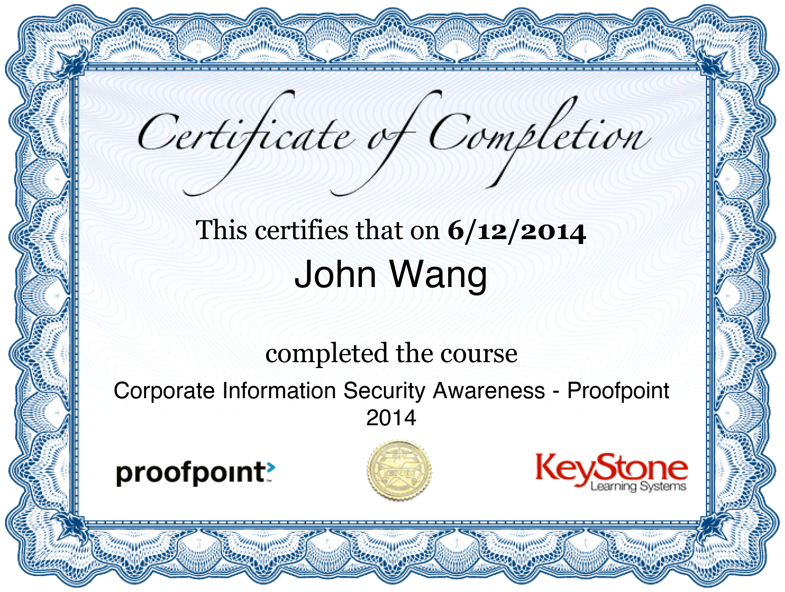
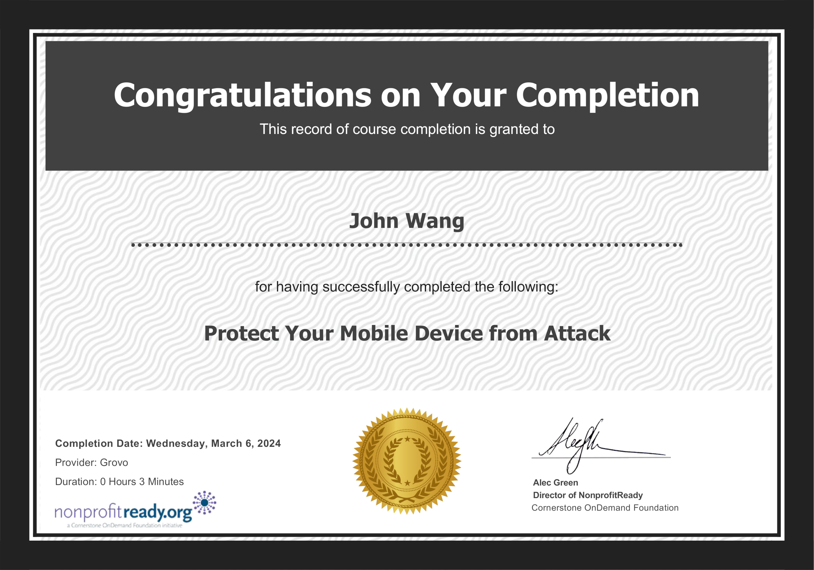

# John's Security: InfoSec Certificates
1. [Fundamentals](#fundamentals-6)
    1. [Corporate Information Security Awareness - Proofpoint 2014 from Proofpoint](#corporate-information-security-awareness-proofpoint-2014-from-proofpoint)
    1. [Saviynt Information Security Annual Training from Saviynt](#saviynt-information-security-annual-training-from-saviynt)
    1. [2024 Kevin Mitnick Security Awareness Training from KnowBe4 by Kevin Mitnick](#2024-kevin-mitnick-security-awareness-training-from-knowbe4-by-kevin-mitnick)
    1. [Top 5 Security Awareness Fundamentals from KnowBe4](#top-5-security-awareness-fundamentals-from-knowbe4)
    1. [Cybersecurity: Every second counts from KnowBe4](#cybersecurity-every-second-counts-from-knowbe4)
    1. [Non-Technical Security from KnowBe4](#non-technical-security-from-knowbe4)
1. [Concepts](#concepts-1)
    1. [Voice on Security: Piggybacking from KnowBe4](#voice-on-security-piggybacking-from-knowbe4)
1. [General Data Protection Regulation (GDPR)](#general-data-protection-regulation-gdpr-2)
    1. [General Data Protection Regulation (GDPR) 2024 from Traliant](#general-data-protection-regulation-gdpr-2024-from-traliant)
    1. [General Data Protection Regulation (GDPR) "2023" from Traliant](#general-data-protection-regulation-gdpr-2023-from-traliant)
1. [California Consumer Privacy Act (CCPA)](#california-consumer-privacy-act-ccpa-1)
    1. [California Consumer Privacy Act (CCPA & CPRA) V2 from Traliant](#california-consumer-privacy-act-ccpa-cpra-v2-from-traliant)
1. [Passwords](#passwords-1)
    1. [Secure Passwords With Quiz from KnowBe4](#secure-passwords-with-quiz-from-knowbe4)
1. [Email Protection](#email-protection-12)
    1. [2024 Kevin Mitnick Enabled Content Demonstration from KnowBe4 by Kevin Mitnick](#2024-kevin-mitnick-enabled-content-demonstration-from-knowbe4-by-kevin-mitnick)
    1. [Kevin Mitnick - Two-Factor Authentication Attack from KnowBe4 by Kevin Mitnick](#kevin-mitnick-two-factor-authentication-attack-from-knowbe4-by-kevin-mitnick)
    1. [Fake Meeting Request Demonstration from KnowBe4 by Kevin Mitnick](#fake-meeting-request-demonstration-from-knowbe4-by-kevin-mitnick)
    1. [Phil Hendrie & Kevin Mitnick Pretexting - Credential Harvesting Attack from KnowBe4 by Paul Hendrie, Kevin Mitnick](#phil-hendrie-kevin-mitnick-pretexting-credential-harvesting-attack-from-knowbe4-by-paul-hendrie-kevin-mitnick)
    1. [AI, Phishing, and Cybersafety from KnowBe4](#ai-phishing-and-cybersafety-from-knowbe4)
    1. [Spear Phishing in Action from KnowBe4](#spear-phishing-in-action-from-knowbe4)
    1. [Phish or Treat? - Phishing Edition from KnowBe4](#phish-or-treat-phishing-edition-from-knowbe4)
    1. [Callback Phishing: Email and Phone-Based Cyberattacks from KnowBe4](#callback-phishing-email-and-phone-based-cyberattacks-from-knowbe4)
    1. [Business Email Compromise: Not Just for Execs and Finance Anymore from KnowBe4](#business-email-compromise-not-just-for-execs-and-finance-anymore-from-knowbe4)
    1. [What is CEO Fraud? from KnowBe4](#what-is-ceo-fraud-from-knowbe4)
    1. [Criminal Minds: Spear Phishing from KnowBe4](#criminal-minds-spear-phishing-from-knowbe4)
    1. [Browser-in-the-Browser Attacks from KnowBe4](#browser-in-the-browser-attacks-from-knowbe4)
1. [Web Surfing](#web-surfing-1)
    1. [Safe Surfing 101 from KnowBe4](#safe-surfing-101-from-knowbe4)
1. [Applications](#applications-1)
    1. [Do You Know What Third-Party Apps Are? from KnowBe4](#do-you-know-what-third-party-apps-are-from-knowbe4)
1. [Endpoints](#endpoints-1)
    1. [Dangers of USBs from KnowBe4](#dangers-of-usbs-from-knowbe4)
1. [Mobile](#mobile-1)
    1. [Protect Your Mobile Device from Attack from Grovo](#protect-your-mobile-device-from-attack-from-grovo)
1. [Malware](#malware-1)
    1. [Malware as a Service from KnowBe4](#malware-as-a-service-from-knowbe4)
1. [Ransomware](#ransomware-2)
    1. [Ransomware: Blackmail Using Encrypted Data from KnowBe4](#ransomware-blackmail-using-encrypted-data-from-knowbe4)
    1. [World Wild Web: Ransomware from KnowBe4](#world-wild-web-ransomware-from-knowbe4)
1. [Social Engineering](#social-engineering-1)
    1. [Pretexting - "Tech Support" Social Engineering? from KnowBe4](#pretexting-tech-support-social-engineering-from-knowbe4)
1. [Disaster Recovery](#disaster-recovery-1)
    1. [Security and Disaster Preparedness from KnowBe4](#security-and-disaster-preparedness-from-knowbe4)
1. [Proofpoint](#proofpoint-1)
    1. [Enterprise Protection/Privacy Accredited Engineer from Proofpoint](#enterprise-protection-privacy-accredited-engineer-from-proofpoint)
## Fundamentals (6)
### Corporate Information Security Awareness - Proofpoint 2014 from Proofpoint

### Saviynt Information Security Annual Training from Saviynt

### 2024 Kevin Mitnick Security Awareness Training from KnowBe4 by Kevin Mitnick

### Top 5 Security Awareness Fundamentals from KnowBe4

### Cybersecurity: Every second counts from KnowBe4

### Non-Technical Security from KnowBe4

## Concepts (1)
### Voice on Security: Piggybacking from KnowBe4

## General Data Protection Regulation (GDPR) (2)
### General Data Protection Regulation (GDPR) 2024 from Traliant

### General Data Protection Regulation (GDPR) "2023" from Traliant

## California Consumer Privacy Act (CCPA) (1)
### California Consumer Privacy Act (CCPA & CPRA) V2 from Traliant

## Passwords (1)
### Secure Passwords With Quiz from KnowBe4

## Email Protection (12)
### 2024 Kevin Mitnick Enabled Content Demonstration from KnowBe4 by Kevin Mitnick

### Kevin Mitnick - Two-Factor Authentication Attack from KnowBe4 by Kevin Mitnick

### Fake Meeting Request Demonstration from KnowBe4 by Kevin Mitnick

### Phil Hendrie & Kevin Mitnick Pretexting - Credential Harvesting Attack from KnowBe4 by Paul Hendrie, Kevin Mitnick

### AI, Phishing, and Cybersafety from KnowBe4

### Spear Phishing in Action from KnowBe4

### Phish or Treat? - Phishing Edition from KnowBe4

### Callback Phishing: Email and Phone-Based Cyberattacks from KnowBe4

### Business Email Compromise: Not Just for Execs and Finance Anymore from KnowBe4

### What is CEO Fraud? from KnowBe4

### Criminal Minds: Spear Phishing from KnowBe4

### Browser-in-the-Browser Attacks from KnowBe4

## Web Surfing (1)
### Safe Surfing 101 from KnowBe4

## Applications (1)
### Do You Know What Third-Party Apps Are? from KnowBe4

## Endpoints (1)
### Dangers of USBs from KnowBe4

## Mobile (1)
### Protect Your Mobile Device from Attack from Grovo

## Malware (1)
### Malware as a Service from KnowBe4

## Ransomware (2)
### Ransomware: Blackmail Using Encrypted Data from KnowBe4

### World Wild Web: Ransomware from KnowBe4

## Social Engineering (1)
### Pretexting - "Tech Support" Social Engineering? from KnowBe4

## Disaster Recovery (1)
### Security and Disaster Preparedness from KnowBe4

## Proofpoint (1)
### Enterprise Protection/Privacy Accredited Engineer from Proofpoint

