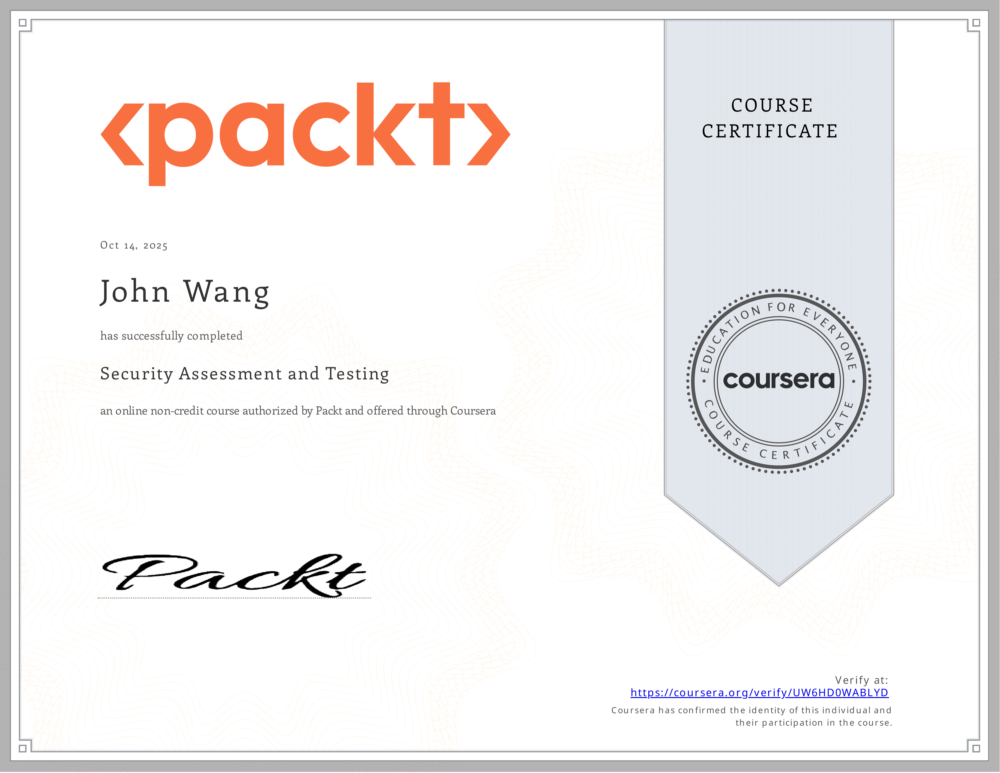

# John's Security: SecOps Certificates
1. [Assessment and Testing](#assessment-and-testing-1)
    1. [Security Assessment and Testing from Packt by Anthony Sequeira, Lauren Deal](#security-assessment-and-testing-from-packt-by-anthony-sequeira-lauren-deal)
1. [Threat Intelligence](#threat-intelligence-1)
    1. [Threat Intelligence from Udemy by Peter A](#threat-intelligence-from-udemy-by-peter-a)
1. [Threat Simulation](#threat-simulation-4)
    1. [Lateral Movement with Infection Monkey from Pluralsight by Maril Vernon](#lateral-movement-with-infection-monkey-from-pluralsight-by-maril-vernon)
    1. [Red Team Operations: Target and Capability Development from Pluralsight by Aaron Rosenmund](#red-team-operations-target-and-capability-development-from-pluralsight-by-aaron-rosenmund)
    1. [Red Team Tools for Emulated Adversary Techniques with MITRE ATT&CK from Pluralsight by Aaron Rosenmund](#red-team-tools-for-emulated-adversary-techniques-with-mitre-attck-from-pluralsight-by-aaron-rosenmund)
    1. [Blue Team Tools: Defense against Adversary Activity Using MITRE Techniques from Pluralsight by Aaron Rosenmund](#blue-team-tools-defense-against-adversary-activity-using-mitre-techniques-from-pluralsight-by-aaron-rosenmund)
1. [Datadog](#datadog-1)
    1. [Detect, Prioritize, and Remediate Cloud Security Risks with Datadog CSM from Datadog](#detect-prioritize-and-remediate-cloud-security-risks-with-datadog-csm-from-datadog)
## Assessment and Testing (1)
### Security Assessment and Testing from Packt by Anthony Sequeira, Lauren Deal
* [John's Packt online credential](https://coursera.org/verify/UW6HD0WABLYD)

## Threat Intelligence (1)
### Threat Intelligence from Udemy by Peter A
* [John's Udemy online credential](http://ude.my/UC-5de04873-4909-4caf-a157-645531882407)

## Threat Simulation (4)
### Lateral Movement with Infection Monkey from Pluralsight by Maril Vernon

### Red Team Operations: Target and Capability Development from Pluralsight by Aaron Rosenmund

### Red Team Tools for Emulated Adversary Techniques with MITRE ATT&CK from Pluralsight by Aaron Rosenmund

### Blue Team Tools: Defense against Adversary Activity Using MITRE Techniques from Pluralsight by Aaron Rosenmund

## Datadog (1)
### Detect, Prioritize, and Remediate Cloud Security Risks with Datadog CSM from Datadog
* [John's Datadog online credential](https://learn.datadoghq.com/certificates/jq29dawso1)

