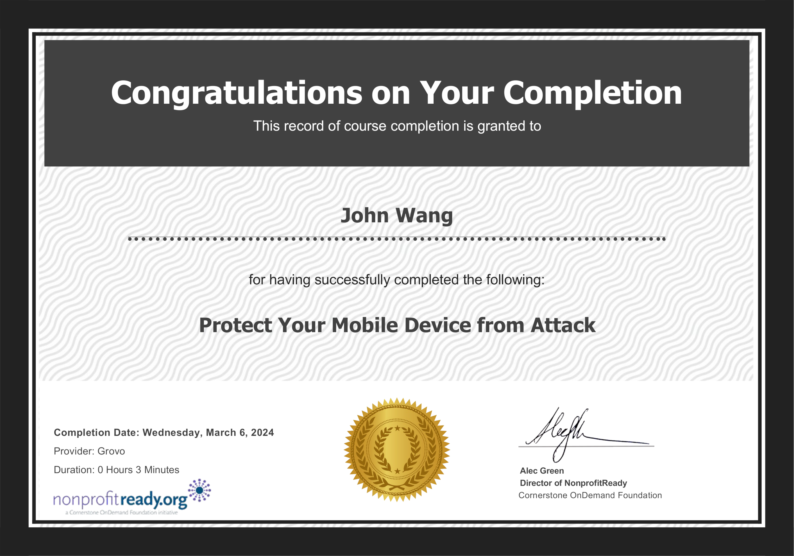
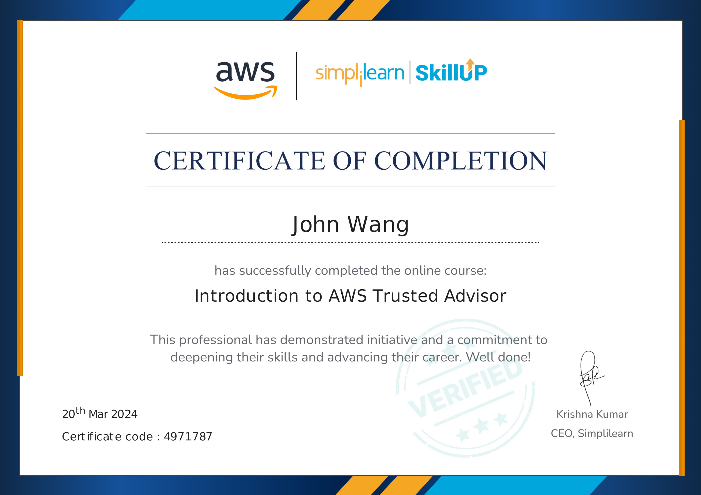

# John's Security Certificates
1. [Programming](#programming-4)
    1. [OWASP Top 10 from Snyk](#owasp-top-10-from-snyk)
    1. [Snyk Top 10 from Snyk](#snyk-top-10-from-snyk)
    1. [Security for Developers from Snyk](#security-for-developers-from-snyk)
    1. [Introduction to OAuth 2.0 and OpenID Connect from Pragmatic Web Security by Dr. Philippe De Ryck](#introduction-to-oauth-20-and-openid-connect-from-pragmatic-web-security-by-dr-philippe-de-ryck)
1. [Artificial Intelligence](#artificial-intelligence-1)
    1. [AI Security from Lakera](#ai-security-from-lakera)
1. [API](#api-1)
    1. [API Security Architect from API Academy](#api-security-architect-from-api-academy)
1. [DevOps](#devops-1)
    1. [Certified DevOps Information Security Engineer (DevOps-SEC) from DevOps Academy](#certified-devops-information-security-engineer-devops-sec-from-devops-academy)
1. [Mobile](#mobile-1)
    1. [Protect Your Mobile Device from Attack from NonprofitReady](#protect-your-mobile-device-from-attack-from-nonprofitready)
1. [Email Protection](#email-protection-1)
    1. [Enterprise Protection/Privacy Accredited Engineer from Proofpoint](#enterprise-protectionprivacy-accredited-engineer-from-proofpoint)
1. [Information Technology](#information-technology-1)
    1. [Corporate Information Security Awareness from Proofpoint](#corporate-information-security-awareness-from-proofpoint)
1. [AWS](#aws-4)
    1. [AWS: Identity and Access Management from Whizlabs](#aws-identity-and-access-management-from-whizlabs)
    1. [Introduction to AWS Identity and Access Management (IAM) from Simplilearn](#introduction-to-aws-identity-and-access-management-iam-from-simplilearn)
    1. [Introduction to AWS Trusted Advisor from Simplilearn](#introduction-to-aws-trusted-advisor-from-simplilearn)
    1. [Getting Started with AWS Security Hub from Simplilearn](#getting-started-with-aws-security-hub-from-simplilearn)
## Programming (4)
### OWASP Top 10 from Snyk

### Snyk Top 10 from Snyk

### Security for Developers from Snyk

### Introduction to OAuth 2.0 and OpenID Connect from Pragmatic Web Security by Dr. Philippe De Ryck
* [John's Pragmatic Web Security online profile](https://courses.pragmaticwebsecurity.com/certificates/ismezbjb1w)

## Artificial Intelligence (1)
### AI Security from Lakera
* [John's Lakera online credential](https://security.certificates.lakera.ai/credentials/53495805-342d-41b7-b9bf-5923ae00422d)

## API (1)
### API Security Architect from API Academy

## DevOps (1)
### Certified DevOps Information Security Engineer (DevOps-SEC) from DevOps Academy
* [John's DevOps Academy online credential](https://www.devops-certification.org/badges/22465533642098)

## Mobile (1)
### Protect Your Mobile Device from Attack from NonprofitReady

## Email Protection (1)
### Enterprise Protection/Privacy Accredited Engineer from Proofpoint

## Information Technology (1)
### Corporate Information Security Awareness from Proofpoint

## AWS (4)
### AWS: Identity and Access Management from Whizlabs

### Introduction to AWS Identity and Access Management (IAM) from Simplilearn

### Introduction to AWS Trusted Advisor from Simplilearn

### Getting Started with AWS Security Hub from Simplilearn

