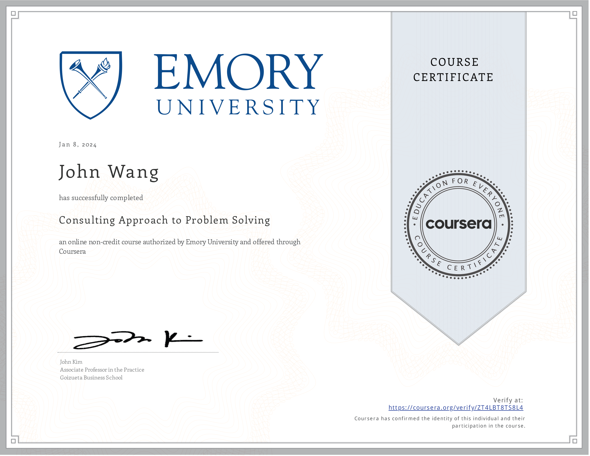

# John's Strategy Certificates
1. [Fundamentals](#fundamentals-1)
    1. [Managing Strategy and Vision from Pluralsight by Curtis Webb](#managing-strategy-and-vision-from-pluralsight-by-curtis-webb)
1. [Management Consulting](#management-consulting-2)
    1. [Management Consulting Specialization (5 Courses) from Emory University by John Kim](#management-consulting-specialization-5-courses-from-emory-university-by-john-kim)
    1. [Consulting Approach to Problem Solving from Emory University by John Kim](#consulting-approach-to-problem-solving-from-emory-university-by-john-kim)
1. [Frameworks](#frameworks-2)
    1. [Customer-Centric IT Strategy from University of Virginia, Darden School by Alex Cowan](#customer-centric-it-strategy-from-university-of-virginia-darden-school-by-alex-cowan)
    1. [The Strategist's Challenge from University of Virginia, Darden School Foundation by Michael Lenox, Jared Harris](#the-strategists-challenge-from-university-of-virginia-darden-school-foundation-by-michael-lenox-jared-harris)
1. [Product Management](#product-management-1)
    1. [Product Management: Strategy and Vision from Pluralsight by Jeremy Jarrell](#product-management-strategy-and-vision-from-pluralsight-by-jeremy-jarrell)
1. [Artificial Intelligence](#artificial-intelligence-1)
    1. [AI Strategy and Governance from University of Pennsylvania, Wharton School](#ai-strategy-and-governance-from-university-of-pennsylvania-wharton-school)
## Resources

1. [Strategy Reading List](../strategy_resource-links)
## Fundamentals (1)
### Managing Strategy and Vision from Pluralsight by Curtis Webb

## Management Consulting (2)
### Management Consulting Specialization (5 Courses) from Emory University by John Kim
* [John's Emory University online credential](https://coursera.org/verify/specialization/ZM5E4DBYR7QW)

### Consulting Approach to Problem Solving from Emory University by John Kim
* [John's Emory University online credential](https://coursera.org/verify/ZT4LBT8TS8L4)

## Frameworks (2)
### Customer-Centric IT Strategy from University of Virginia, Darden School by Alex Cowan
* [John's University of Virginia, Darden School online credential](https://coursera.org/verify/JU7THK93NFN3)

### The Strategist's Challenge from University of Virginia, Darden School Foundation by Michael Lenox, Jared Harris
* [John's University of Virginia, Darden School Foundation online credential](https://coursera.org/verify/TRF84QSBXV2S)

## Product Management (1)
### Product Management: Strategy and Vision from Pluralsight by Jeremy Jarrell

## Artificial Intelligence (1)
### AI Strategy and Governance from University of Pennsylvania, Wharton School
* [John's University of Pennsylvania, Wharton School online credential](https://coursera.org/verify/DGB6XB4C7VKD)

