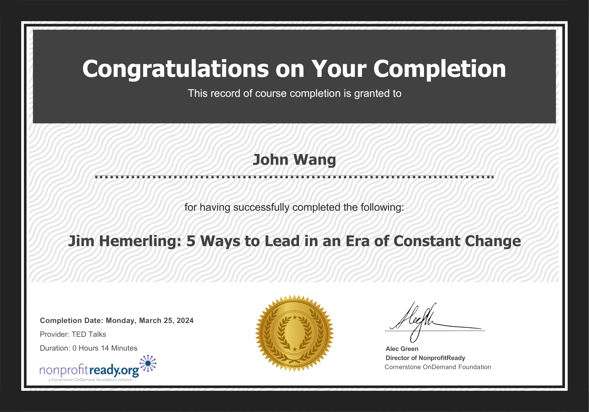

# John's TED Talks Certificates
1. [Leadership](#leadership-2)
    1. [5 Ways to Lead in an Era of Constant Change from NonprofitReady by Jim Hemerling](#5-ways-to-lead-in-an-era-of-constant-change-from-nonprofitready-by-jim-hemerling)
    1. [Why Good Leaders Make You Feel Safe from NonprofitReady by Simon Sinek](#why-good-leaders-make-you-feel-safe-from-nonprofitready-by-simon-sinek)
1. [Hiring](#hiring-1)
    1. [Why the Best Hire Might Not Have the Perfect Resume from TED Talks by Regina Hartley](#why-the-best-hire-might-not-have-the-perfect-resume-from-ted-talks-by-regina-hartley)
1. [Mindfulness](#mindfulness-2)
    1. [All It Takes Is 10 Mindful Minutes from TED Talks by Andy Puddicombe](#all-it-takes-is-10-mindful-minutes-from-ted-talks-by-andy-puddicombe)
    1. [How to Stay Calm When You Know You'll Be Stressed from TED Talks by Daniel Levintin](#how-to-stay-calm-when-you-know-youll-be-stressed-from-ted-talks-by-daniel-levintin)
1. [Storytelling](#storytelling-2)
    1. [The Secret Structure of Great Talks from TED Talks by Nancy Duarte](#the-secret-structure-of-great-talks-from-ted-talks-by-nancy-duarte)
    1. [How Great Leaders Inspire Action from NonprofitReady by Simon Sinek](#how-great-leaders-inspire-action-from-nonprofitready-by-simon-sinek)
## Leadership (2)
### 5 Ways to Lead in an Era of Constant Change from NonprofitReady by Jim Hemerling

### Why Good Leaders Make You Feel Safe from NonprofitReady by Simon Sinek

## Hiring (1)
### Why the Best Hire Might Not Have the Perfect Resume from TED Talks by Regina Hartley

## Mindfulness (2)
### All It Takes Is 10 Mindful Minutes from TED Talks by Andy Puddicombe

### How to Stay Calm When You Know You'll Be Stressed from TED Talks by Daniel Levintin

## Storytelling (2)
### The Secret Structure of Great Talks from TED Talks by Nancy Duarte

### How Great Leaders Inspire Action from NonprofitReady by Simon Sinek

