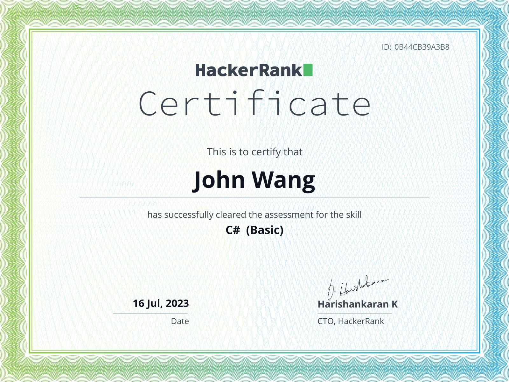
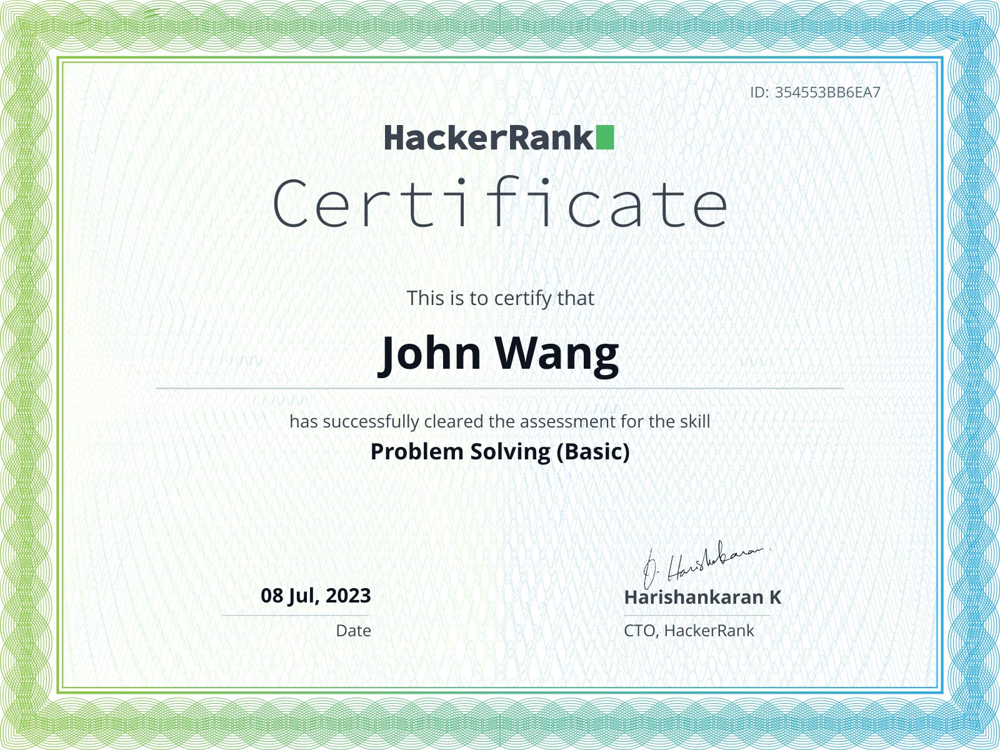

# Programming Certificates

## C# (1)

### C# (Basic) - HackerRank

## Go (1)

### Go (Basic) - HackerRank

## Problem Solving (1)

### Problem Solving (Basic) - Hacker Rank

## Python (1)

### Python (Basic) - HackerRank

## Rest API (1)

### Rest API (Intermediate) - HackerRank

## SQL (3)

### SQL (Advanced) - HackerRank

Link: [https://www.hackerrank.com/certificates/3398beadc245](https://www.hackerrank.com/certificates/3398beadc245)

### SQL (Intermediate) - HackerRank

### SQL (Basic) - HackerRank

