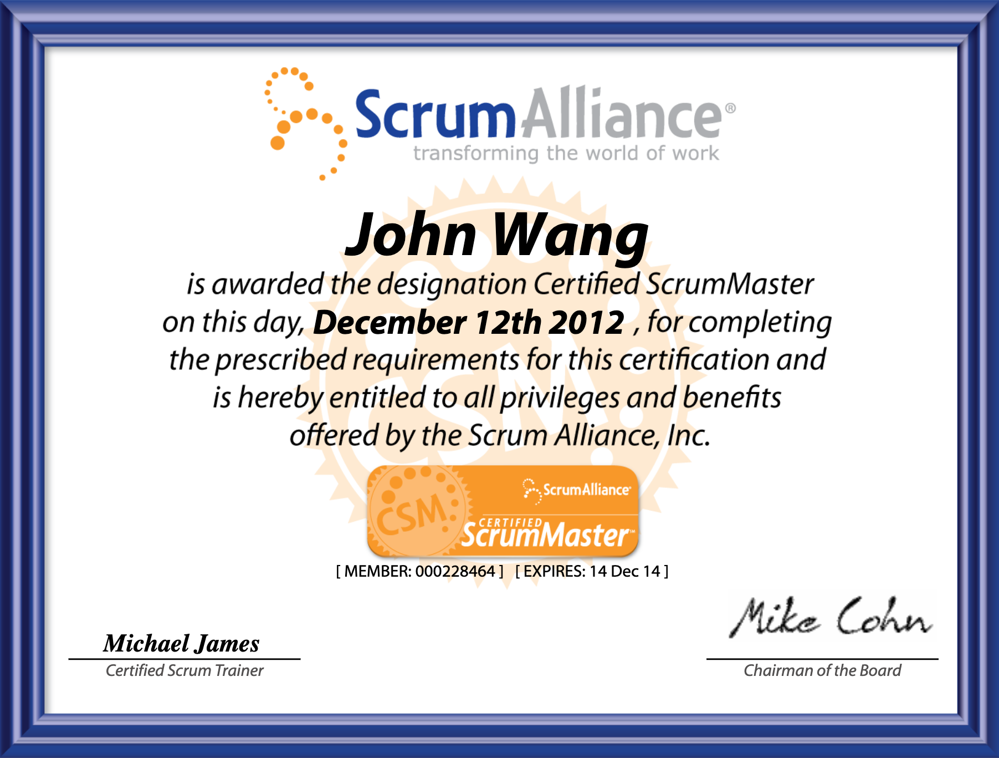
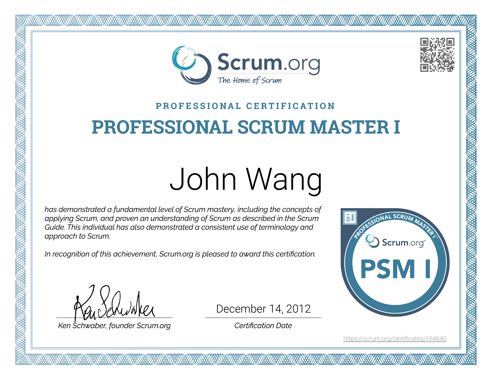
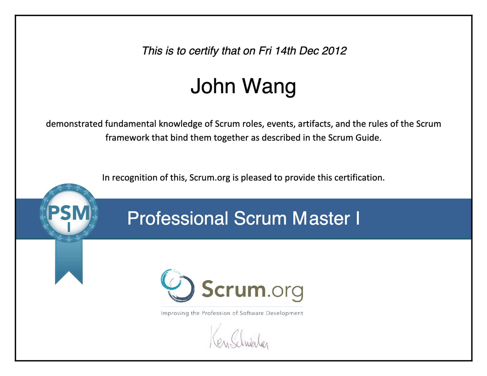
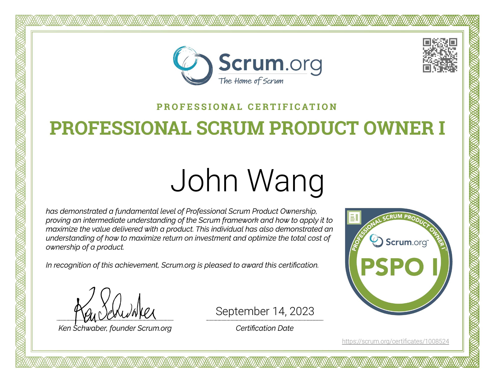
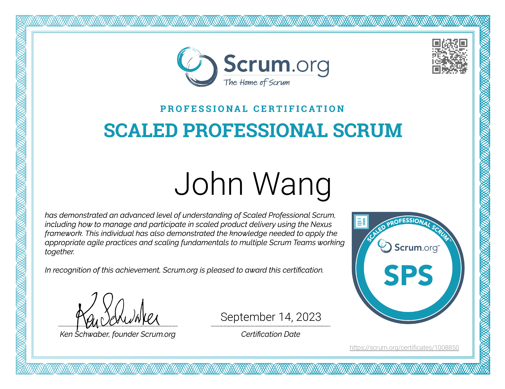

# John's Scrum Certificates

1. Scrum Master
	1. [Certified ScrumMaster (CSM) from Scrum Alliance](#certified-scrummaster-csm-from-scrum-alliance)
	1. [Professional Scrum Master III (PSM III) from Scrum.org](#professional-scrum-master-iii-psm-iii-from-scrumorg)
	1. [Professional Scrum Master II (PSM II) from Scrum.org](#professional-scrum-master-ii-psm-ii-from-scrumorg)
	1. [Professional Scrum Master I (PSM I) from Scrum.org](#professional-scrum-master-i-psm-i-from-scrumorg)
1. Product Owner
	1. [Certified Scrum Product Owner (CSPO) from Scrum Alliance](#certified-scrum-product-owner-cspo-from-scrum-alliance)
	1. [Professional Scrum Product Owner I (PSPO I) from Scrum.org](#professional-scrum-product-owner-i-pspo-i-from-scrumorg)
1. Scaled Scrum
	1. [Scaled Professional Scrum (SPS) from Scrum.org](#scaled-professional-scrum-sps-from-scrumorg)
1. Leadership
	1. [Professional Agile Leadership I (PAL I) from Scrum.org](#professional-agile-leadership-i-pal-i-from-scrumorg)

## Articles

* [Renewing Scrum Alliance Certificates](../scrum_scrumalliance-renewal)

## Scrum Master (4)

### Certified ScrumMaster (CSM) from Scrum Alliance

* [John's Scrum Alliance profile](https://www.scrumalliance.org/community/profile/jwang96)

### Professional Scrum Master III (PSM III) from Scrum.org

> *People who have passed PSM III, achieving certification, demonstrate a distinguished level of Scrum mastery. PSM III certificate holders  have a deep understanding of the application and practices of Scrum and the Scrum Values in a variety of complex team and organizational situations. - [Scrum.org](https://www.scrum.org/professional-scrum-certifications/professional-scrum-master-assessments)*

* [John's Scrum.org profile](https://www.scrum.org/user/16066/)

### Professional Scrum Master II (PSM II) from Scrum.org

> *People who have passed PSM II, achieving certification, demonstrate an advanced level of Scrum mastery. PSM II certificate holders prove that they have an understanding of the underlying principles of Scrum and can effectively apply Scrum in complex, real-world situations. - [Scrum.org](https://www.scrum.org/professional-scrum-certifications/professional-scrum-master-assessments)*

* [John's Scrum.org profile](https://www.scrum.org/user/16066/)

### Professional Scrum Master I (PSM I) from Scrum.org

> *People who have passed PSM I, achieving certification, demonstrate a fundamental level of Scrum mastery. PSM I certificate holders prove that they understand Scrum as described in the Scrum Guide and how to apply Scrum in Scrum Teams.  PSM I holders have a consistent terminology and approach to Scrum. - [Scrum.org](https://www.scrum.org/professional-scrum-certifications/professional-scrum-master-assessments)*

* [John's Scrum.org profile](https://www.scrum.org/user/16066/)

## Product Owner (2)

### Certified Scrum Product Owner (CSPO) from Scrum Alliance

* [John's Scrum Alliance profile](https://www.scrumalliance.org/community/profile/jwang96)

### Professional Scrum Product Owner I (PSPO I) from Scrum.org

> *People that have passed PSPO I and achieved certification demonstrate a fundamental understanding of the Scrum framework, and how to apply it to maximize the value delivered with a product. They exhibit a dedication to continued professional development, and a high level of commitment to their field of practice. Achieving PSPO I is the minimum demonstration of knowledge any Professional Scrum Product Owner should be able to make. - [Scrum.org](https://www.scrum.org/professional-scrum-product-owner-certifications)*

* [John's Scrum.org profile](https://www.scrum.org/user/16066/)

## Scaled Scrum (1)

### Scaled Professional Scrum (SPS) from Scrum.org

> *SPS certification is evidence that you have demonstrated a fundamental understanding of skills that can be applied to overcome challenges when scaling Scrum beyond a single Scrum Team, and the use and details of the Nexus framework. - [Scrum.org](https://www.scrum.org/assessments/scaled-professional-scrum-certification)*

* [John's Scrum.org profile](https://www.scrum.org/user/16066/)

## Leadership (1)

### Professional Agile Leadership I (PAL I) from Scrum.org

> *PAL certification is evidence that you have demonstrated a fundamental understanding of how leaders of agile teams best support, guide and coach teams to create conditions for greater agility. You recognize the role that leaders play in creating a successful agile environment. - [Scrum.org](https://www.scrum.org/assessments/scaled-professional-scrum-certification)*

* [John's Scrum.org profile](https://www.scrum.org/user/16066/)

